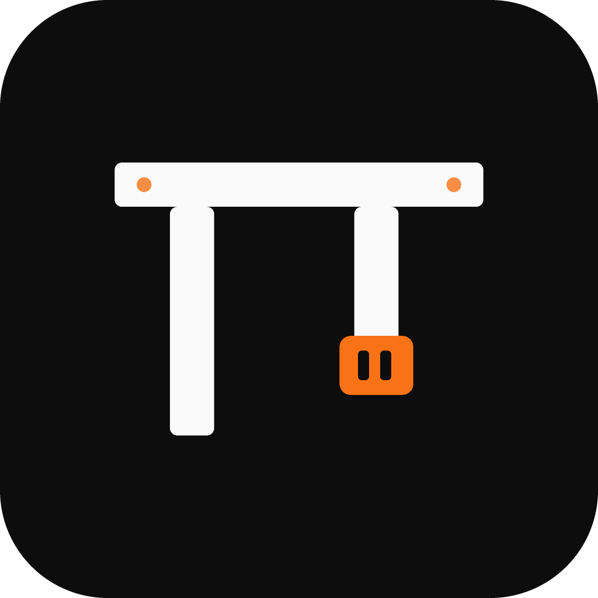
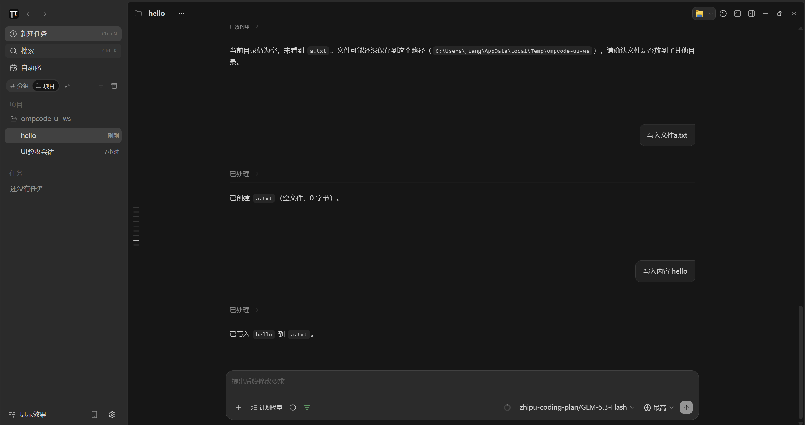
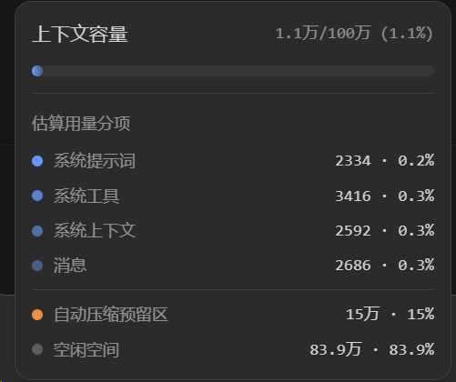
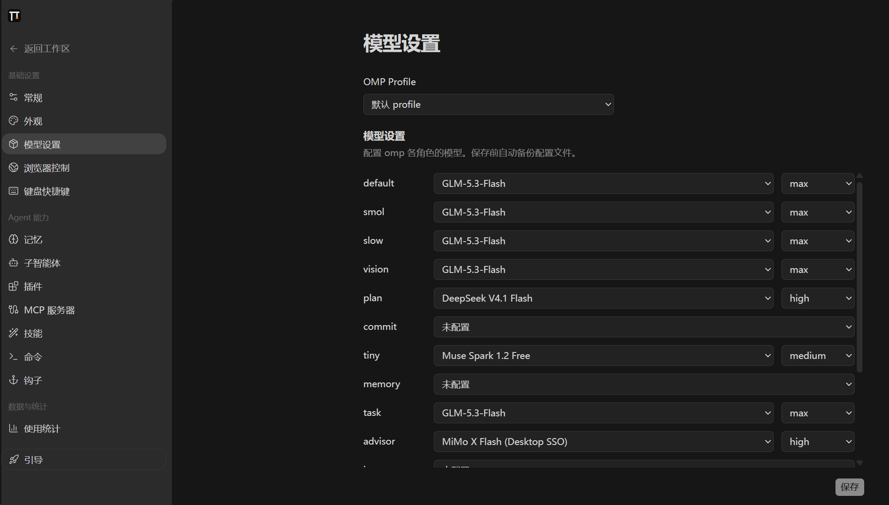
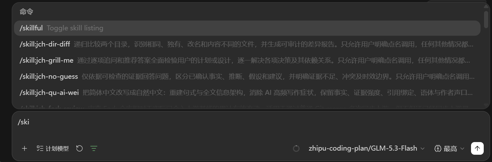

# OmpCode

<p align="center">
  
</p>

<h3 align="center">The best desktop experience for OMP</h3>

<p align="center">
  The familiar feel of ChatGPT. The polished interface of ZCode. The full power of OMP.<br />
  OmpCode brings every OMP command and feature into a friendly graphical workspace for AI coding.
</p>

<p align="center">
  <a href="README.zh-CN.md">简体中文</a> ·
  <a href="#quick-start">Quick start</a> ·
  <a href="https://github.com/can1357/oh-my-pi/discussions/13231">OMP community discussion</a> ·
  <a href="#credits">Credits</a>
</p>

## See OmpCode in action

**A chat experience you already know, powered by the agent you want.** The ZCode-based workspace feels as approachable as ChatGPT while keeping OMP's tasks, tool calls, file changes, and session state in view.

<p align="center">
  <a href="docs/images/ompcode-workspace.png">
    
  </a>
</p>

**Know your context.** See context capacity, estimated usage breakdown, free space, and the reserve for automatic compaction.

<p align="center">
  <a href="docs/images/ompcode-context.png">
    
  </a>
</p>

**Configure models the omp way.** Select a Profile and set the model and thinking level for each model role.

<p align="center">
  <a href="docs/images/ompcode-models.png">
    
  </a>
</p>

**Every OMP slash command is within reach.** Type `/` in the composer to browse and run commands without leaving the conversation.

<p align="center">
  <a href="docs/images/ompcode-commands.png">
    
  </a>
</p>

## Why OmpCode

- **ZCode's UI, ChatGPT-style ease:** Start with a familiar, chat-first layout and a polished coding workspace instead of learning a new terminal interface.
- **OMP all the way through:** An embedded OMP core powers the agent, while the UI is adapted to OMP's sessions, tools, models, commands, and full feature set.
- **Every slash command:** Browse and run the complete OMP command catalog in the composer, including `/model`, `/switch`, `/compact`, `/mcp`, `/usage`, and skill commands.
- **Models on your terms:** Use OMP Profiles and model roles to pick models and thinking levels, or switch them for a session.
- **A clear view of your work:** Streaming responses, tool calls, file changes, context usage, and compaction state stay visible in one workspace.
- **Keep working across devices:** Continue with the Web interface and mobile remote access.

## Quick start

Install Git, Node.js **24.14.0**, and pnpm **10.33.2**. [mise.toml](mise.toml) is the source of truth for tool versions. From the repository root:

```bash
pnpm bootstrap
pnpm dev:desktop
```

`pnpm bootstrap` installs dependencies, prepares desktop runtime assets, and builds the project. The desktop app embeds omp, so you do not need a separate omp installation. It uses your omp configuration, models, and session data.

To develop the Web client and server:

```bash
pnpm dev:web
```

To build the desktop app:

```bash
pnpm bundle:desktop -- --os win --arch x64
```

See the root and package `package.json` files for additional commands.

## Manual release packaging

In GitHub Actions, run **Release Windows EXE** from `main` or **Release CentOS 7 ZIP** from `experiment/centos7-no-proot`. The CentOS workflow refuses other refs; its branch is permanent and is not merged into `main`. Both manual workflows package and publish without running tests. Supply a unique tag matching the current `package.json` version, such as `v3.14.3-omp.1` for Windows or `v3.14.3-omp.2-centos7` for CentOS 7.

The CentOS workflow publishes `OmpCode-<version>-centos7-x64.zip` and its `.sha256` checksum. Copy both files to the offline machine, then extract and launch as a regular user:

```bash
sha256sum --check OmpCode-3.14.3-centos7-x64.zip.sha256
unzip -q OmpCode-3.14.3-centos7-x64.zip -d "$HOME"
"$HOME/OmpCode-3.14.3-centos7-x64/bin/ompcode-centos7"
```

The ZIP runs Electron 28 directly on the host's glibc 2.17, with an embedded omp and CentOS-compatible native addons and search tools. It needs no root access, PRoot, `ptrace`, bind mounts, host Node/omp upgrade, package installation or network access. A graphical session with the system's standard desktop libraries remains necessary; the VMware CentOS 7 X11 session passed, but the company Citrix X Server's XKB/GLX support has not been verified. The launcher uses private XDG paths under HOME; normal application startup may register a user-level `zcode://` desktop entry, not a system-wide installation.

**Chromium sandboxing is disabled** in this compatibility build. Electron 28 and CentOS 7 are end-of-life; use only trusted workspaces ([Electron platform policy](https://github.com/electron/electron#platform-support)).

## Credits

OmpCode builds on [ZCode](https://github.com/zai-org/ZCode), carrying forward its desktop interface and visual style. Its Agent core is [omp (oh-my-pi)](https://github.com/can1357/oh-my-pi), connected through the [omp adapter](packages/omp-agent/). Thanks to both upstream projects and their contributors.

OmpCode is licensed under the [Apache License 2.0](LICENSE). See [NOTICE.md](NOTICE.md) for third-party notices and project information.
