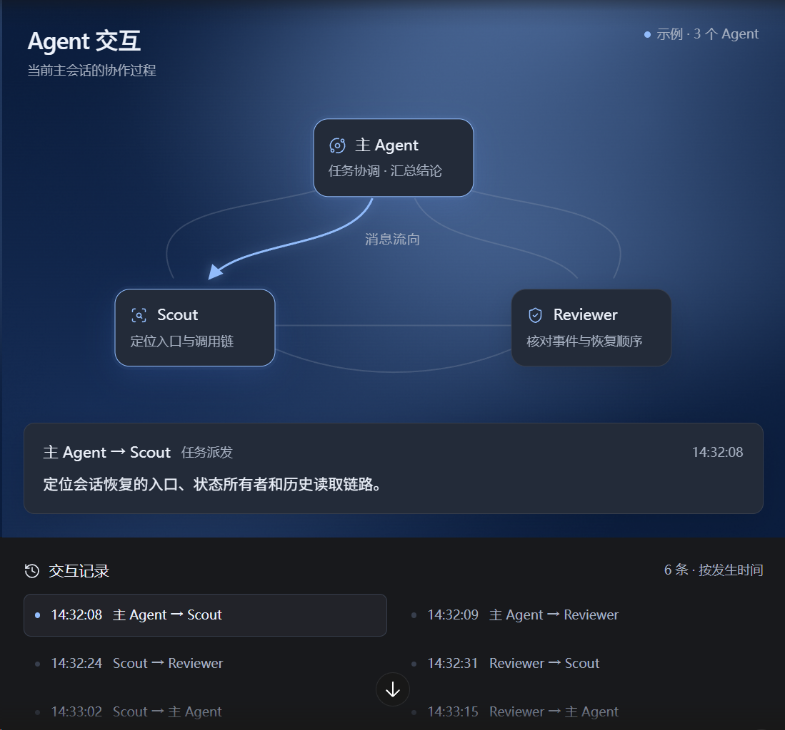

# OmpCode

<p align="center">
  
</p>

<h3 align="center">The best desktop experience for OMP</h3>

<p align="center">
  The familiar feel of ChatGPT. The polished interface of ZCode. The full power of OMP.<br />
OmpCode brings OMP sessions, tools, model roles and command discovery into a friendly graphical workspace for AI coding.
</p>

<p align="center">
  <a href="README.zh-CN.md">简体中文</a> ·
  <a href="#quick-start">Quick start</a> ·
  <a href="https://github.com/can1357/oh-my-pi/discussions/13231">OMP community discussion</a> ·
  <a href="#credits">Credits</a>
</p>

## See OmpCode in action

**A chat experience you already know, powered by the agent you want.** The ZCode-based workspace feels as approachable as ChatGPT while keeping OMP's tasks, tool calls, file changes, and session state in view.

<p align="center">
  <a href="docs/images/ompcode-workspace.png">
    
  </a>
</p>

**Know your context.** See context capacity, estimated usage breakdown, free space, and the reserve for automatic compaction.

<p align="center">
  <a href="docs/images/ompcode-context.png">
    
  </a>
</p>

**Configure models the omp way.** Select a Profile and set the model and thinking level for each model role.

<p align="center">
  <a href="docs/images/ompcode-models.png">
    
  </a>
</p>

**Every OMP slash command is within reach.** Type `/` in the composer to browse and run commands without leaving the conversation.

<p align="center">
  <a href="docs/images/ompcode-commands.png">
    
  </a>
</p>

**Follow agent collaboration.** See how the main agent and subagents exchange messages, with an interaction timeline showing the order of events.

<p align="center">
  <a href="docs/images/ompcode-agent-interactions.png">
    
  </a>
</p>

## Why OmpCode

- **ZCode's UI, ChatGPT-style ease:** Start with a familiar, chat-first layout and a polished coding workspace instead of learning a new terminal interface.
- **OMP all the way through:** An embedded OMP core powers the agent, while the UI is adapted to OMP's sessions, tools, models and commands. Explicit capability limits are documented in [the Fork requirements](docs/requirements/FORK.md#已知与允许的差异).
- **Every slash command:** Browse and run the complete OMP command catalog in the composer, including `/model`, `/switch`, `/compact`, `/mcp`, `/usage`, and skill commands.
- **Models on your terms:** Use OMP Profiles and model roles to pick models and thinking levels, or switch them for a session.
- **A clear view of your work:** Streaming responses, tool calls, file changes, context usage, and compaction state stay visible in one workspace.
- **Desktop and Web workflows:** Use the desktop workspace or the general Web client. Dedicated mobile remote control has been retired.

## Quick start

Install Git, Node.js **24.14.0**, and pnpm **10.33.2**. [mise.toml](mise.toml) is the source of truth for tool versions. From the repository root:

```bash
pnpm bootstrap
pnpm dev:desktop
```

`pnpm bootstrap` installs dependencies, prepares desktop runtime assets, and builds the project. The desktop app embeds omp, so you do not need a separate omp installation. It uses your omp configuration, models, and session data.

To develop the Web client and server:

```bash
pnpm dev:web
```

To build the desktop app:

```bash
pnpm bundle:desktop -- --os win --arch x64
```

See the root and package `package.json` files for additional commands.

AI testing is Windows-only. `pnpm fastcheck` runs static analysis, formatting and compilation only, with no tests; Agents select it only when needed after related edits are complete. `pnpm fulltest --human-authorized` adds all applicable Windows automated tests, and `pnpm slowtest --human-authorized` runs the same complete plan once because no WSL extension applies. Their non-compilation budgets are 60/900/1500 seconds respectively; genuine compilation is excluded, and every run reports total, compilation-excluded, budgeted time, limit and status. Full/slow require an explicit run instruction or an active invocation of `jch-fastcheck-fulltest-slowtest-gates`; the authorization flag only reflects that grant. Gates reuse build caches, parallelize safe work, and never invoke CI/release workflows, Computer Use or shared-mouse automation. See [test requirements](docs/requirements/test-gates.md) and [execution rules](AGENTS.md#三级测试门禁).

## Manual release packaging

In GitHub Actions, independently run the existing **Release Windows EXE** (`release-windows.yml`) or **Release CentOS 7 ZIP** (`release-centos7.yml`) from `main`, only with explicit release authorization; both workflows refuse other refs. Neither workflow accepts custom inputs: tags are generated as `v<UTC-YYYYMMDD>-<HHmmss>-<run-id>-<run-attempt>`, and releases include the package and its SHA256 checksum. Do not create another release entry point, version, or custom tag. CentOS packaging retains its required asset, ELF, SSH handshake, archive, and checksum validation before publishing; these are independent build-integrity constraints, not stages of the Windows test gates. A successful release is not a passing test result. See the authoritative [distribution rules](docs/requirements/FORK.md#omp-侧依赖).

The CentOS workflow publishes `OmpCode-<version>-centos7-x64.zip` and its `.sha256` checksum. Copy both files to the offline machine, then extract and launch as a regular user:

```bash
sha256sum --check OmpCode-3.14.3-centos7-x64.zip.sha256
unzip -q OmpCode-3.14.3-centos7-x64.zip -d "$HOME"
"$HOME/OmpCode-3.14.3-centos7-x64/bin/ompcode-centos7"
```

The ZIP runs Electron 28 directly on the host's glibc 2.17, with an embedded omp and CentOS-compatible native addons and search tools. It needs no root access, PRoot, `ptrace`, bind mounts, host Node/omp upgrade, package installation or network access. A graphical session with the system's standard desktop libraries remains necessary. Historical VMware CentOS 7 X11 evidence does not establish acceptance of the current ZIP; the company Citrix X Server's XKB/GLX support remains unverified. Dedicated CentOS/VM/Citrix automated tests are canceled, not counted as passes; CentOS product support and packaging constraints remain in force. The launcher uses private XDG paths under HOME; normal application startup may register a user-level `zcode://` desktop entry, not a system-wide installation.

**Chromium sandboxing is disabled** in this compatibility build. Electron 28 and CentOS 7 are end-of-life; use only trusted workspaces ([Electron platform policy](https://github.com/electron/electron#platform-support)).

## Credits

OmpCode builds on [ZCode](https://github.com/zai-org/ZCode), carrying forward its desktop interface and visual style. Its Agent core is [omp (oh-my-pi)](https://github.com/can1357/oh-my-pi), connected through the [omp adapter](packages/omp-agent/). Thanks to both upstream projects and their contributors.

OmpCode is licensed under the [Apache License 2.0](LICENSE). See [NOTICE.md](NOTICE.md) for third-party notices and project information.
