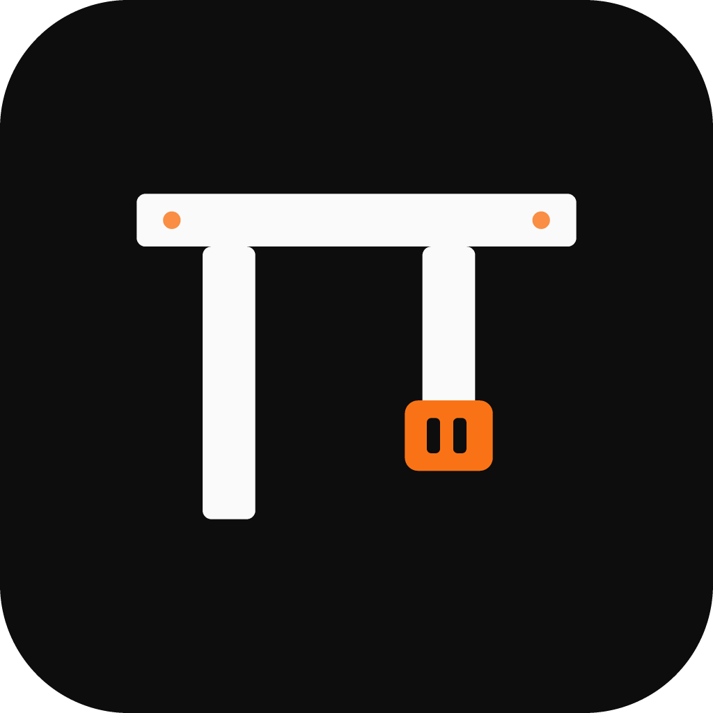
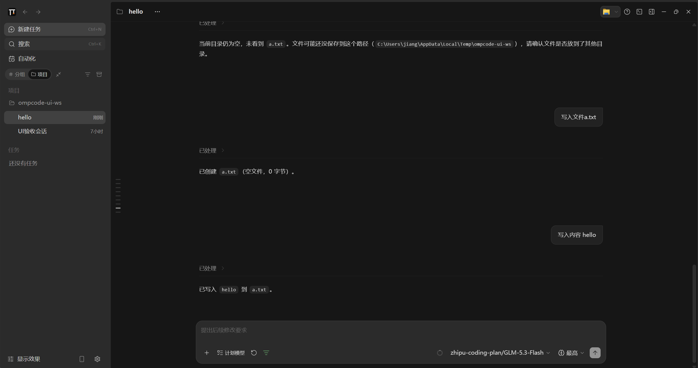
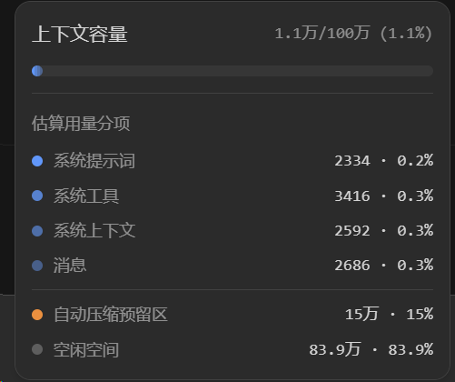
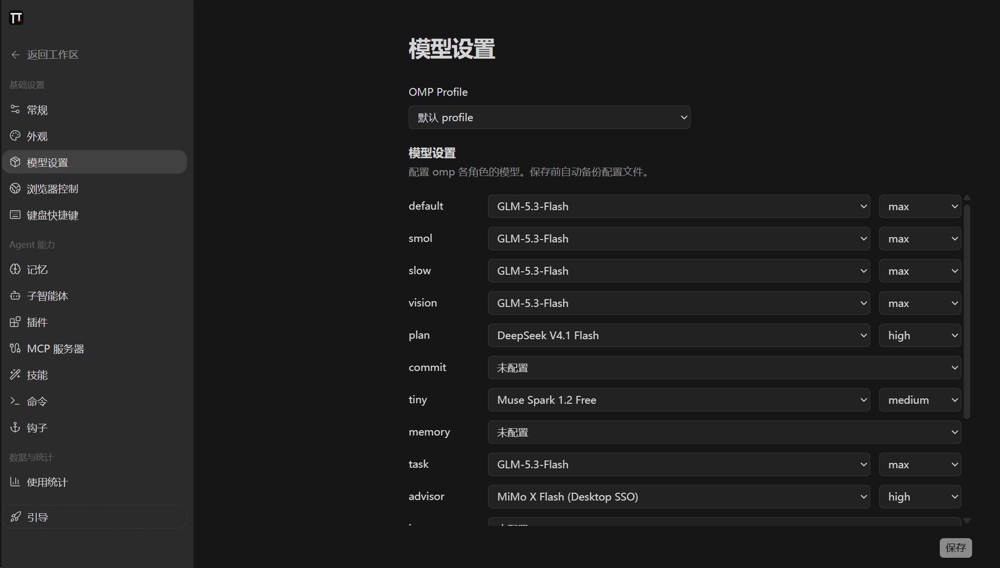
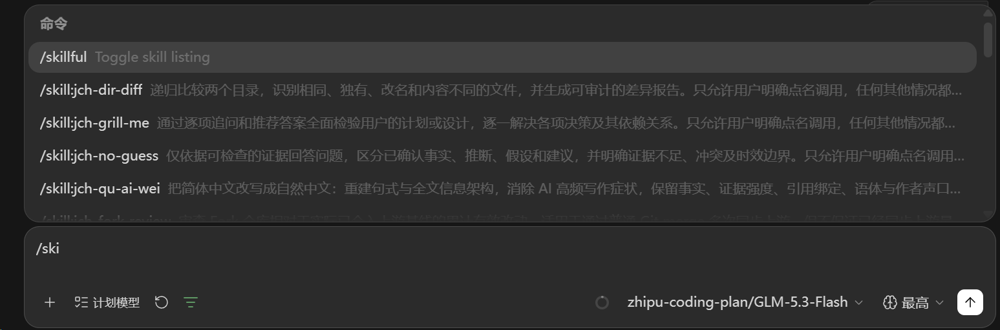

# OmpCode

<p align="center">
  
</p>

<h3 align="center">omp 最好的桌面版本</h3>

<p align="center">
  像 ChatGPT 一样顺手，拥有 ZCode 的精致界面和 omp 驱动的工作流。<br />
  OmpCode 把 omp 会话、工具、模型角色与命令发现，带进友好的图形化 AI 编程工作台。
</p>

<p align="center">
  <a href="README.md">English</a> ·
  <a href="#快速开始">快速开始</a> ·
  <a href="https://github.com/can1357/oh-my-pi/discussions/13231">omp 社区讨论</a> ·
  <a href="#项目来源">项目来源</a>
</p>

## 看看 OmpCode

**用熟悉的聊天界面，驾驭完整的 omp。** 基于 ZCode 的工作区延续 ChatGPT 式对话体验，同时清晰呈现 omp 的任务、工具调用、文件改动与会话状态。

<p align="center">
  <a href="docs/images/ompcode-workspace.png">
    
  </a>
</p>

**看清上下文。** 在输入区查看上下文容量、估算用量分项、空闲空间和自动压缩预留区。

<p align="center">
  <a href="docs/images/ompcode-context.png">
    
  </a>
</p>

**按 omp 的方式配置模型。** 选择 Profile，为不同模型角色分别设置模型和思考等级。

<p align="center">
  <a href="docs/images/ompcode-models.png">
    
  </a>
</p>

**每条 omp 斜杠命令都触手可及。** 在输入框键入 `/`，浏览并执行命令，不必离开对话。

<p align="center">
  <a href="docs/images/ompcode-commands.png">
    
  </a>
</p>

## 为什么选择 OmpCode

- **ZCode 界面，ChatGPT 式上手体验**：沿用 ZCode 的界面与视觉风格，用熟悉的对话布局呈现强大的编程工作区。
- **由 omp 驱动到底**：内嵌 omp 核心，界面围绕 omp 的会话、工具、模型与命令设计；明确能力边界见 [Fork 需求](docs/requirements/FORK.md#已知与允许的差异)。
- **所有斜杠命令**：在输入框浏览并执行完整的 omp 命令目录，包括 `/model`、`/switch`、`/compact`、`/mcp`、`/usage` 与技能命令。
- **模型由你掌控**：复用 omp Profile 与模型角色，为不同角色设置模型和思考等级，也可以在会话中临时切换。
- **清晰的工作现场**：流式回复、工具调用、文件改动、上下文用量和压缩状态，都在同一工作区里可见。
- **桌面与 Web 工作流**：可使用桌面工作区或通用 Web 客户端；专用手机远程控制已退役。

## 快速开始

准备 Git、Node.js **24.14.0** 和 pnpm **10.33.2**；版本以 [mise.toml](mise.toml) 为准。在仓库根目录运行：

```bash
pnpm bootstrap
pnpm dev:desktop
```

`pnpm bootstrap` 安装依赖、准备桌面运行资源并构建项目。桌面应用会内嵌 omp；无需单独安装 omp。应用使用 omp 的配置、模型与会话数据。

开发 Web 客户端与服务端：

```bash
pnpm dev:web
```

构建桌面应用：

```bash
pnpm bundle:desktop -- --os win --arch x64
```

更多可用命令以根目录和目标包的 `package.json` 为准。

## 手动发布

在 GitHub Actions 中从 `main` 手动运行 **Release Windows EXE** 或 **Release CentOS 7 ZIP**，两条流水线均拒绝其他 ref。Windows 只打包发布；CentOS 打包还会用内嵌 Electron 校验 SSH 握手，但二者均不运行完整测试套件。Windows 必须输入符合当前 `package.json` 版本且未使用过的标签（`v<版本>-omp.N`，例如 `v3.14.3-omp.1`）；CentOS 7 的标签可选——留空自动生成 `v<版本>-centos7-<run-id>-<run-attempt>`，也可输入任意未占用标签（不强加命名模式）。按需选择预发布。标签和资产相互独立，不修改 Windows 安装包。

CentOS 7 流水线发布 `OmpCode-<version>-centos7-x64.zip` 和对应 `.sha256` 校验文件。将二者复制到离线机器，以普通用户解压运行：

```bash
sha256sum --check OmpCode-3.14.3-centos7-x64.zip.sha256
unzip -q OmpCode-3.14.3-centos7-x64.zip -d "$HOME"
"$HOME/OmpCode-3.14.3-centos7-x64/bin/ompcode-centos7"
```

ZIP 直接在宿主 glibc 2.17 上运行 Electron 28，内含 omp、兼容的原生插件、搜索工具与中文字体。无需 root、PRoot、`ptrace`、bind mount、宿主 Node/omp 升级、安装包或网络。宿主仍需图形会话与标准桌面库；VMware CentOS 7 X11 的历史验证不代表公司 Citrix X Server 的 XKB/GLX 已验收。启动器在 HOME 下隔离 XDG 路径；正常应用启动可能注册用户级 `zcode://` 桌面入口，并非系统级安装。

**此兼容构建禁用 Chromium 沙箱。** Electron 28 与 CentOS 7 均已停止维护，只在可信工作区中使用（[Electron 平台政策](https://github.com/electron/electron#platform-support)）。

## 项目来源

OmpCode 基于 [ZCode](https://github.com/zai-org/ZCode) 开发，延续其桌面界面与视觉风格；Agent 内核替换为 [omp（oh-my-pi）](https://github.com/can1357/oh-my-pi)，通过 [omp 适配器](packages/omp-agent/)接入。感谢两个上游项目及其贡献者。

本项目采用 [Apache License 2.0](LICENSE)。第三方版权与项目声明见 [NOTICE.md](NOTICE.md)。
