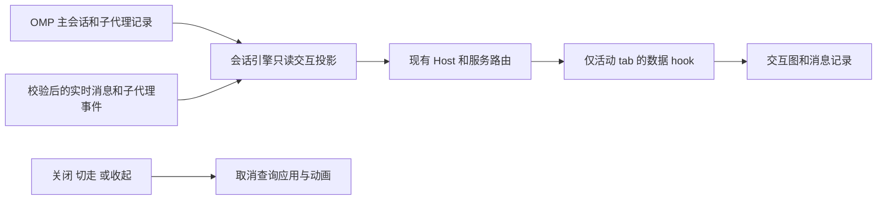

# Agent 交互观察页

本域维护 OMP 主会话及其子代理的只读交互观察页面。子代理运行、详情与控制仍由 [integrations.md](integrations.md) 和 [omp-core-integration.md](omp-core-integration.md) 维护；此页面不承载发送、停止、重跑或修改会话的动作。

## 产品规则

- 「Agent 交互」是工作区右侧独立 tab，与各子代理详情 tab 同级。主会话提供显式打开入口；未打开时不显示交互内容，不能在主对话中内嵌整张交互图。切换到其他 tab、收起侧栏或关闭 tab 后停止页面的数据查询和图形动画。
- 每个 `workspaceIdentity?.trim() || workspacePath`、`remoteSessionId` 和根会话仅有一个交互 tab；重复打开激活原 tab。根会话临时身份迁移与稳定身份绑定沿用现有会话规则，不串工作区或父会话。
- 页面观察当前根会话和可从真实记录证明归属的子代理（包括嵌套子代理）。显示 agent 身份、任务关系和有方向的消息连线；选择交互记录后联动高亮发送方、接收方和对应连线，并显示时间、正文与记录类型。
- 消息默认精简展示。固定头部保留发送方、接收方、时间依据与事件类型；任务结果正文优先从已识别的 OMP `task-result`/`output` 包装及结构化结果中抽取状态、耗时、结果/摘要、子任务结果与报告的发送数量，不直接铺开 XML、JSON、测试/跟踪标记或尾部工具提示。较长普通正文默认显示短摘要；原文通过显式「查看原文」展开完整保留。摘要仅作确定性格式提取，不调用模型、改写事实、特殊识别某次测试标记或把代理报告的数量当成真实投递回执。无法可靠提取时显示简短正文或结构化结果提示，缺失字段不补造。
- 数据包括有依据的任务派发、任务结果返回和代理通信；通信保留真实发送方、接收方、消息 ID、回复 ID、时间、正文以及可取得的投递结果。广播按实际接收者展开，不能凭名单补出未发生的投递。相同内容的不同消息不合并；同一消息在实时事件、接收记录和转发中的重复观察应幂等归并。
- `steer_subagent` 是用户干预，不能标为父 agent 通信。投递、唤醒或恢复成功不代表对方已经处理；不存在的已读/处理回执不得生成。
- 节点的当前运行状态须由实时 owner 证明；纯冷历史中的 pending/running 不能冒充当前仍在执行，显示「状态未确认」。有结构化 task/wait 终态时保留真实终态，不由根会话结束、工具文本或超时推断子代理完成，也不以冷目录陈旧的非终态覆盖明确终态。
- 无交互记录时显示空状态；查询失败显示错误与重试。真实源缺失时间、身份或历史时显示未知/部分记录，不能用恢复时刻替代发送时刻，不能把空数据伪装成完整记录。实时 IRC 的消息时间、历史条目的记录时间和未知时间明确区分：仅有条目时间时标「记录时间」，不宣称精确发送时刻。原始消息作为文本/已有安全消息组件渲染，不执行消息内容。
- 页面视觉采用当前项目引导页的主题渐变、柔和流场和节点光晕，并复用已有图形/动效能力。界面兼顾浅/深主题、国际化、窄侧栏与较多 agent；正文保持可读，不靠颜色区分方向。
- Windows 与 CentOS 7 入口和内容一致；WebGL 不可用或减少动态效果时保留同样的静态图与消息。动画只用于真实新消息/选择切换，页面不可见时停止；不使用无限流动伪造持续通信，不新增图形依赖。

## 所有权、接口与顺序

OMP 是运行与持久记录的事实源；omp-agent 会话引擎拥有交互观察投影，基于真实原始条目和已校验的实时事件归并。服务层通过现有 Host 路由提供带 workspace/root-session 归属的只读查询，UI 通过 hooks 获取，不读取会话文件、不直接调用平台桥、不建立第二份通信事实状态。

- 查询结果与事件关联使用真实身份与稳定消息/条目 ID；旧 scope、旧请求、旧进程结果不得覆盖新页面或新会话。
- 桌面 `desktop-continuous` 与 Web `web-remote-replayable` 复用同一投影，刷新与重连均从权威读面恢复。读取详情不能执行新模型轮次、启动新子代理或写入 OMP 会话。
- 冷恢复聚合根会话记录和已验证归属的子代理记录；实时转发仅存在于内存的内容如无法恢复必须明确缺口。当前 OMP 核没有统一全量持久通信日志，本需求不将转发观察视为持久完整审计，也不在本仓库另造 OMP 执行语义。
- 显式打开才查询；活动页面以只读轮询补读权威记录，并采用单飞/尾随补读；轮询周期只控制刷新频率，不能用于推断交互或判定业务终态。关闭后取消调度及过期结果应用。实现必须界定分页/读取预算并显示仍有记录或不完整状态，不能静默截断。
- 公开读面为 `IZCodeAgentService.listSessionAgentInteractions`，经现有 Host 路由调用 `session/agentInteractions`。请求包含 workspace、根 `sessionId` 和可选分页信息；响应包含 `rootSessionId`、`revision`、`agents`、`events` 与 `coverage`。每项 event 的时间缺失时保持缺失，UI 标「时间未知」；观察时间如保留，必须与发送时间区分。该读面不新增控制指令或模型执行入口。

## 验收场景

1. **入口与生命周期**：主会话未打开交互页时无图、无独立交互查询；显式打开后新 tab 与子代理详情并列；重复打开只有一项。切走、收起、关闭后无图形帧循环与新增查询，重开可恢复真实内容。
2. **任务与通信**：从真实主会话入口启动两个子代理并发生有独立标记的主→子、子→主、子→子通信。页面每条显示正确双方、时间和正文；选择记录联动正确方向和节点，两个 agent 不按到达顺序串联。
3. **幂等与身份**：重复生命周期/消息帧、重连、先 snapshot 后 live 与先 live 后历史均不增加同一消息计数；相同正文不同 ID 保留两条。不同工作区/根会话及嵌套子代理不串记录，旧 scope 的晚到请求被丢弃。
4. **冷恢复与缺失**：重启隔离桌面后从已保存会话打开交互页，能看到源中保存的任务与消息。缺文件、未持久转发、缺字段/不完整读取显式提示，不补造消息时间、收件人或回执；查看不产生模型执行。
5. **用户干预与失败**：用户对子代理发送的干预不显示成 agent 发信；真实失败保留失败事实，不显示已处理。广播仅显示有记录的实际接收者。
6. **视觉与兼容**：浅/深主题、窄面板、超过三个 agent 与长正文无覆盖或裁剪；WebGL/动效不可用仍能读完整信息。两平台入口相同，动画与会话事实解耦。
7. **验证证据**：UT 覆盖归并/身份/时间/缺失和 UI 选择模型；协议集成覆盖真实公开查询与双链路恢复；真实隔离桌面 GUI E2E 覆盖入口→OMP 通信→可见结果及冷恢复。模拟与静态检查不能替代真实 GUI；未执行的平台/核心边界明确记录。
8. **精简内容**：真实任务结果包含 `task-result` 包装、结构化结果与工具提示时，默认详情与列表只出现简明字段/摘要，包装、测试标记和原始 JSON 不直接铺开；展开原文后可核对完整内容。普通短消息保持原文，长消息可展开；未知或畸形结构不崩溃、不补造摘要含义，原文仍安全文本显示。中英文标签、发送/记录时间、选中方向与消息 ID 保持不变。

## 实现与验证状态

- 2026-10-08：实现完成。Windows 隔离桌面已用内嵌 OMP `v18.8.3+fork.300` 和主/子/嵌套 GLM-5.3-Flash 验证实时通信、独立 tab 生命周期与冷恢复；默认字段摘要/原文开合、浅深主题与窄栏布局通过真实 GUI 验证。本功能及必要前提修复的 56 项 UT/协议回归通过、0 跳过，Lint 与变更架构检查通过。全仓类型检查、OMP 合集与格式检查仍有未修改文件的既有失败；CentOS 7、独立 Web GUI 与安装包未验收。具体范围、源缺口与证据见 [验收记录](../test-reports/agent-interactions-2026-10-08.md)。
