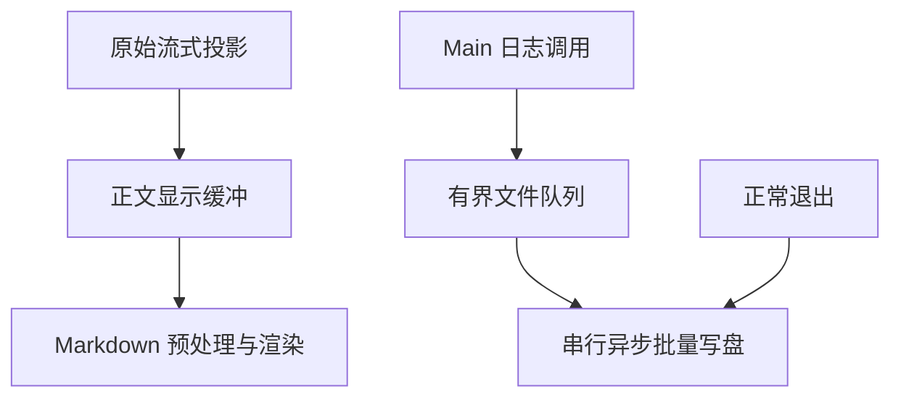

# CentOS 7 无 GPU 桌面性能

## 范围与依据

- 视觉与流式显示策略仅随 CentOS 7 发布构建启用（`__OMPCODE_CENTOS7_DESKTOP__` 构建标记）：减少动画、100ms 流式正文显示合并；Web 及 Windows 桌面构建保持原行为。该策略与 `--offline` 离线锁定相互独立，不因锁定开关改变。
- 静态证据：`MessageResponse` 原先对每次文本变化执行 citation、图片和数学文本预处理；`logger.write` 每条日志同步 mkdir/appendFile。正文 Streamdown 淡入本来已经关闭，不重复实现。
- CPU 软件绘制及共享远程 X 显示的实际收益必须在目标主机测量；本地验证不宣称等价于公司环境。

## 所有者与时序

- UI 根负责 CentOS 专用视觉策略：缩短 CSS 动画和过渡到完成态、停用背景模糊和平滑滚动；保留结束事件、布局、提示及功能。系统减少动画偏好同时供已有 JS 动画读取。
- `MessageResponse` 只缓冲展示文本，最多每 100ms 发布一次最新累计文本。首段、完成/中止、正文替换以及身份切换立即显示，取消旧定时器；卸载时取消。原会话投影、复制/保存、seq 和 Host 传输不改变。预处理和 Markdown 子树只消费缓冲后的文本。
- Main 文件日志 writer 是唯一队列所有者：同一轮连续同文件日志合并，按入队顺序串行异步落盘；目录操作也异步。时间与容量上限必须在代码中显式定义为常量并被回归测试引用（CentOS 7 分支已验证的参考值为 25ms 合批窗口与 4MiB 队列上限、不含正在写的一批；实现可调整数值，但必须保持显式与被测试覆盖）。超限的文件日志计数并在后续文件记录中报告，允许的日志同时写入 console。磁盘错误不传播至业务调用，也不触发无限重试。该异步路径为唯一写盘路径，Windows 构建同样受益；不为单一平台维护第二条同步写盘路径。
- 离线锁定模式（CentOS 7 启动器传入 `--offline`，即 `OMPCODE_CENTOS7_LOCAL_ONLY=1`）下，Main、Host 和 Renderer 应用日志仅输出 `error`：过滤发生在序列化、终端打印、跨进程转发和文件排队之前；Renderer 原先在生产包禁用的 `error` 仍需保留。连接进度与用户可见消息属于功能事件，不受日志过滤影响。未锁定时维持原级别策略。
- 正常退出在 Host 清理后及最终退出前排空日志，共用最多 1 秒总预算，不逐次累加等待；强杀、磁盘失败或超时不保证日志落盘。

## 验收

- 同一组连续增量合并后最终全文一致，发布次数减少；持续输入不能无限延期，完成/切换/卸载不遗留旧文本或计时器。
- 浏览器中验证 CentOS 构建的动画时长、结束事件、消息完成态和切换行为；Windows 构建不减少动画。
- 构建标记只影响根视觉策略与正文显示合批；未加 `--offline` 的 CentOS 7 与 Windows 使用相同 reporter、目录及状态订阅路径。已退役的 ZCode 账号恢复两平台统一关闭，不以构建标记决定是否恢复账号。
- 模拟慢磁盘时日志调用不阻塞事件循环；同文件合批、跨日/目录顺序、失败恢复、队列上限、退出 flush 均有回归测试。
- 离线锁定模式下应用日志只含 error 级别；功能事件（连接进度、用户可见消息）不受影响；未锁定时各级别正常输出。
- 在公司 CentOS 7 上继续验证滚动、打字、流式回答及退出；本地测试只报告其实际覆盖范围。

## 实现与验证状态

需求从 CentOS 7 专有分支的 spec 迁入并按单分支、`--offline` 门控决策调整范围表述；未因当前实现降低要求。统一证据边界见 [需求索引](README.md#实现与验证状态)。
