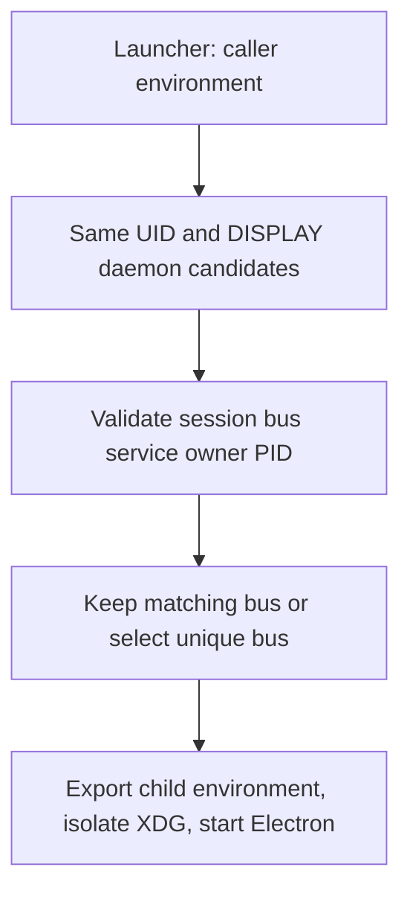

# CentOS 7 x64 release（原生 glibc 2.17 兼容包）

## 平台界面与功能边界

- CentOS 7 与 Windows 使用完全一致的前端 UI；Windows 为全功能基准，CentOS 7 不删除、不隐藏任何 UI 入口。
- CentOS 7 启动器沿用现有 `--offline` 参数作为企业离线锁定开关：传入时关闭公网更新、公网配置与遥测等后端，并透传给内嵌 omp；不传入时桌面为全功能，与 Windows 基准一致。被关闭功能的 UI 入口保留，入口触发时给出明确的禁用或失败反馈，不静默缺失。
- 与 Windows 的差异只允许存在于底层依赖与打包：Windows 运行 Electron 44.x；CentOS 7 发布流水线在构建时切换为 Electron 28.3.3 与 Node 18 兼容依赖组合（原生 glibc 2.17 资产、启动器与离线开关）。OMP 核心、协议与 UI 代码两平台同源，桌面 Main/Host/renderer 代码不得使用 Electron 44 独有 API 而缺失 Electron 28 回退。

## Product behavior

- 手动分发的 `release-centos7.yml` 从 `main` 构建唯一的 CentOS 7 x64 自包含 ZIP；不维护独立发布分支。ZIP 以原生 glibc 2.17 方案在 Linux 3.10 上运行，不需要 PRoot、Ubuntu userspace、root 权限、宿主包安装或网络，也不替换用户已安装的 omp。修改 GitHub 发布 workflow 前必须在 CentOS 7 VM 完整验证应用。
- 自包含 ZIP 及其 SHA256 校验文件是 CentOS 7 唯一分发格式。不产出或恢复任何内嵌 PRoot/Ubuntu userspace 或依赖其运行的 RPM/安装器（早期 `OmpCode-3.14.3-centos7-x64.rpm` 属已废弃的 PRoot 设计）。PRoot 仅允许作为开发/打包便利（在旧 glibc 宿主内运行 Node/pnpm），不得出现在任何分发产物或用户可见启动路径中。
- Electron 选型：Windows 基线运行 Electron 44.x；CentOS 7 构建任务在构建时把桌面依赖切换为 Electron 28.3.3 及 Node 18 兼容版本（实测 Electron 29.4.6 需 GLIBC_2.18、30.5.1 需 GLIBC_2.25，官方 28.3.3 二进制可在 glibc 2.17 上以非 root 用户打开渲染窗口）。仓库 manifest 与 lockfile 按 Windows 基线维护；版本切换只发生在 CentOS 7 构建任务内，且必须使用精确版本保证可重现。CentOS 7 构建的运行时依赖集至少包括 `undici` 精确 `6.23.0`（8.x 需 Node 20+）与 `better-sqlite3` 精确 `9.6.0`，完整清单以 CentOS 7 专有分支 lockfile 提取的 Node 18 兼容组合为准、由构建切换脚本钉住。sqlite 访问层必须双运行时可用：Windows/Electron 44（Node 22）走 `node:sqlite`，CentOS 7/Electron 28（Node 18.18）走 better-sqlite3，由同一封装模块按运行时选择驱动，任务索引、自动化与 Cookie 库的数据行为两平台等价，禁止散落的双写路径。CentOS 7 构建同时启用 `__OMPCODE_CENTOS7_DESKTOP__` 发布构建标记，供 UI 层的 CentOS 专用渲染性能策略识别（见 [centos7-performance.md](centos7-performance.md)）；该标记不得触及界面结构、入口或功能（见 [FORK.md](FORK.md)「界面统一」）。
- ZIP 包含应用、内嵌 omp、兼容的 `node-pty`、经 `ssh2` 与 Electron 内置 crypto 的 SSH、原生搜索可执行文件，以及离线启动所需的 glibc 2.17 兼容 C++/GUI 库与字体。宿主无 CJK 字体时，Linux 桌面 renderer 必须自带可再分发的简体中文字形，覆盖设置、菜单、会话正文与代码，并在 ZIP 内保留字体许可。不分发 `ssh2` 的可选 `sshcrypto.node` 加速器（Electron 28 用 OpenSSL 1.1.1，glibc-2.17 Node 20 构建器提供 OpenSSL 3 头文件，按其编译的可加载加速器在 SSH 密钥交换时失败）。不捆绑或替换 glibc；需要更高 GLIBC 符号的二进制必须在打包期失败，不得成为运行期意外。
- CentOS 7 构建任务拥有运行时选型、ELF 兼容检查、依赖版本、ZIP 布局、符号链接、权限与校验。启动器负责进程本地的库路径与私有 XDG 设置、解析安装目录、选择 omp 启动 profile 与离线模式、直接拉起内嵌 Electron。
- 应用与打包工具使用仓库 Node 24/pnpm 工具链构建；原生模块与搜索可执行文件在 glibc 2.17 x64 构建器上用钉住的 Node 20.19.0（glibc-217 构建）与 GCC 11 单独编译。Node 20 仅用于构建，不进 ZIP。原生阶段产物必须合入 `app.asar`/`app.asar.unpacked` 与 `resources/tools`，不得复制到 Electron 可执行文件旁。
- 离线锁定的激活链：启动器解析到 `--offline` 时设置 `OMPCODE_CENTOS7_LOCAL_ONLY=1` 并把 `--offline` 透传给内嵌 omp 子进程；不传时二者都不发生。桌面 Main、Host 与 renderer 读取该运行时变量执行锁定；error-only 日志过滤复用同一信号（见 [centos7-performance.md](centos7-performance.md)）。该变量的唯一设置者是 CentOS 7 启动器，Windows 不提供该锁定参数。
- 离线锁定生效时：桌面禁用互联网功能；仅内嵌 omp 可用其自身配置的企业 API 端点。内嵌浏览器可打开企业内网文档（含仅解析到私有地址的 DNS 名）。其他桌面 HTTP(S)/WebSocket 流量限制在回环。企业 SSH 工作区保持可用。不为桌面服务添加内部主机名白名单。公网配置、帮助、遥测、CDN、账号与外部浏览器流程不得运行；Main 不调度应用启动/日活遥测，Host 不启动或放行在线 bot 任务。被关闭功能的 UI 入口逐项保留：公网更新检查、公网配置/帮助/社区/反馈、账号/分享、外部浏览器拉起——一律呈禁用态并附「离线锁定中已关闭」说明；技术上无法做禁用态的操作在触发时明确报错。桌面 Main/Renderer 与 Host 拥有该策略。启动器接受 `--profile <name>` 或 `--profile=<name>`，拒绝缺失或无效的 profile 名后才启动 Electron，其余启动参数原样转发；显式启动 profile 覆盖本次运行的 App Settings profile。
- 推荐提示词只引用本地任务与内嵌图标，不需要公网站点、在线插件或下载图片。锁定模式下不调度应用启动/日活遥测、不转发远程用量与会话创建报告，Host 不启动或放行在线 bot 任务；入口与菜单项保留，触发时按上述反馈规则处理。提示词目录归 UI 所有，绝不执行网络 IO；启动器仍是桌面网络策略所有者。缺失可选视觉资源不得延迟或阻塞渲染。
- 启动器接受 `--home <absolute-dir>`，在 Electron 启动前把全部 OmpCode 持久与临时数据置于该目录之下：创建 `<absolute-dir>/.ompcode` 与 `<absolute-dir>/.omp`，把 `~/.ompcode` 与 `~/.omp` 链接到这些目录，Electron 用户/会话数据与 XDG config、data、cache、state 及临时目录都置于其下，并在其中创建应用默认/草稿工作区。`PI_CONFIG_DIR`、`ZCODE_DATA_BASE_DIR` 与 `ZCODE_DESKTOP_HOME_DIR` 同样指向其下；shell 的 `HOME` 保持不变，SSH 与其他用户环境文件不受影响。已保存的数据目录或 Settings 变更不能覆盖显式 `--home`。指向相同目标的既有链接幂等复用；已存在目录或指向其他目标的链接保留并报明确错误；选中目录内解析到其外的受管路径被拒绝。启动器绝不移动或删除既有数据。相对路径、缺失值、`--home ~`、以及位于 `~/.ompcode` 或 `~/.omp` 内的目的地被拒绝。不带 `--home` 时保持既有数据位置。
- 启动器对 `--help` 或 `-h` 打印自身用法并以成功码退出，先于包文件检查、Electron 启动与任何数据目录创建；帮助说明 `--home`、`--profile`、`--offline` 与其他桌面参数的转发。正常启动保持既有参数处理。
- Host 工具进程使用专属 stdout/stderr 管道，其日志不会继承 Citrix 或 shell 会话中的无效描述符。原始输出管道不可用（`EBADF`/`EPIPE`）时，日志继续经既有结构化消息通道输出，不终止 Host；无关写错误保持可见。发布 workflow 校验从 `main` 运行且 tag 未占用，不强加自定义 tag 命名模式；空 tag 输入自动生成 `v<app-version>-centos7-<run-id>-<run-attempt>`，提供的 tag 合法且未占用时原样使用。校验 job 把解析出的 tag 作为 job 输出发布，发布 job 精确使用该值；重跑获得不同的自动 tag。
- 面向该分发 commit 创建或更新 release 使用 workflow 默认 `GITHUB_TOKEN`（发布 job `contents: write`）。workflow 从 `main` 分发，天然满足默认 token 对 workflow 文件与默认分支一致的要求。
- 手动发布 workflow 每次全新构建 CentOS 7 原生资产，并在打包前校验必需文件与 ELF 兼容性；不缓存原生阶段、最终 ZIP 或解包后的桌面应用。组装完成的 ZIP 仍需通过完整兼容性、SSH、归档与校验和检查后才发布。
- 分支与 tag 校验通过后，Linux 桌面与 CentOS 7 原生资产在不同 GitHub runner 上并行构建；两组产物以 tar 归档经 workflow artifacts 传递以保留可执行权限与符号链接；在依赖的打包 job 中组装并校验 ZIP，仅发布该 job 校验通过的 ZIP 与 SHA256。所有 job 必须构建或打包触发 commit，而不是移动中的分支头。

## Ownership and boundaries

- Electron 的 `ELECTRON_RUN_AS_NODE` 子进程执行既有 omp 适配器；omp 在其配置目录（默认 `~/.omp`，选择 `--home` 时链接其下）保留配置、会话与凭据所有权。内嵌 omp 与用户自行安装的可执行文件保持隔离。启动路径不使用 `ptrace`、bind mount 或 `OMPCODE_CENTOS7_BIND`；工作目录是普通宿主路径。
- Electron 28 内嵌 Node 18.18.2，而应用使用更新的 Node API（含 `fs/promises.glob` 与 `node:sqlite`）。这些路径必须提供真实等价实现与兼容依赖版本，不降级用户可见功能。Electron 28 缺少 `webUtils` 与 `webContents.navigationHistory`；替代实现必须保留文件附件与浏览器历史行为，不得静默禁用。Electron 44 → 28 的 API 差异面必须维护构建期可检查的清单（已知项：`webUtils`、`webContents.navigationHistory`、`node:sqlite`、`fs/promises.glob`）；新增 Main/renderer 代码不得引入清单外仅 Electron 44 可用的 API。验收须覆盖文件拖拽附件与浏览器历史导航在 CentOS 7 包上与 Windows 行为一致。
- 无 root 解压无法安装 Chromium setuid 沙箱。启动器使用 `--no-sandbox`，这是显式安全限制，尤其配合已停止维护的 Electron/Chromium 版本；使用时应避免不可信工作区。CentOS 7 宿主可能无 GPU，启动器默认向 Electron 传递 `--disable-gpu`，同时保持软件渲染可用。仍需图形 X11/Wayland 会话；缺失 XKB/GLX 的服务器可能独立于 glibc 兼容性失败。
- 运行时库不得静默加载自构建器更新的 OS。ZIP 保留可执行权限与符号链接；重定位不得破坏启动。缺失必需资源与不兼容 ELF 依赖在分发前失败。打包阶段还在临时端口上用打包的 Electron 运行时执行回环 SSH 握手；它不替代 CentOS 7 VM 验收。

## Acceptance

### IBus session selection

- 仅 CentOS 启动器拥有输入法环境选择，先于私有 XDG 路径与 Electron 启动。X11 下选择 IBus（或无显式替代）时，只检查初始 `DISPLAY` 与调用者完全一致的当前 UID `ibus-daemon` 进程。按数据读取其 NUL 分隔的 `/proc/<pid>/environ`，绝不 source。仅本地 Unix 会话总线地址合格。
- 用命令局部 `DBUS_SESSION_BUS_ADDRESS` 以 `gdbus --session` 校验每个候选：`org.freedesktop.DBus.GetConnectionUnixProcessID(org.freedesktop.IBus)` 必须返回该守护进程 PID。每次探测限时两秒。保留已匹配且校验通过的调用者总线；否则采纳唯一校验通过的候选。歧义候选、不可读/消失进程、缺失工具与失败探测不得阻止 Electron 启动或导致猜测选择；自动对齐无法完成时告警。
- 仅向应用及其子进程导出选定的会话总线。未设置/空的 `GTK_IM_MODULE` 与 `XMODIFIERS` 默认为 IBus；保留显式替代输入法。保留显式 `IBUS_ADDRESS`；缺失时在 XDG 隔离前用原 HOME/XDG 环境与选定会话总线查询 `ibus address`（限时两秒）。保留守护进程生命周期、父 shell、其他用户与持久输入法设置。
- 回归依据：IBus 1.5.17 的 GTK 模块单独在会话总线上监视 `org.freedesktop.IBus`。可用的私有 IBus 连接、`libpinyin` 引擎与 `FocusIn`/光标通知不能证明按键处理已启用：缺少会话总线名称时 `_daemon_is_running` 保持 false，`filter_keypress` 回退为简单输入。把应用会话总线对齐守护进程后在用户主机恢复了中文输入。仅链接配置目录不能修复该状态。

- 自动化启动器回归须覆盖分裂总线修复、已正确环境、XDG 隔离前的地址发现、显式覆盖、排除其他 DISPLAY/用户、歧义会话、探测失败与无守护进程。真实 GUI 验收：从 tcsh 以错误的继承会话总线与既有同用户/同 DISPLAY IBus 守护进程启动打包启动器，在聊天输入输入 `ni` 并提交中文。公司主机手动环境修复已确认；自动启动器仍需在该环境做包级 GUI 验证。

### Package acceptance

- 在 CentOS 7 x64 VM（`glibc 2.17`、内核 `3.10.0-1160.el7.x86_64`）上，非 root 用户把 ZIP 解压到 HOME 下，不安装任何内容，启动启动器并看到 OmpCode UI。宿主无 CJK 字体时，中文设置与菜单标签及任意中文会话文本显示为字形而不是空框；英文保持可读。实测内嵌 omp 会话、集成终端与原生搜索；用打包的 `ssh2` 客户端完成 SSH 握手，并确认 `app.asar` 与 `app.asar.unpacked` 均无可选原生加密加速器。
- 以区别于已保存 App Settings profile 的命名 `--profile` 启动：内嵌 omp 收到该 profile，UI 的角色与历史读取同一命名 profile。传 `--offline` 时每个内嵌 omp 进程收到该参数，且桌面处于离线锁定：启动桌面、打开设置、显示推荐内容并使用内嵌浏览器期间追踪网络连接，Main、Renderer、Host 与调度器不连接公网；内嵌浏览器打开解析到私有 IP 的企业 DNS 名并拒绝公网 URL；仅 omp 可达其配置的企业 API；逐项检查被关功能入口（公网更新、公网配置/帮助/社区/反馈、账号/分享、外部浏览器）均为禁用态并附「离线锁定中已关闭」说明，且无对应公网请求。不传 `--offline` 时桌面为全功能，与 Windows 行为一致：内嵌浏览器可打开公网 URL、更新检查按 Windows 语义可用、应用日志输出全部级别。缺失或无效 profile 名在 Electron 启动前以明确错误退出。
- 离线 HTTP 重定向回归（无需模型）：临时回环服务返回指向公网 URL 的 302 时，Host 全局 fetch 与 undici 出口均拒绝，不能向重定向目标发起请求；普通非离线请求仍保留原重定向行为。
- 检查内嵌推荐目录与 UI 资产：每条推荐都可用本地工具运行，每个推荐图标已内嵌，没有动画来源指向公网主机。
- 以指向默认数据路径外空目录的 `--home` 启动：`.ompcode`、`.omp`、XDG、Electron 用户/会话、cache、state 与临时路径解析到目标之下；`~/.ompcode` 与 `~/.omp` 链接到对应目标目录；shell `HOME` 不变。覆盖生效期间已保存数据目录被忽略且不能在目标外修改。相同目的地的第二次启动成功且无变化。被占用的 `~/.ompcode` 或 `~/.omp`、冲突链接、逃逸的受管符号链接或无效目的地都在不替换用户数据的情况下退出。不带 `--home` 时，启动器既有 XDG 默认值与其他环境路径不变。
- 关闭或无效的 Host stdout/stderr 描述符不能把普通 RPC 日志变成未捕获异常；结构化日志仍到达 Main。发布 workflow 接受未占用的短自定义 tag（如 `v0928`）或留空时自动生成，仍拒绝复用 tag 或错误分支。自动 tag 在 workflow 重跑间不同。
- 检查每个分发可执行文件与原生插件的 GLIBC 需求 ≤ 2.17，并在宿主 `libstdc++` 缺所需符号时提供其 C++ 运行时。发布 ZIP 不含 PRoot 或 Ubuntu 根文件系统，不修改宿主 glibc 或既有 omp 安装。仅在该 VM 验收通过后，才允许调整手动 CentOS workflow 的构建方式。
- Windows 基线保护：CentOS 7 构建的版本切换不得持久改写仓库 manifest 与 lockfile（CI 工作区内的临时改写不回传仓库）；Windows 发布产物仍基于 Electron 44.x 且 `node:sqlite` 路径可用。renderer 做一次 CentOS 7 包（Chromium 120）与 Windows 的 UI 走查对比：界面结构、入口与交互一致，渲染性能策略差异除外。
- 双轨回归（无需模型）：Electron 44 的原生 File 经 `webUtils.getPathForFile` 得到本地附件路径；Electron 28 缺少该能力时才读取 `File.path`。两者都不能把空路径伪装成本地文件。慢磁盘下正常退出的所有 Main 日志排空调用共用一秒预算，不得在已超预算后重新等待无界队列。
- 公司 Citrix X Server 是独立验收环境：通过 VM 的 X11 显示不代表公司服务器的 XKB 或 GLX 能力可用。

## 实现与验证状态

需求从 CentOS 7 专有分支的权威 spec 迁入并按单分支、Electron 双轨与 `--offline` 门控决策改写；未因当前实现降低要求。既有实现及历史验证不等于本次验收；统一证据边界见 [需求索引](README.md#实现与验证状态)。
