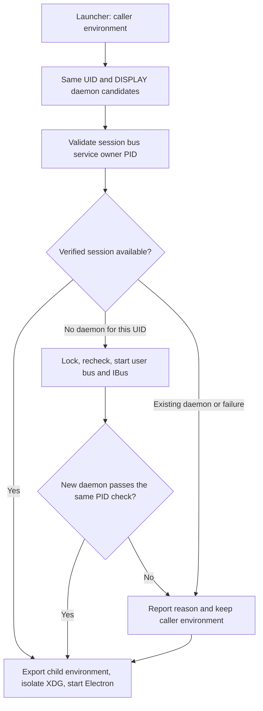

# CentOS 7 x64 release（原生 glibc 2.17 兼容包）

## 平台界面与功能边界

- CentOS 7 与 Windows 使用完全一致的前端 UI；Windows 为全功能基准，CentOS 7 不删除、不隐藏任何 UI 入口。
- CentOS 7 默认使用简体中文界面（`zh-CN`）。启动器注入 `OMPCODE_CENTOS7_DEFAULT_LOCALE=zh-CN`，设置服务仅在没有已保存语言设置时采用该默认值；菜单与 renderer 继续读取同一设置。已有中文、英文或跟随系统的选择优先，用户仍可切换语言；不改写 `LANG`、`LC_ALL`、`LANGUAGE`，不改变 Windows 默认语言规则。
- CentOS 7 启动器使用继承的 `OMP_OFFLINE` 环境变量作为企业离线锁定开关：启用时关闭公网更新、公网配置与遥测等后端，该变量原样透传给内嵌 omp；未启用时桌面为全功能，与 Windows 基准一致。被关闭功能的 UI 入口保留，入口触发时给出明确的禁用或失败反馈，不静默缺失。
- 与 Windows 的差异只允许存在于底层依赖与打包：Windows 运行 Electron 44.x；CentOS 7 发布流水线在构建时切换为 Electron 28.3.3 与 Node 18 兼容依赖组合（原生 glibc 2.17 资产、启动器与离线开关）。OMP 核心、协议与 UI 代码两平台同源，桌面 Main/Host/renderer 代码不得使用 Electron 44 独有 API 而缺失 Electron 28 回退。

## Product behavior

- 手动分发的 `release-centos7.yml` 从 `main` 构建唯一的 CentOS 7 x64 自包含 ZIP；不维护独立发布分支。ZIP 以原生 glibc 2.17 方案在 Linux 3.10 上运行，不需要 PRoot、Ubuntu userspace、root 权限、宿主包安装或网络，也不替换用户已安装的 omp。CentOS 专属自动测试及修改 workflow 前的 VM 验收前提已取消；两平台发布独立于 Windows 测试，构建期完整性约束不变。
- 自包含 ZIP 及其 SHA256 校验文件是 CentOS 7 唯一分发格式。不产出或恢复任何内嵌 PRoot/Ubuntu userspace 或依赖其运行的 RPM/安装器（早期 `OmpCode-3.14.3-centos7-x64.rpm` 属已废弃的 PRoot 设计）。PRoot 仅允许作为开发/打包便利（在旧 glibc 宿主内运行 Node/pnpm），不得出现在任何分发产物或用户可见启动路径中。
- Electron 选型：Windows 基线运行 Electron 44.x；CentOS 7 构建任务在构建时把桌面依赖切换为 Electron 28.3.3 及 Node 18 兼容版本（实测 Electron 29.4.6 需 GLIBC_2.18、30.5.1 需 GLIBC_2.25，官方 28.3.3 二进制可在 glibc 2.17 上以非 root 用户打开渲染窗口）。仓库 manifest 与 lockfile 按 Windows 基线维护；版本切换只发生在 CentOS 7 构建任务内，且必须使用精确版本保证可重现。CentOS 7 构建的运行时依赖集至少包括 `undici` 精确 `6.23.0`（8.x 需 Node 20+）与 `better-sqlite3` 精确 `9.6.0`，Node 18 兼容组合最初从原 CentOS 7 专有分支 lockfile 提取；当前精确版本清单由 `main` 中的 `scripts/prepare-centos7-build.mjs` 钉住，构建不依赖已删除的专有分支。sqlite 访问层必须双运行时可用：Windows/Electron 44（Node 22）走 `node:sqlite`，CentOS 7/Electron 28（Node 18.18）走 better-sqlite3，由同一封装模块按运行时选择驱动，任务索引、自动化与 Cookie 库的数据行为两平台等价，禁止散落的双写路径。CentOS 7 构建同时启用 `__OMPCODE_CENTOS7_DESKTOP__` 发布构建标记，供 UI 层的 CentOS 专用渲染性能策略识别（见 [centos7-performance.md](centos7-performance.md)）；该标记不得触及界面结构、入口或功能（见 [FORK.md](FORK.md)「界面统一」）。
- ZIP 包含应用、内嵌 omp、兼容的 `node-pty`、经 `ssh2` 与 Electron 内置 crypto 的 SSH、原生搜索可执行文件，以及离线启动所需的 glibc 2.17 兼容 C++/GUI 库与字体。宿主无 CJK 字体时，Linux 桌面 renderer 必须自带可再分发的简体中文字形，覆盖设置、菜单、会话正文与代码，并在 ZIP 内保留字体许可。不分发 `ssh2` 的可选 `sshcrypto.node` 加速器（Electron 28 用 OpenSSL 1.1.1，glibc-2.17 Node 20 构建器提供 OpenSSL 3 头文件，按其编译的可加载加速器在 SSH 密钥交换时失败）。不捆绑或替换 glibc；需要更高 GLIBC 符号的二进制必须在打包期失败，不得成为运行期意外。
- CentOS 7 构建任务拥有运行时选型、ELF 兼容检查、依赖版本、ZIP 布局、符号链接、权限与校验。启动器负责进程本地的库路径与私有 XDG 设置、解析安装目录、选择 omp 启动 profile 与离线模式、直接拉起内嵌 Electron。
- 应用与打包工具使用仓库 Node 24/pnpm 工具链构建；原生模块与搜索可执行文件在 glibc 2.17 x64 构建器上用钉住的 Node 20.19.0（glibc-217 构建）与 GCC 11 单独编译。Node 20 仅用于构建，不进 ZIP。原生阶段产物必须合入 `app.asar`/`app.asar.unpacked` 与 `resources/tools`，不得复制到 Electron 可执行文件旁。
- 离线锁定的激活链：启动器按 OMP 规则读取 `OMP_OFFLINE`（去除首尾空白、忽略大小写，`1`/`true`/`yes`/`on` 为启用），启用时派生 `OMPCODE_CENTOS7_LOCAL_ONLY=1`；原环境值直接传给内嵌 omp，不再注入 `--offline`。未启用时清除桌面锁定变量。桌面 Main、Host 与 renderer 读取该运行时变量执行锁定；error-only 日志过滤复用同一信号（见 [centos7-performance.md](centos7-performance.md)）。该变量的唯一设置者是 CentOS 7 启动器，Windows 不派生该桌面锁定变量；继承的 OMP 环境变量仍直接交给 omp。
- 离线锁定生效时：桌面禁用互联网功能；仅内嵌 omp 可用其自身配置的企业 API 端点。内嵌浏览器可打开企业内网文档（含仅解析到私有地址的 DNS 名）。其他桌面 HTTP(S)/WebSocket 流量限制在回环。企业 SSH 工作区保持可用。不为桌面服务添加内部主机名白名单。公网配置、帮助、遥测、CDN、账号与外部浏览器流程不得运行；Main 不调度应用启动/日活遥测，Host 不启动或放行在线 bot 任务。被关闭功能的 UI 入口逐项保留：公网更新检查、公网配置/帮助/社区/反馈、账号、外部浏览器拉起——一律呈禁用态并附「离线锁定中已关闭」说明；技术上无法做禁用态的操作在触发时明确报错。桌面 Main/Renderer 与 Host 拥有该策略。启动器接受 `--profile <name>` 或 `--profile=<name>`，拒绝缺失或无效的 profile 名后才启动 Electron，其余启动参数原样转发；显式启动 profile 覆盖本次运行的 App Settings profile。
- 推荐提示词只引用本地任务与内嵌图标，不需要公网站点、在线插件或下载图片。锁定模式下不调度应用启动/日活遥测、不转发远程用量与会话创建报告，Host 不启动或放行在线 bot 任务；入口与菜单项保留，触发时按上述反馈规则处理。提示词目录归 UI 所有，绝不执行网络 IO；启动器仍是桌面网络策略所有者。缺失可选视觉资源不得延迟或阻塞渲染。
- 取消启动器的 `--home`、`--offline` 参数；移除原 `--home` 的符号链接、目录迁移与设置锁定逻辑。OMP 数据根使用继承的环境变量，规则见 [模型与命令](models-and-commands.md#产品规则与所有权)；启动器不改写 `OMP_CONFIG_ROOT` 或 `PI_CONFIG_DIR`。OmpCode 数据目录及只读界面遵循同一 [根目录规则](models-and-commands.md#产品规则与所有权)，旧数据及符号链接不自动修改。
- 启动器对 `--help` 或 `-h` 打印自身用法并以成功码退出，先于包文件检查、Electron 启动与任何数据目录创建；帮助说明 `OMP_CONFIG_ROOT`、`OMP_OFFLINE`、`--profile` 与其他桌面参数的转发。正常启动保持既有参数处理。
- Host 工具进程使用专属 stdout/stderr 管道，其日志不会继承 Citrix 或 shell 会话中的无效描述符。原始输出管道不可用（`EBADF`/`EPIPE`）时，日志继续经既有结构化消息通道输出，不终止 Host；无关写错误保持可见。发布 workflow 的零输入与自动日期时间 Tag 规则统一见 [Fork 分发约定](FORK.md)。校验 job 把生成的 Tag 作为 job 输出发布，发布 job 精确使用该值。
- 面向该分发 commit 创建或更新 release 使用 workflow 默认 `GITHUB_TOKEN`（发布 job `contents: write`）。workflow 从 `main` 分发，天然满足默认 token 对 workflow 文件与默认分支一致的要求。
- 手动发布 workflow 每次全新构建 CentOS 7 原生资产，并在打包前校验必需文件与 ELF 兼容性；不缓存原生阶段、最终 ZIP 或解包后的桌面应用。组装完成的 ZIP 仍需通过完整兼容性、SSH、归档与校验和检查后才发布。
- 分支与 tag 校验通过后，Linux 桌面与 CentOS 7 原生资产在不同 GitHub runner 上并行构建；两组产物以 tar 归档经 workflow artifacts 传递以保留可执行权限与符号链接；在依赖的打包 job 中组装并校验 ZIP，仅发布该 job 校验通过的 ZIP 与 SHA256。所有 job 必须构建或打包触发 commit，而不是移动中的分支头。

## Ownership and boundaries

- Electron 的 `ELECTRON_RUN_AS_NODE` 子进程执行既有 omp 适配器；omp 在其配置目录（默认 `~/.omp`，可由环境重定位）保留配置、会话与凭据所有权。内嵌 omp 与用户自行安装的可执行文件保持隔离。启动路径不使用 `ptrace`、bind mount 或 `OMPCODE_CENTOS7_BIND`；工作目录是普通宿主路径。
- Electron 28 内嵌 Node 18.18.2，而应用使用更新的 Node API（含 `fs/promises.glob` 与 `node:sqlite`）。这些路径必须提供真实等价实现与兼容依赖版本，不降级用户可见功能。Electron 28 缺少 `webUtils` 与 `webContents.navigationHistory`；替代实现必须保留文件附件与浏览器历史行为，不得静默禁用。Electron 44 → 28 的 API 差异面必须维护构建期可检查的清单（已知项：`webUtils`、`webContents.navigationHistory`、`node:sqlite`、`fs/promises.glob`）；新增 Main/renderer 代码不得引入清单外仅 Electron 44 可用的 API。文件拖拽附件与浏览器历史导航在 CentOS 7 包上必须与 Windows 行为一致；该产品规则不要求 AI 执行 CentOS 测试。
- 无 root 解压无法安装 Chromium setuid 沙箱。启动器使用 `--no-sandbox`，这是显式安全限制，尤其配合已停止维护的 Electron/Chromium 版本；使用时应避免不可信工作区。CentOS 7 宿主可能无 GPU，启动器默认向 Electron 传递 `--disable-gpu`，同时保持软件渲染可用。仍需图形 X11/Wayland 会话；缺失 XKB/GLX 的服务器可能独立于 glibc 兼容性失败。
- 运行时库不得静默加载自构建器更新的 OS。ZIP 保留可执行权限与符号链接；重定位不得破坏启动。缺失必需资源与不兼容 ELF 依赖在分发前失败。打包阶段仍在临时端口上用打包的 Electron 运行时执行回环 SSH 握手；这是独立构建的产物完整性约束，不是测试门禁的 workflow 阶段，也不能证明目标宿主已验收。

## 产品标准与构建期约束

以下保留 CentOS 产品行为及包完整性标准，不是 AI 的 Linux/CentOS/WSL、VM 或 Citrix 自动测试计划。CentOS 专用 UT、启动器回归及 Linux GUI 测试已取消；共享逻辑的 Windows 适用断言保持原标准。AI 测试范围与执行权限见 [三级测试需求](test-gates.md) 与 [AGENTS.md](../../AGENTS.md#三级测试门禁)，不测试、触发、等待或验证发布 workflow。历史报告及未验证边界保留，不宣称本次 CentOS 包或目标宿主已验收。

- 在英文系统环境与无语言设置的全新数据根启动 CentOS 7 包，菜单与主界面默认简体中文；保存英文或跟随系统后重启仍保留该选择。仅有旧 `locale` 字段的设置也保留原语言。启动器不改变宿主语言环境变量，Windows 默认规则不受影响。

### IBus session selection

- 仅 CentOS 启动器拥有输入法环境选择，先于私有 XDG 路径与 Electron 启动。X11 下选择 IBus（或无显式替代）时，只检查初始 `DISPLAY` 与调用者完全一致的当前 UID `ibus-daemon` 进程。按数据读取其 NUL 分隔的 `/proc/<pid>/environ`，绝不 source。仅本地 Unix 会话总线地址合格。
- 用命令局部 `DBUS_SESSION_BUS_ADDRESS` 以 `gdbus --session` 校验每个候选：`org.freedesktop.DBus.GetConnectionUnixProcessID(org.freedesktop.IBus)` 必须返回该守护进程 PID。每次探测限时两秒。保留已匹配且校验通过的调用者总线；否则采纳唯一校验通过的候选。歧义候选、不可读/消失进程、缺失工具与失败探测不得阻止 Electron 启动或导致猜测选择；自动对齐无法完成时告警。
- 没有可验证候选时，仅在当前 UID 完全没有 `ibus-daemon` 且没有显式 `IBUS_ADDRESS` 的情况下自动启动。先以当前用户缓存目录中的 `flock` 串行化启动，再重新检查候选与进程；并发启动器复用已就绪会话。存在但无法验证的守护进程、其他 DISPLAY 的同用户守护进程、歧义或显式地址均不触发替换或第二次启动。
- 自动启动复用可连接且未注册 `org.freedesktop.IBus` 的调用者 Unix 会话总线，否则通过 `dbus-launch --close-stderr` 创建当前用户的新总线；输出按键值数据读取，不使用二进制输出拆分或 `eval`。以原 HOME/XDG 环境运行 `ibus-daemon --daemonize`，不使用 `--replace` 或 `--xim`：OmpCode 使用 GTK IBus 连接，共享 X server 的全局 XIM 不由应用接管。进程后台运行，关闭应用不主动停止它；启动锁描述符不传给后台进程。
- 启动后在五秒就绪窗口内轮询，沿用同一候选校验路径观察服务注册，每次探测仍限时两秒；只有 PID、UID、DISPLAY 与选定总线均满足条件后才接入。总线创建与启动命令分别限时三秒、五秒，锁等待限时五秒；缺失工具、锁失败、启动失败或未就绪时输出具体原因并继续启动 Electron，不改动父 shell。失败时回收本次新建总线，成功会话由用户会话持有；不停止已有守护进程、不强制设置引擎、不改写持久配置。
- 仅向应用及其子进程导出选定的会话总线。未设置/空的 `GTK_IM_MODULE` 与 `XMODIFIERS` 默认为 IBus；保留显式替代输入法。保留显式 `IBUS_ADDRESS`；缺失时在 XDG 隔离前用原 HOME/XDG 环境与选定会话总线查询 `ibus address`（限时两秒）。保留已有守护进程生命周期、父 shell、其他用户与持久输入法设置。
- 回归依据：IBus 1.5.17 的 GTK 模块单独在会话总线上监视 `org.freedesktop.IBus`。可用的私有 IBus 连接、`libpinyin` 引擎与 `FocusIn`/光标通知不能证明按键处理已启用：缺少会话总线名称时 `_daemon_is_running` 保持 false，`filter_keypress` 回退为简单输入。把应用会话总线对齐守护进程后在用户主机恢复了中文输入。仅链接配置目录不能修复该状态。

- 启动器行为仍须正确处理分裂总线、已正确环境、XDG 隔离前的地址发现、显式覆盖、其他 DISPLAY/用户、歧义会话、探测失败，以及无守护进程时的自动启动、并发启动复用、失效总线替换与启动失败清理；不再要求专属启动器自动回归或包级 Linux GUI 测试。公司主机手动环境修复曾确认中文输入恢复；另有用户的手动创建总线与启动 IBus 结果显示 PID/总线校验通过，但这些证据不证明当前自动启动代码或打包启动器在该环境已验收。

### 包完整性与运行行为

- CentOS 7 x64（`glibc 2.17`、Linux 3.10）上的非 root 用户必须能够把 ZIP 解压到 HOME 下，无需安装额外内容即可启动 OmpCode UI。宿主无 CJK 字体时，中文设置与菜单标签及任意中文会话文本应显示为字形而不是空框，英文保持可读。内嵌 omp 会话、集成终端、原生搜索与 SSH 必须可用；`app.asar` 与 `app.asar.unpacked` 均不得包含可选原生加密加速器。这些产品规则保留，但不再要求 AI 执行 VM 专项测试。
- 以区别于已保存 App Settings profile 的命名 `--profile` 启动时，内嵌 omp 接收该 profile，UI 的角色与历史读取同一命名 profile。设置 `OMP_OFFLINE=1` 时每个内嵌 omp 进程继承该变量且不接收旧 `--offline` 参数，桌面处于离线锁定：启动桌面、打开设置、显示推荐内容及使用内嵌浏览器均不得使 Main、Renderer、Host 与调度器连接公网；内嵌浏览器可打开解析到私有 IP 的企业 DNS 名并拒绝公网 URL；仅 omp 可达其配置的企业 API。被关功能入口（公网更新、公网配置/帮助/社区/反馈、账号、外部浏览器）均为禁用态并附「离线锁定中已关闭」说明，无对应公网请求。未启用 `OMP_OFFLINE` 时桌面为全功能，与 Windows 行为一致：内嵌浏览器可打开公网 URL、更新检查按 Windows 语义可用、应用日志输出全部级别。缺失或无效 profile 名在 Electron 启动前以明确错误退出。以上是产品行为标准，不要求 AI 在 Linux 包上追踪网络或执行专属 GUI 测试。
- CentOS 离线网络产品行为标准：回环服务返回指向公网 URL 的 302 时，Host 全局 fetch 与 undici 出口均拒绝，不能向重定向目标发起请求；普通非离线请求仍保留原重定向行为。这不是当前 Windows 离线测试或新增测试要求；通用网络专项已从精简测试中删除，不再声明门禁验证该边界。
- 内嵌推荐目录与 UI 资产必须满足：每条推荐都可用本地工具运行，每个推荐图标已内嵌，没有动画来源指向公网主机。
- 带 `OMP_CONFIG_ROOT` 与不同 `PI_CONFIG_DIR` 启动时二者原样进入 Electron/Host/omp，目录解析遵循根目录环境规则；启动器不创建 `~/.ompcode` 或 `~/.omp` 链接，帮助不再列出 `--home` 或 `--offline`，OmpCode 的只读数据目录界面按根目录规则展示，不再提供路径选择或保存。既有 XDG 默认值、输入法配置链接、profile 参数与 `OMP_OFFLINE` 环境门控保留。
- 关闭或无效的 Host stdout/stderr 描述符不能把普通 RPC 日志变成未捕获异常；结构化日志仍到达 Main。发布 workflow 无自定义输入项，自动生成日期时间 Tag，仍拒绝复用 Tag 或错误分支；重新运行全部 job 时生成不同 Tag。
- 每个分发可执行文件与原生插件的 GLIBC 需求必须 ≤ 2.17，宿主 `libstdc++` 缺所需符号时提供其 C++ 运行时；由独立构建的打包校验保证。发布 ZIP 不含 PRoot 或 Ubuntu 根文件系统，不修改宿主 glibc 或既有 omp 安装；不再以 VM 测试作为调整手动 CentOS workflow 构建方式的前提。
- Windows 基线保护：CentOS 7 构建的版本切换不得持久改写仓库 manifest 与 lockfile（CI 工作区内的临时改写不回传仓库）；Windows 发布产物仍基于 Electron 44.x 且 `node:sqlite` 路径可用。CentOS 7 包（Chromium 120）与 Windows 的界面结构、入口与交互保持一致，渲染性能策略差异除外；不追加跨平台 GUI 走查。
- Windows 本机共享兼容逻辑回归（无需模型）：Electron 44 的原生 File 经 `webUtils.getPathForFile` 得到本地附件路径；Electron 28 缺少该能力时才读取 `File.path`。两者都不能把空路径伪装成本地文件。慢磁盘下正常退出的所有 Main 日志排空调用共用一秒预算，不得在已超预算后重新等待无界队列；不要求在 Linux 运行专属 UT。
- 公司 Citrix X Server 的 XKB 或 GLX 能力不由历史 VM X11 结果推断；该目标环境仍未验证，已取消其专项测试前提，不把取消写成通过。

## 实现与验证状态

需求从 CentOS 7 专有分支的权威 spec 迁入并按单分支、Electron 双轨与 `OMP_OFFLINE` 环境门控决策改写；未因当前实现降低要求。既有实现及历史验证不等于本次验收；统一证据边界见 [需求索引](README.md#实现与验证状态)。

2026-10-09：启动器加入无守护进程时的用户 IBus 自动启动、启动锁与同一路径的 PID 校验，并补充中文根因注释。仅完成 Shell 语法、差异空白与架构静态检查；未执行 Linux/CentOS 启动器测试或目标主机中文输入验收，未构建或发布新包。
