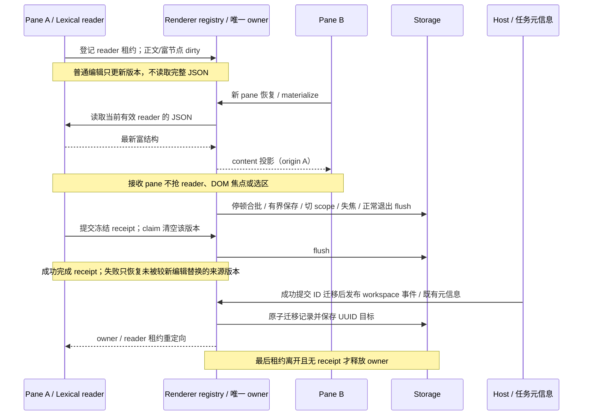

# OmpCode 桌面输入区状态与快捷操作

## 产品规则与所有权

- 电脑窗口的会话输入框沿用原有单行工具栏：附件在左，模型、思考档和发送在右；omp 默认全权限，隐藏原权限/模式选择控件。只读状态（模型、思考档、Git、上下文圆环）插在同一工具栏中，不在输入框边框外增加第二行，不重复模型或思考入口。压缩上下文按钮与自动压缩开关在工具栏和输入框下方均不出现，手动压缩只走 `/compact` 命令输入。窄电脑窗口仍显示分支名，并优先保留原有操作；其他状态可用图标/提示收起。手机布局不展示新增入口。草稿态只展示有事实源的项目。
- 模型与思考等级继续由 Composer Draft 持有下一次提交意图；原工具栏读取并展示同一选择。模型可选思考档位取自 omp `get_available_models[].thinking.efforts`，并包含 RPC 支持的 `off`；新任务初始化和手动选择模型时，草稿取该模型支持的最高思考档位。已有会话从自身投影初始化选择，用户单独选择思考档位后保留该选择。模型切换在提交时应用到当前 omp 会话，不写 omp 配置文件；首发 createSession 与后续 sendText 均下发模型和思考档，重复相同选择不重复下发。
- 输入区不展示「计划模型」或「计划模式」切换按钮，计划入口通过输入 `/plan` 使用 OMP 原生命令，规则见 [核心 rpc-ui 命令接入](omp-native-commands.md)。移除按钮专属的临时模型切换及恢复标记；历史草稿保留当前模型与思考档，忽略旧按钮的恢复标记。设置中的 plan role 配置仍按 [模型与命令](models-and-commands.md) 管理。
- 上下文总用量来自同一个 v4 snapshot 的 `usage.contextWindow`，以 omp `get_state.contextUsage` 为准；会话刚创建且 token 为 0 时可展示 0%。在空闲会话中通过同一 omp RPC 进程执行本地 `/context`，读取 `command_output` 的估算分项（系统提示词、工具、系统上下文、技能、消息、空闲空间、自动压缩预留区等），解析后随 v4 用量快照交付。原工具栏圆环与悬浮面板复用既有布局，弹层展示每项 token 数及占总容量比例，并把分项明确标为估算；不提供的项目不伪造。`/context` 输出缺失、格式不认识或与 `get_state` 容量不一致时仅显示已确认的总量；不沿用过期分项或 ZCode 套餐额度。未知容量时不显示圆环。手动压缩复用已有 v4 `compact` 命令。
- 已存在的 omp 会话在首个 conversation 订阅建立后异步启动自己的 RPC 进程并读取 `get_state`；先交付冷历史快照，状态回读后按同一订阅投影更新。每次终结的 `agent_end` 和成功压缩后回读上下文用量，避免仅保留启动时的数值。回读失败时保留未知或上次已知值，不能伪造用量。
- `/context` 仅在无活跃用户轮次时请求；进程适配器在该本地命令完成前暂缓后续输入命令，并把对应 `command_output` 从聊天文本侧信道中截走，避免把弹层读取显示成聊天消息。失败只影响分项，不阻断用户输入。每次新的 `get_state` 总量替换时清除旧分项，再读取同一会话的最新分项；仅当前进程的结果能更新投影。
- 自动压缩由 omp 会话自身管理；v4 协议面保持兼容：`autoCompactionEnabled` 仍随会话配置投影（旧快照无该字段按未知处理），`setAutoCompaction` 命令保留在协议中但无 GUI 触发入口。桌面任何位置不提供压缩/自动压缩控件；手动压缩通过输入 `/compact` 执行。
- Git 分支与改动文件数读取宿主已有的 Git summary 和 dirty count；状态行不自行调用 Git，也不复制缓存。点击打开已有 Git 审阅入口；无仓库或不可用时隐藏。
- 辅助 pane 的输入与父模型约束按 [OMP 辅助对话](omp-core-integration.md#辅助对话原生-btw唯一需求权威)；普通 Composer Draft 的模型与 `/plan` 规则不适用于 BTW。
- 会话草稿（正文与 Composer 持有的提交意图）由同一草稿所有者合批持久化：普通编辑只更新内存中的最新草稿值，不逐字符触发草稿全量重写，也不牵动会话页其余部分的快照订阅；发送、切换会话、窗口失焦与正常退出时 flush 最终值。持久化失败不丢已提交输入，草稿恢复以最后一次成功写入为准。
- Composer 仅接收展示所需的稳定投影；提交回调读取当前会话、路由、队列及配置的最新事实。草稿正文与编辑器 JSON 共用持久化调度，连续输入具有有界保存间隔；切换 scope 时先保存旧草稿，延迟回调不能写入新会话。退出保存复用既有平台生命周期，不创建另一条草稿写入路径。
- 编辑器富节点结构变化即使 Markdown 正文相同也标记同一草稿为待保存；只在实际合批保存时读取完整 JSON。保存失败后的普通编辑仍按有界窗口重试，不因超过上一次保存时限退化为逐字符重试；显式边界 flush 可以立即重试。
- 同一 renderer 内，相同 `workspaceIdentity?.trim() || workspacePath` 与 scope 的所有 pane 复用唯一内存草稿 owner 和保存调度器。编辑器 reader 以租约登记，过时的初始化或 reader 不得覆盖最新编辑。普通 dirty 信号不序列化富 JSON；恢复读取或合批保存边界只读取当前有效 reader，若 JSON/mention 实际变化则更新 owner 并以该 reader 为 origin 向其他 pane 发布最新 content。origin pane 忽略自己的投影回环，接收 pane 的程序恢复不得夺取 reader 优先级，也不得改变正在编辑的其他 pane 的 DOM 焦点或选区。新 pane 从 owner 读取尚未落盘的最新值，最后一个 pane 离开仍 flush，保存失败保留待保存值；不为每个 pane 创建独立持久化写入者。
- 提交时由同一 owner 冻结草稿版本与 scope，命令失败时只恢复仍属于该提交且未被较新编辑替换的来源草稿。用户切到其他 pane/scope 后，失败仍可恢复来源草稿，但不得调用新编辑器、清除新 pending 或覆盖较新草稿；同 scope 另一 pane 的新正文、富 JSON 与附件不被旧成功/失败回包清除，pending receipt 继续归属于原提交直到落定；重复完成/失败幂等。
- 临时会话 ID 绑定持久 UUID 时，草稿只依据 Host 成功持久化后发布的权威迁移关系迁移。迁移使用同一 owner 和一次草稿记录更新，重复事件幂等。目标有较新正文/富结构或 pending 时整份目标草稿优先，冲突来源备份保留；Storage 写入失败不删除来源。目标仅配置意图且没有目标内容/pending 时，以来源草稿的正文、富 JSON 与 mention 为基底，只覆盖目标显式标记的手动模型/思考选择及 `ompModelBaseline`、`ompModelEdited` / `ompThoughtEdited`，不丢来源内容或初始化配置以外的其他字段。无权威映射的旧记录保留，不根据标题、正文或时间猜测归属。
- 迁移监听跟随窗口的 workspace 与实际连接，不跟随当前 pane。冷恢复复用既有任务列表元信息：缓存接纳元信息后只发布带迁移关系的事实，绑定监听时读取一次已有缓存；普通任务状态更新不额外扫描全量缓存或拉取另一份任务列表。

## 状态与时序

```text
空闲会话 get_state → v4 总量投影 → omp /context 本地命令
  → command_output 由进程适配器消费并解析 → v4 分项投影 → 原上下文弹层
  → 与用户 prompt 同时到达时先完成 /context，再下发 prompt
```

Git 刷新沿用宿主现有事件和请求。



## 验收场景

1. 电脑窗口在原工具栏显示当前模型、思考等级、Git 项目当前分支及改动数；原上下文圆环可打开悬浮面板，展示 omp 总量及 `/context` 返回的实际分项、空闲空间和自动压缩预留区；分项读取失败时只保留总量，ZCode 额度不出现；手机布局不增加底栏。
2. 桌面宽窗口、窄窗口及手机输入区均不出现计划模型或计划模式切换按钮。
3. `/plan` 命令由 OMP 原生处理；移除按钮不改变模型选择、思考档或设置中的 plan role 配置。
4. 工具栏与输入框下方均不出现压缩上下文按钮和自动压缩开关；输入 `/compact` 走 OMP 原生命令并保留参数与时间线输出，omp 自动压缩仍由会话管理，上下文圆环与分项弹层不受影响。
5. Git 状态更新沿用现有宿主刷新；非 Git 工作区不显示误导信息。两种 v4 交付链路的 snapshot 解析和类型检查通过。
6. 冷会话及终结轮次刷新分项；弹层读取不产生聊天消息，读取期间用户输入按顺序下发；不同容量或前一会话的延迟结果不会污染当前快照。
7. 交互输入不依赖真实模型即可通过 extension UI 请求验收：敏感 input/editor 仅用密码框、不得进入问答草稿 store；editor 初始值完整可编辑，确认提交不得裁剪首尾空白，取消可结束整次请求。富 ask 保留多题、多选、选项 preview、推荐项及自定义回答；两个题目的文字相同也按题序分别应答。
8. 恢复含旧按钮恢复标记的草稿时，保留当前模型与思考档，不重新触发计划模型切换或恢复。
9. 在长草稿中连续输入时，草稿持久化按合批写入：以同一输入序列比较优化前后的草稿写入次数，普通按键不触发全量草稿重写，也不引起会话页时间线等其余部分的重新渲染；发送后消息内容与输入一致，切换会话再返回、窗口失焦及正常退出后草稿恢复为最后一次 flush 的值。
10. 输入期间发生流式帧、队列变更或连接路由变化后提交，仍使用最新路由与配置；长草稿连续编辑不重复序列化前后两份 EditorState，正文、提及与附件引用保持一致。覆盖清空、发送失败、相同路径不同 identity 和旧 scope 延迟回调。
11. 草稿已经保存后，仅修改同正文富节点的提及身份/元数据，再失焦或切会话，恢复 JSON 保留最新结构；Storage 持续失败期间按键仍合批，成功后恢复最新正文与 JSON。
12. 使用真实草稿 hook 在同 workspace 的 pane A 编辑后挂载同 scope 的 pane B；普通 dirty 不序列化富 JSON，materialize/合批 flush 边界将 A 的最新富结构投影到已挂载 B，新 pane 恢复读取同一最新正文与 JSON（含同 Markdown 的 mention 身份）。不得用旧初始化结构覆盖、不得让接收 pane 的程序恢复抢 reader 或其他 pane 的输入焦点/DOM 选区；持续输入及真实 mention picker 的文字顺序、候选选择仍属于用户当前编辑的 pane。切换/保存后恢复最后一次用户编辑。不同 workspace identity 或不同会话 scope 相互隔离。
13. 同 scope pane A 提交并处于 pending 时，pane B 编辑正文和富 JSON、加入附件；分别验证 A 成功与失败后保留 B 的新编辑和附件，receipt/pending 仍归属于 A 直到其回包落定。失败不得恢复 A 覆盖 B。
14. A 提交后离开，A 的命令随后拒绝或抛错，再返回 A 能恢复未被新编辑替换的原草稿；B 的正文、富 JSON、pending、附件和错误不受影响。覆盖 A→B→A、重复回包以及 A 已有新编辑时旧失败不覆盖。
15. 首次真实会话完成后发布临时 ID→UUID 迁移，继续编辑并切会话再返回、正常关闭后冷启动，以 UUID 恢复同一草稿。覆盖未挂载来源 pane、重复迁移、错误 workspace identity 与 Storage 写入失败/重试；目标仅有初始化模型/思考选择时来源正文、富 JSON、mention 与来源选择胜出。目标空正文但已标记手动模型或思考改选时，来源正文/富结构继续迁移，目标 `modelSelection`、OMP baseline 与 `ompModelEdited` / `ompThoughtEdited` 覆盖配置；目标较新内容或 pending 时整份目标草稿优先并保留来源备份。

## 实现与验证状态

需求从原有权威 FORK 与对应 spec 迁入，未因当前实现降低要求。既有实现及历史验证不等于本次验收；统一证据边界见 [需求索引](README.md#实现与验证状态)。

- 历史阶段：首次临时 ID→UUID、共享 reader 富 JSON、pending 新编辑及配置-only 冲突曾未验收；旧阶段结果保留于性能报告，不作为当前缺口或通过依据。
- 2026-10-09 续作：最新 reader JSON materialize、配置-only 迁移、跨 pane 非抢焦点回填与来源失败恢复已实现。真实 Electron 双 hook/Lexical/mention picker 组件验收通过，覆盖 pending 成功/失败、附件引用、A→B→A、窗口迁移事件及已有 query cache 晚绑定。
- 隔离真实桌面通过首次 GLM 发送、Host 临时 ID→UUID 权威元信息、旧 scope 消费者、唯一 canonical 草稿、切回与流式期间草稿保护；live/stable 比较完整 80 行及顺序，R7 正常退出后的 cold 恢复通过。项目内真实 `@` 无命中补扫、新文件选择及同 Markdown 富节点剪贴板/恢复通过。验收脚本修正了误走全局无项目入口导致写入与检索工作区错位的问题，未修改文件检索产品规则。
- 固定 Node 24.14.0 / pnpm 10.33.2，OMP 核心全集 374/374 通过、0 失败、0 跳过。真实模型使用既有 GLM 凭据与隔离数据根，不修改用户配置。完整门禁及发布结果独立记录；目标 CentOS 7 网络盘、原生 IME/操作系统原生失焦、真实 Web 产品 GUI 与真实附件上传仍不由本轮组件/桌面场景推断。证据见 [性能热路径验证](../test-reports/performance-hot-paths-2026-10-09.md#核心体验续作验收)。
