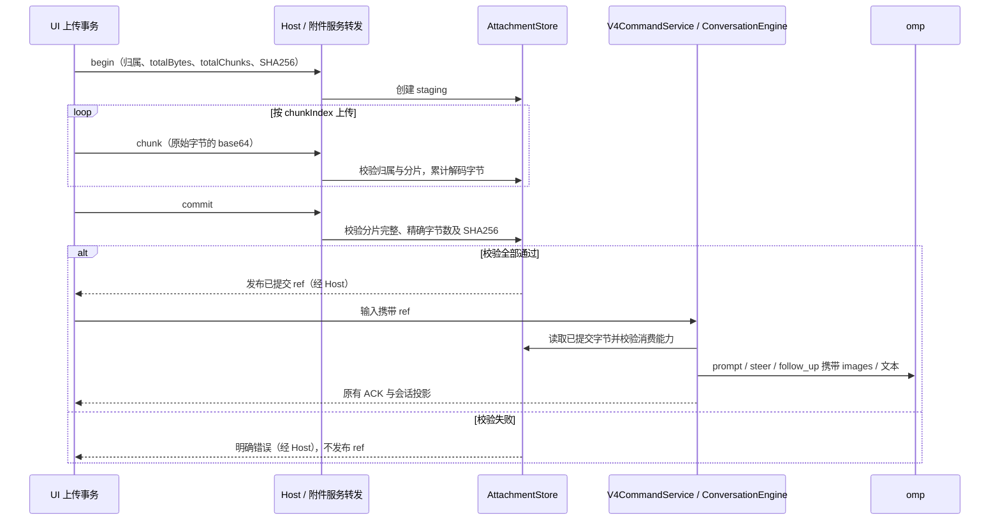

# omp 原生工具、扩展与自动化集成

## 范围与产品规则

本域保留日常 GUI 使用中已经确认的差异：子代理运行与记录、会话操作、omp 原生扩展/MCP、自动化、非图片附件，以及 GUI 验收记录的侧栏重复、上下文选择错误和数据目录文案。具体实现以 omp RPC 和当前 Fork 的 Host / v4 会话协议为边界，不重新启用上游 CLI 运行时。

### 子代理

主会话的 Agent 交互独立观察 tab（与子代理详情同级）见 [agent-interactions.md](agent-interactions.md)，本域不重复定义通信图与消息聚合规则。

- omp `task` 工具负责启动和调度子代理。GUI 显示运行中、结束和失败状态，能查看子代理记录；不得把父代理最终回复当成子代理运行证据。
- 新工具行和子代理行首次出现必须发送 `row.appended`，之后才使用 `row.upserted`；桌面实时增量和 Web 恢复快照应得到相同的行集合。
- 每个 omp 会话进程在 ready 后订阅 `subagent_lifecycle` / `subagent_progress` / `subagent_event`。适配器校验并投影同一子代理 ID 的状态；重连或冷恢复从 `get_subagents` 取快照，记录从 `get_subagent_messages` 读取。订阅失败显式降级并记录错误，不能假装没有子代理。
- omp 的 `get_subagents` 只包含当前进程内作业；完全重启后从父会话 `task`/`wait` 条目还原子代理 ID、状态，并从该会话同名子目录读取子代理 JSONL 记录。读取限制在已验证的子代理文件名和当前会话目录内。
- 冷恢复须结合父会话的结构化任务结果与已验证归属的子代理记录恢复终态：结果通过 `wait` 接收或通过后台通知自动送达，均保留已结束事实。子代理记录中最新的结构化 `yield` 结果及助手消息 `stopReason` 用于核对成功、失败和中断；之后有未结束的新执行时不得沿用此前终态。历史中的 pending/running 不能作为当前执行证明，缺少可靠终态时显示「状态未确认」，不计入运行数，不伪造成功或失败。
- `ConversationEngine` 是会话子代理投影的唯一 owner；UI 只消费已有 v4 `subagents` 与 `subagent` 行，不创建本地事实源。兼顾 `desktop-continuous` 与 `web-remote-replayable` 的 snapshot / delta 顺序。
- OMP 子代理复用 ZCode 右上角独立「智能体」状态面板、输入区计数与主对话 Agent 卡片。每个子代理按真实 ID 单独展示任务与状态，并通过带父会话归属的 `childSessionId` 打开已有只读侧栏。一个 `task` 启动多个子代理时不得按到达顺序配对或合并成一个代理；已结束后仍保留面板的目录入口和胶囊摘要，冷恢复后同样可打开详情。
- 主对话的子代理卡片保留启动轮归属。已有真实子代理行时，通过 OMP 提供的 `parentToolCallId` 替代同一父 task 的泛化卡片；没有关联依据或父工具失败时仍保留其详情，不靠名称、到达顺序或超时推断关联。
  辅助对话的所有权、历史与无工具边界只在 [OMP 辅助对话](omp-core-integration.md#辅助对话原生-btw唯一需求权威) 维护，不将 BTW 当 task 子代理或普通会话。

### GUI 验收遗留问题

- omp 会话的 `@` 文件搜索可用。ZCode 插件引用目录不由 omp 提供时，不请求 `plugins/referenceCatalog`，也不显示原始 `-32601`；文件结果和其他可用分组不受影响。

## 所有者与时序

```text
omp task / 子代理事件 → OmpProcess 校验 → ConversationEngine 权威投影
  → v4 snapshot / delta → SessionPane 原有子代理状态面板与记录入口
冷恢复 / 重连 → get_subagents + get_subagent_messages → 同一投影

omp todo 成功结果 → ConversationEngine 的同一会话投影 owner
  → 工具行 output.plan + 会话 plan → 同一 seq 的 snapshot / delta
  → 原有时间线工具详情（按显示开关）+ 独立待办面板（持续显示）
冷恢复 → 最后一条有效 todo 结果 → 同一 plan 状态

@ 输入 → MentionPlugin 能力分组 → omp 文件搜索 → 文件引用 chip
```

同一子代理的重复生命周期帧按 ID 幂等更新；旧会话事件不得覆盖新会话的投影。首次订阅、恢复和实时事件可能任意顺序到达，快照只替换对应会话的状态。失败的子代理保留结束状态和错误提示，不留永久 running。GUI 不能直接读取 omp 会话文件或调用 `window.zcode`。

## 验收场景

1. fake omp 发出子代理 start → progress → end：v4 快照和增量均含正确 running / ended，原有状态面板可见；重复事件不增加计数。
   首次行增量是 `row.appended`，从订阅快照逐条应用增量后可看到工具与子代理行。
2. 子代理在 GUI 中执行只读任务，能看到运行状态、结束结果和记录；重启恢复同一会话后仍可查看，不重复生成任务。
3. omp 未提供子代理订阅或查询时，界面显示明确不可用状态，普通聊天不受影响。
4. 身份迁移按 [会话恢复要求](session-recovery.md) 验收。
5. 项目输入 `@a.txt` 能选择文件，无 `plugins/referenceCatalog` 原始错误；ZCode 原生模式仍保留现有插件引用行为。
6. 数据目录文案按 [有效数据根与只读设置要求](models-and-commands.md#产品规则与所有权) 验收。
7. 真实 GUI 启动两个不同任务的子代理：独立智能体面板与输入区计数显示两个运行项，主对话各有 Agent 卡片；分别打开正确详情。结束后运行计数归零、已结束目录保留两项；冷恢复仍可打开同一记录。无 Git/Goal/Todo 等其他状态时，已结束目录入口仍可见。
8. OMP `todo` 的成功工具结果将完整 phases 清单投影到会话 v4 `plan`，独立待办面板持续显示任务状态与完成进度，不受「显示待办」工具行开关影响。后续更新替换同一清单；失败或畸形结果不覆盖已有清单，明确空清单清除面板。冷恢复及 Web 快照/增量恢复得到相同清单；GUI 可观察 pending → inProgress → completed，并在工具工作组折叠时仍可查看。
9. 真实主会话并行分配三个子代理，分别创建文件 a、b、c，再广播 `hello`；工具完成、最终回复、运行计数与详情记录一致。主会话完成后重新打开及重启隔离桌面，父会话的 `wait` 结果和后台自动送达结果均得到核对，不残留「工作中」或运行计数；失败、中断和记录缺失分别显示真实终态或状态未确认。三项详情和 Agent 交互页按各自需求验收，不能只以父代理最终回复证明全部通过。

## 扩展、自动化与附件边界

- Computer Use 由 OMP 原生实现和配置，OmpCode 不接入 ZCode CUA Helper、broker 或 `zcode-cua` MCP。Host 不探测其安装资源、不注入 broker 环境、不因旧 ZCode 特性开关启动 Helper；保留 OMP 自身工具配置。验收：Windows 启动会话不解析 `runtime-manifest.json`、不启动 ZCode Helper、不产生其不可用告警。

- 扩展、MCP 以 omp 的配置目录和 RPC 状态为事实源；GUI 只管理或展示 omp 原生项，不重新启用 ZCode 插件商店运行时。
- 设置中的扩展/MCP 页列出当前 omp profile 与本地项目 `.omp` 中明确配置的扩展入口和 MCP 服务器名、启用状态；不展示配置里的命令参数、环境变量或密钥。提供打开 omp 配置目录的入口，由 omp 原生配置完成管理。当前 omp RPC 无 `list_mcp_servers`，适配器 `mcp/list` 返回合法空状态快照，不伪造连接事实；设置页仍按配置目录扫描列项，连接状态标注「未提供」。扩展运行态查询同样未提供；远程项目不读取同名本地路径。
- MCP 配置发现由桌面主进程适配器持有，沿用本地 OMP discovery 的原生路径与同名优先级：当前本地项目 `.omp/mcp.json` → `.omp/.mcp.json` → 当前启动 profile 的 agent 目录 `mcp.json` → `.mcp.json`，同名服务器先出现者生效；禁用项也占据该名字，不让较低优先级同名项重新启用。两个文件都须扫描，不能只在 `mcp.json` 不存在时才读取兼容文件；不同名配置合并并保留真实来源。用户级跨来源禁用/强制启用名单仍按 OMP 语义应用，禁用名单优先。文件不存在是该来源的合法空状态，解析或读取失败显式显示配置错误而非「无配置」，其他有效来源仍可展示；不得修改配置、连接服务器或将文件存在标为已连接。
- 浏览器设置页展示 omp 内置浏览器的默认开启状态，状态是说明文字，不是可操作的开关；不查询或修改旧 ZCode Browser Use 插件，也不因不支持 `plugins/list` 而显示错误。omp 浏览器的运行与配置仍由 omp 自身负责，页面不保存另一份状态。浏览器数据导入、清理与证书策略沿用原有入口和行为，不迁移旧插件配置。验收：打开浏览器设置显示「默认开启」，不出现插件查询错误，原有浏览器数据和安全控件仍可用。
- 「钩子」页读取当前启动 profile 的 agent 目录与当前本地项目的 `.omp` 目录，桌面主进程只枚举各自 `hooks/pre`、`hooks/post` 中的 `.ts`、`.js` 文件；展示来源、阶段、文件名和路径，不读取、执行或通过 IPC 返回钩子源码。其他格式、目录及根 `hooks/` 下的文件不伪装成已发现钩子。页面使用现有原生配置快照与「打开目录」能力，不请求 ZCode `plugins/list` 或旧 Hook 存储服务；OMP 会话与实际加载状态仍由 OMP 持有，页面仅列出可发现文件，刷新重新扫描，不把存在文件标为已加载，也不提供不兼容的创建、删除、开关操作。缺少目录时显示空列表并允许打开配置根目录；远程项目不读取本机同名路径；读目录失败显示错误，不静默标为零条。验收：打开「钩子」不出现 `method not supported by omp core: plugins/list`，能看到 profile 与本地项目的 `pre`/`post` JS/TS 文件及来源；不显示其他文件、钩子源码或旧 ZCode 的新增、编辑、信任与启停控件；刷新反映新增或删除；无目录、非本地项目及目录不可读给出准确状态。
- 自动化的计划、启停与下次触发由现有调度服务持久化；触发时仍通过 Host 启动 omp 会话执行，运行与结果以该会话为事实源。不得创建第二套 Agent 运行时或将仅打开编辑表单算作执行成功。
- 定时任务表单的模型候选与最高思考档取目标工作区 `workspace-config` 中的 omp 模型目录，与聊天工具栏同源；不依赖旧 ZCode Provider Registry。创建时固定具体 `provider/model:effort`，Host 派发时按此选择启动 omp 会话。omp 全权限运行，表单不展示旧权限模式选择；编辑时保留历史未改动的模型意图。
- 自动化至少验证创建、立即运行、运行记录与暂停/恢复；单纯使保存按钮可点击不算完成。
- 自动化新任务的 Host 终态监听以创建时的临时 task ID 为键。omp 会话文件 UUID 到达后，sessions-index 在该轮结束前保持临时 ID；先发临时 ID 的终态摘要使运行记录结算，再移除临时 ID 并公布稳定 UUID。后续轮次持续使用稳定 ID，不往返切换，也不出现两条侧栏任务。
- 升级换核只清理旧 CLI 会话投影，不清空自动化计划及运行记录。已持久化的计划、启停、下次触发和历史运行必须保留；迁移失败不能冒称计划已恢复。验收：临时索引库中预置一条自动化计划、成功/失败运行和旧 CLI task，执行换核迁移后仅旧 CLI 会话投影被清理，计划与运行字段逐项保持，迁移再次运行不改变这些记录。
- 非图片附件中的 UTF-8 文本（`text/*`、JSON、XML、JavaScript、YAML）作为带文件名的文本片段并入 omp prompt；单文件上限 256 KiB，全部文本附件合计上限 512 KiB，非法 UTF-8 必须拒绝。图片仍走 omp image content。
- PDF、视频和其他 omp RPC 不能直接消费的附件在提交前明确拒绝，返回可见错误，不创建空轮次，也不把仅上传成功误报为模型已读取。附件引用不存在时同样拒绝。

### MCP 兼容发现验收

1. 临时 profile 与本地项目分别只配置 `.mcp.json` 时，设置页均列出对应服务器及正确来源/启用状态；`mcp.json` 与 `.mcp.json` 共存时不同名合并，同名按项目主文件、项目兼容文件、profile 主文件、profile 兼容文件顺序生效。覆盖同名禁用项与用户级禁用/强制启用名单，结果与当前本地 OMP discovery 一致；不存在、不可读及无效 JSON 区分准确，远程项目不扫描本机同名目录，输出不含命令参数、环境变量或密钥，连接状态仍为「未提供」。

## 工具交互与能力拒绝

- 通用工具详情（含 `wait`）默认只展示有效参数和结果，不展示空对象参数、重复工具名称或整份调试 JSON。Markdown 文本结果按 Markdown 阅读，普通文本保留换行并自动折行；完整工具数据保留在默认折叠的「查看原始数据」入口，展开时才序列化。此规则只改变 UI 展示，工具结果、状态及实时/恢复投影仍由原 owner 持有。
- 验收：展开空参数的 `wait` 时结果仅显示一份，无空参数块和重复 kind；Markdown 标题及代码段可读，窄栏普通文本不产生横向滚动；原始数据可通过键盘展开、查看、折叠，失败信息和快照完整字段加载入口保留。
- 共享参数/结果展示与 MCP 调用详情采用同一空参数规则：缺失、null、空白字符串、空对象和空数组不占用参数区域；`0`、`false` 是有效数据，必须保留。普通文本结果保留换行、自动折行，不按 JSON 高亮；对象/数组及合法 JSON 对象/数组字符串继续使用代码展示。参数、结果和错误标签随界面语言显示。计划指引在失败时优先展示可读错误，不用已提取正文遮住失败原因。
- 验收：覆盖共用组件的空参数、非空参数、零/布尔结果、JSON/非 JSON 文本、中文/英文、失败优先；MCP 空参数且无描述时没有多余调用详情，有描述或实际参数时保留详情；隔离真实组件环境验证原始数据开合、内容保留、窄栏折行与深浅主题。组件验证不代替真实模型会话及冷恢复链路验收。

- omp `confirm` 在会话交互面提供接受和拒绝按钮，并能按原请求 ID 回答。未完成交互不得显示无应答入口的遮罩。
- omp 原生 `todo` 工具沿用待办工具身份和「显示待办」设置；`task` 卡片显示实际 agent 类型及任务文本。工具 UI 只读适配器投影，不维护第二套状态。
- 「显示待办」仅控制时间线中的 todo 工具详情；右上角独立待办面板读取同一 owner 从成功结果派生的 v4 `plan`，不由 UI 从工具文本重建。实时顺序为工具结果 → 工具行与 plan 状态更新 → snapshot/delta → 原有面板；冷恢复从最后一条有效 todo 工具结果重建同一状态，不读取或修改 OMP 配置。
- 设置 MCP 页的启用状态按 omp 配置语义计算：服务器 `enabled: false` 与用户级跨来源禁用/强制启用名单均生效；不把配置存在误报成已连接。
- `confirm` 接受和拒绝均能收口；todo 默认隐藏、开启后显示清单；并发 task 可按 agent 与任务区分；不支持的反馈不出现空转操作。
- MCP profile 与项目配置中的禁用和跨来源名单显示与 omp 一致；不显示配置里的密钥或命令参数。

- 会话中隐藏 omp 无法持久化的赞/踩反馈入口，保留复制等其他回复操作。
- ZCode 插件安装/市场不可用，市场入口隐藏；旧 plugins/referenceCatalog 返回合法空目录，桌面不内嵌 ZCode 官方插件运行时与内置技能包。技能的独立需求见 [skills.md](skills.md)。
- omp 子代理的详细过程查看（见 [omp-core-integration.md](omp-core-integration.md)）：目录项提供只读子会话下钻（合成 childSessionId `omp-subagent:<id>@<parent>`，内容为经父会话进程 `get_subagent_messages` 读取的已保存记录 + 实时事件）与控制入口（停止 → `cancel_subagent`、发送消息 → `steer_subagent`，经 `session/controlSubagent` 业务入口）。backgroundWorks 中的其他旧任务仍未发起。
- 错峰任务仍不可用；自动化验收须跑通创建、立即运行、运行记录、暂停与恢复。

## 图片附件转发

### 所有权

- v4 `createSession.firstInput.attachments` 和 `sendText.attachments` 中已提交的图片附件，按输入顺序作为 omp `ImageContent`（base64 数据和 MIME 类型）随同一次输入转发。图片正文不进入 v4 command frame。
- `AttachmentStore` 是已上传字节及 MIME 类型的唯一所有者；v4 命令只按附件 ref 读取，不保存第二份附件状态。`ConversationEngine` 继续负责选择 omp `prompt`、`steer` 或 `follow_up`，三种命令都携带同一组图片。
- `AttachmentStore` 同时是 begin/chunk/commit staging 状态与完整性校验的唯一 owner；Host/服务只按公开附件接口转发，不能凭 UI 已计算 checksum 或 schema 合法省略服务端验真。begin 固定 `connectionId` / `sessionId` / `uploadId` 归属、`totalBytes`、`totalChunks`、`checksum`（`sha256:` 加 64 位小写十六进制）及 MIME/文件名，chunk 按 `chunkIndex` 接收解码后的原始字节；commit 只有在完整分片数、精确解码字节总数与原字节 SHA256 全部匹配声明后才发布 ref。字节数与摘要不按 base64 字符数、文本字符数或 MIME 内容推算；零字节上传须为零分片，并匹配空字节串的 SHA256。

### 时序与失败语义



- 上传未提交时仍由现有上传流程处理；非图片 ref 不生成 `ImageContent`。v4 命令的幂等 ACK、会话 owner、桌面 continuous 与 Web replayable 投影语义不变。
- staging 不可被附件 read 或模型输入当作已提交内容。缺片、少字节、多字节、摘要不符或上传归属不符时，commit 返回可见错误，不返回/发布 ref、不标记 committed，也不以不完整字节进入 prompt；上传事务仍可按既有 abort 清理。合法重复 chunk/commit 沿用上传幂等语义，不能重复累计字节或发布另一份 ref；相同 uploadId 的冲突内容不能借重复提交绕过校验。完整性失败不等于附件类型拒绝，两层校验都须满足，正常 UI 与直接调用公开接口采用同一边界。

### 附件验收

1. v4 `createSession` 首发和已有会话的 `sendText` 均可将已提交图片的原始字节及 MIME 类型传给 fake omp；多图按输入顺序传递。
2. 混合图片与 PDF 时整次提交明确拒绝，不创建空轮次或静默丢弃 PDF；无附件时不携带 `images` 字段。UTF-8 文本按本文件规定转发；缺失引用、非法编码及超限输入均拒绝。
3. 流式中的 `guide` 和 `queue` 输入继续分别使用 `steer` 与 `follow_up`，并携带所提交的图片。
4. **F008 / 公开上传完整性**：通过真实 begin/chunk/commit 协议上传多分片图片与 UTF-8 文本，commit 后读回的字节、MIME 及 SHA256 与 begin 声明一致，模型消费收到原字节。声明 2 字节却仅上传 1 字节（分片数齐全）、超过声明长度、缺片，以及字节数相同但 SHA256 错误分别明确拒绝，不发布可读取 ref、不标记 committed、不启动模型轮次；不能以 UI 正常不会构造该输入免除校验。
5. **F008 / 边界与幂等**：零字节/零分片配正确空串摘要可完成上传（消费类型限制不变），错误空串摘要拒绝；重复合法 chunk 不增加字节数，重复合法 commit 返回同一 ref，冲突分片/声明及跨 session/connection 提交不绕过验证。失败后 abort 清理 staging，既有已提交附件不受影响。

无附件的文本输入和 legacy 图片转发路径保持可用；不迁移历史会话或附件。已上传/可回读不等于 omp 能消费，不能据此跳过提交校验。

## 实现与验证状态

- 2026-10-09 工具详情展示：共享参数/结果、MCP 空详情及计划错误优先已实施；`fallbackToolPresentation.test.tsx` 与 `toolContentPresentation.test.tsx` 合计 7/7 通过，独立 Electron 组件验收 light/dark × 1100/360 四组通过，相关文件 Lint、格式与架构检查通过。证据目录：`C:/Users/jiang/AppData/Local/Temp/ompcode-tool-presentation-9i2IpA/`。前期组件脚本曾因语法、Vite 监听 Electron 缓存和重复测试中的开合状态失败，修正测试环境后重跑通过；不沿用失败轮次。
  本次基于 HEAD `c0873fa3733fe6208161323b4d20df96a52d74c8` 的未提交展示/测试差异，12 个变更 packages 文件按路径排序并逐项拼接路径与原始字节的 SHA256 为 `5a9fb9e9aaf14164c8f20fd6db9f8f0a4d954d537799df920984889ad6f7815c`；工具为 Node 24.20.0、pnpm 10.33.2、Electron 44.4.5。`fastcheck` 因要求 Node 24.14.0 而在执行前失败；未运行完整门禁或真实模型/冷恢复验收，不宣称整体项目通过。

需求从原有权威 FORK 与对应 spec 迁入，未因当前实现降低要求。既有实现及历史验证不等于本次验收；统一证据边界见 [需求索引](README.md#实现与验证状态)。

- 2026-10-09 核心体验续作：F004 的原生/兼容 MCP 配置发现与部分错误定向回归通过；F008 的声明长度、摘要、分片/幂等/归属拒绝与合法附件读回/转发通过公开 stdio 协议及 fake-omp 入口验证，纳入 OMP 全集 374/374、0 跳过。真实组件的附件引用与 pending 场景通过，不声称真实模型图片消费或产品上传 GUI 链路通过；具体证据及完整门禁边界见 [核心体验续作验收](../test-reports/performance-hot-paths-2026-10-09.md#核心体验续作验收)。未恢复商业账号或付费套餐。
