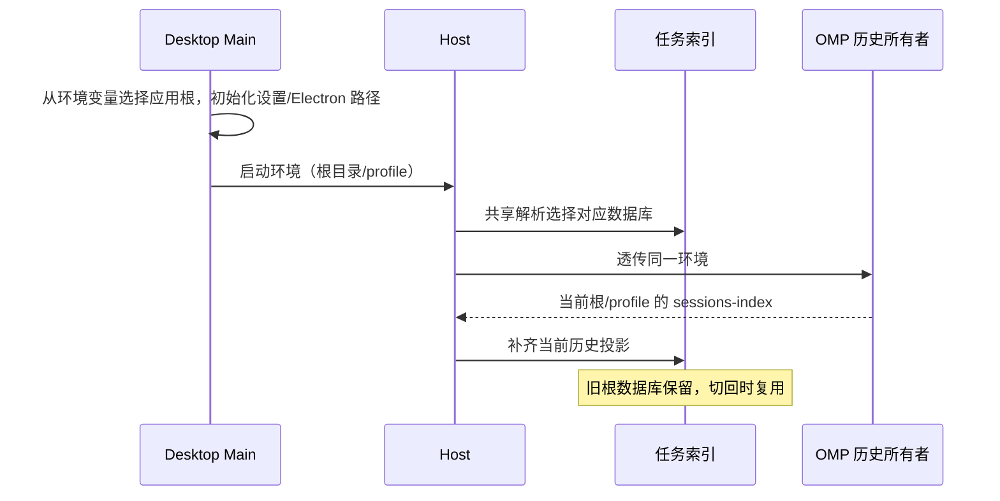

# 账号、omp Profile、模型与命令

## 产品规则与所有权

- 换核后 ZCode 账号体系整体废弃：启动登录门禁永久关闭、侧栏账号/套餐/用量 footer、命令面板登录登出、会话套餐配额横幅全部移除；凭据与模型走用户本机 omp 配置。

- omp 的模型目录是会话模型候选的事实源；`~/.omp/agent/config.yml` 中的 `modelRoles` 是角色配置事实源。Desktop Main 负责配置文件读写，UI 仅通过 `IPlatformService` 请求。模型目录更新由 workspace-config topic 推送，UI 不另建模型缓存或账号目录。
- 工作区恢复取得的 presentation 只拥有 mode 与 slash command 元数据，不得用仅含 mode 的结果覆盖 workspace-config topic 已下发的 omp 模型及思考档位目录。并发顺序无论先后，store 合并时各自保留其所有者字段；重复恢复不清空目录。
- workspace-config 的已接受快照由 Host syncer 在当前 workspace ingest 状态内保留最后一次投影；动态 UI 监听者注册时立即收到这一投影。这样初始 topic 帧早于设置页或侧栏监听时，目录不会因一次性事件丢失；runtime 换代时由新快照替换。
- 工作区首次 presentation 读取同时返回 omp 的模型目录快照，确保尚未建立 v4 background 订阅的冷启动设置页也有候选；后续更新仍由 workspace-config topic 投影。适配器复用同一个目录加载 flight 与结果，避免两个入口同时拉起目录进程。
- omp 的 `get_available_commands` 是斜杠命令目录事实源；workspace-config 与首次 presentation 返回同一命令投影。目录至少包含名字、描述、输入提示和来源，未知来源映射为自定义。命令目录加载失败时应显式记录并返回空目录，不影响模型目录。
- 本地斜杠命令的 `command_output` 投影为该轮文本；`prompt` 响应 `agentInvoked: false` 或关联 request id 的 `prompt_result: false` 必须结束轮次，即使没有 `agent_end`。晚到或无关的完成帧不能关闭后续轮次。
- `prompt_result` 仅在 `agentInvoked:false` 且属于当前本地命令时收口；agent 已启动的终态只由 `agent_end` 决定，失败和中断结果不得被后续完成帧改写。重复收口不产生状态补丁。
- Host 启动 omp 适配器不依赖旧 ZCode Provider Registry 的 provider/model 就绪门禁。适配器先启动并从 omp 读取目录，提交时才校验所选模型；omp 无可用模型时由其自身返回明确错误。
- 首屏及会话输入区不展示旧 ZCode 的“当前没有可用模型／升级／配置”横幅；旧注册表为空不能阻断 omp，真实 omp 错误仍按错误码展示。
- 更改角色时只改用户选择的 role，保留配置文件其他字段、注释与未触及的 role。写前备份，写入失败时原配置可恢复。模型名中的冒号属于模型 ID，只有目录确认的思考档位后缀才按档位解析。
- 角色选择器允许在模型支持的档位中选择思考等级。切换模型时保留新模型也支持的原等级；不支持时使用新模型的缺省等级，未设置缺省则不写档位后缀。
- omp profile 选择由 App Settings 持久化；Desktop Main 启动时读取并通过 `OMP_PROFILE` 传给 Host/内嵌 omp。默认或已有命名 profile 来自 omp 配置根目录，角色配置与历史扫描使用同一 profile 路径。保存后只标记待重启，不能热切换现有会话；待重启时角色编辑器不写旧 profile。
- 模型设置页的 profile、角色模型和思考档位选择器统一复用 ZCode 的 `Select` 组件及输入框/菜单主题，不使用系统原生下拉框；会话工具栏复用的角色编辑器及旧核回落分支采用相同样式。保持现有候选分组、键盘操作、禁用状态与保存语义。
- 当前应用环境沿 Main → Host → 适配器 → omp 传递，OMP 自身拥有配置、缓存、运行状态和浏览器 storage-state 等派生目录；应用不另建迁移机制。有效的 `OMP_CONFIG_ROOT` 优先于 `PI_CONFIG_DIR`，只接受绝对路径，支持 `~`、`~/`、`~\\` 展开；空值和相对值被忽略，再按既有 `PI_CONFIG_DIR`（相对用户主目录）或 `~/.omp` 解析。Desktop Main 的 profile 枚举、角色配置回落、原生扩展/MCP/钩子目录与适配器冷历史扫描复用共享的根/profile 解析。项目级 `.omp/` 不随该变量改变；已有数据不自动移动、复制或删除。Linux 已迁移的 XDG sessions 仍按当前 OMP 的 XDG 优先规则解析。
- 有效的 `OMP_CONFIG_ROOT=xx/bb` 同时决定 OmpCode 数据根为 `xx/bb_ompcode`，配置、日志与索引位于其 `v2` 子目录，Electron 数据位于其 `electron` 子目录，不额外嵌套 `.ompcode`。启动早期即生效并透传到 Host；旧界面数据目录设置不再生效。没有有效该变量时使用默认 `~/.ompcode`；`PI_CONFIG_DIR` 不改变 OmpCode 路径。界面只显示当前生效的数据根及环境变量修改方法，不能选择或保存目录；修改环境变量后完全退出并重新启动应用生效，不自动复制、移动或删除旧数据。
- `OMP_OFFLINE` 原样传给目录进程、会话进程与 OMP 派生进程，不转换成已取消的 `--offline`。模型可见性与解析由 OMP 唯一裁决，应用使用 OMP 返回的可用模型目录，不维护 zcode-api/company 的第二套过滤。offline 进程始终不列出或解析 zcode-api，无公司配置时也不例外；其他已配置且凭据就绪的 lane 仍由 OMP 返回，普通启动保留正常目录。
- 任务索引是 omp 会话的本地投影，必须按实际解析后的 OMP 根目录与已启动的 profile 分库；默认根目录保留现有数据库命名，自定义根目录使用独立数据库。相同有效根目录的不同环境变量写法使用同一索引；无效覆盖值遵循 OMP 的回落规则。切回原根目录/profile 时，原任务及分组、排序、置顶、归档、未读与自动化关联仍保留。Host 启动准备与所有索引 Repo 必须解析到同一路径；切换根目录不迁移或删除旧历史，不在 UI 混入其他根目录的任务。
- 设置侧栏“模型设置”始终展示全部内建 omp role 的选择器，已有配置的自定义 role 追加展示；会话工具栏“管理模型”复用同一编辑器。当前 profile 没有配置文件时显示未配置的内建角色，首次保存仅创建所选角色的 `modelRoles`，不写入空角色；两处只允许选择 omp 目录已有模型，不提供供应商或模型新增操作。该编辑器的目录与保存走 OMP RPC（目录进程 `get_model_roles`/`set_model_role`，全部可配置 role 含未配置项、逐 role 自动保存与保存中/失败/被覆盖状态），本地 YAML 读写仅作 OMP 无 v3 能力时的回落；两条路径的入口与状态语义见 [omp-core-integration.md](omp-core-integration.md)。

## 时序与失败语义

```text
用户选择 role 模型 → UI 请求 Main → Main 读取并校验当前 YAML
  → 仅修改目标 role → 备份原件 → 原子替换配置 → UI 显示结果

用户选择 profile → App Settings 持久化 → UI 提示重启
  → 下次 Main 启动读取设置 → Host/omp 继承 OMP_PROFILE
  → 会话、目录和 modelRoles 同时切换

应用环境 → Host → 适配器 → omp（数据唯一所有者）
  └→ 共享根/profile 解析 → Main 配置目录与冷历史投影
```

配置不存在时读取为空角色并显示内建角色；首次保存仅在目标文件仍不存在时原子创建最小配置，不覆盖并发创建的文件，也不制造虚假的备份。已有配置写入前保留原件备份。YAML 语法无效、`modelRoles` 类型错误或保存失败时显式报错；重复保存同一内容不创建无意义备份。



## 验收场景

1. 隔离桌面开发态不配置任何 ZCode Provider Registry，首屏不出现旧模型横幅，Host 仍启动 omp 适配器并显示其模型目录；从 omp 历史恢复会话、订阅消息；新会话选择 omp 模型，发送后流式展示、工具写文件并能再次恢复。
2. 设置侧栏“模型设置”打开后直接列出已配 role 与 omp 目录，且不出现“添加供应商”；更换含冒号模型 ID 的 role 并保存。重新打开仍显示正确模型，配置文件其他字段、注释、未触及的 role 保留，备份可恢复原件。
3. 无配置时「模型设置」仍显示全部内建 role；选择一个 role 保存后仅创建该角色的 `modelRoles` 最小 `config.yml`（原子创建、不覆盖并发创建、无虚假备份），其他 role 保持未配置。无模型目录、无效 YAML 和保存失败均有明确状态，不允许静默落入 ZCode 模型目录。
   3a. workspace-config 先于工作区恢复或反过来先到时，设置页与 composer 都持续显示 omp 模型目录；冷恢复已存在任务后仍可编辑 role。
   3b. 隔离桌面实例准备默认与命名 profile 的不同模型/角色配置及历史任务；切换 profile 保存后仍显示待重启且不改旧配置；重启后只显示目标 profile 的角色、目录与历史会话；切回默认 profile 后原任务仍可见。
   3b0. 在浅色和深色主题下打开 profile、角色模型及思考档位菜单，触发器、菜单背景、选中标记和悬停样式与 ZCode 设置页一致；键盘可选择，保存中/不可配置项不可操作。未配置、自动、目录外已配置值及缺省档位正确显示，组件内部占位值不得写入 OMP 配置。
   3b1. 设置绝对或 `~` 展开的 `OMP_CONFIG_ROOT`，同时设置指向另一目录的 `PI_CONFIG_DIR`：内嵌 omp、profile 列表、角色配置回落、原生集成目录与冷历史读取使用目标根和同一 profile；相对/空的新变量回落旧规则。默认与命名 profile 的恢复、续聊和删除作用于目标目录；项目 `.omp/` 与旧目录保留。Linux 的 XDG sessions 锚点已存在/不存在时分别与当前 OMP 路径一致。
   3b1a. 默认根目录已有稳定 UUID 历史任务时，以同一 profile 切换到空的新根目录并重启，侧栏不得显示旧任务或触发其恢复；新根目录创建的任务可恢复。切换两个自定义根目录亦保持隔离；切回原目录后，其任务组织信息仍在。显式指定默认根、`~` 展开、尾部分隔符与无效相对覆盖值按有效路径选择同一索引。
   3b1b. 设置 `OMP_CONFIG_ROOT=xx/bb` 后启动，Main/Host 的配置、日志、崩溃、索引、非项目默认工作区及 Electron 缓存均位于 `xx/bb_ompcode` 下；OMP 仍使用 `xx/bb`。旧 setting.json 的 dataBaseDir 不覆盖新根；未设置有效新变量时回到默认应用根。界面只读展示当前路径与 Windows/Linux 的环境变量修改方式，没有目录选择/保存。新根为空不导入旧设置或恢复旧任务，切回原根后仍可读取。
   3b2. `OMP_OFFLINE=1` 原样进入 OMP 且 argv 不含 `--offline`；有/无公司配置时应用模型目录均与 OMP 一致，不出现 zcode-api；未启用时使用普通目录。
   3c. fake omp 返回含内置与自定义命令的目录；工作区 presentation 与 workspace-config 均能展示这些命令，输入框输入 `/` 能补全。真实 omp 二进制也能返回合法目录。本地命令同步或延迟完成时，输出可见且会话控制恢复空闲。
   3d. 角色目录读取或自动保存尚未返回时切换工作区、关闭后重新打开编辑器；旧请求不得回写新目标的角色、待保存选择或保存状态。同一角色快速重复操作只接纳当前请求；失败时所选值保留供重试。远端旧核不支持角色 RPC 时不得回落写本机 profile。
   3e. 设置保存不同 profile 后、重启前，设置与会话工具栏两个角色编辑入口均禁止写旧 profile；模型目录和其他会话临时选择仍按当前运行 profile 保持。
   3e1. 工作区目录进程返回 `sessionModel: { model: { provider, modelId } }` 而没有会话身份时，角色目录仍通过宿主运行时校验并显示全部角色；不得凭空补入会话 ID，也不得把有效目录误报为进程暂不可用。若返回会话身份，仍严格校验其字符串类型。
   3f. 命令参数补全在光标位于词中、候选替换区间跨空格及目录更新时正确：请求携带完整单行文本与 UTF-16 光标，接受候选严格使用返回区间；越界与过期候选不可插入，旧请求不得覆盖新文本或目标。
4. 源码类型检查、lint、omp 协议 E2E 与架构检查通过；GUI E2E 使用当前源码的开发态运行，不执行安装包生成。

## 命令路由与角色覆盖

- omp 当前目录中的内置斜杠命令（如 `/model`、`/switch`、`/compact`、`/rename`、`/mcp`、`/usage`）在对话输入框可用；目录变化（`available_commands_update`）实时推送刷新补全面板；`skill:*` 命令在技能候选分组展示。
- `/rename`、`/model` 等的状态回投（`session_info_update`/`config_update`/`model_changed`）同步到会话标题与模型状态。
- UI 本地拦截让位：命令名命中 omp 目录时按 omp 语义透传执行（如 `/model`、`/switch`、`/usage`）；仅 `/compact`/`/compress` 保留本地 v4 映射（与 omp `/compact` 等价且排队/时间线集成更好）。omp ACP 目录未分发的命令（`/plan`、`/goal` 等 TUI-only 命令）不受影响，仍按 [FORK 能力边界第 5 项](FORK.md#已知与允许的差异) 处理。
- 多角色（`modelRoles`）按本文件角色配置规则在设置与会话工具栏完整适配，角色清单与 omp 内建角色（default/smol/slow/vision/plan/commit/tiny/memory/task/advisor/image/web/speech/dictation/judge）一致并随配置追加自定义角色。

技能目录与调用见 [skills.md](skills.md)；提交时的临时模型选择见 [composer.md](composer.md)；恢复、guide/queue 及文件变更事实见 [session-recovery.md](session-recovery.md)。
辅助入口 `/side` 与 `/btw` 的独立接入按 [OMP 辅助对话](omp-core-integration.md#辅助对话原生-btw唯一需求权威)，不进入普通 slash/prompt 分流；输入区取消计划切换按钮、保留 `/plan` 命令的规则见 [输入区](composer.md)。

验收还应检查：登录/套餐/配额入口全部移除；命令热更新、重命名和模型状态回投可见；命中目录的命令由 omp 执行，压缩保持既有映射；真实失败不能呈现为成功。

## 实现与验证状态

需求从原有权威 FORK 与对应 spec 迁入，未因当前实现降低要求。既有实现及历史验证不等于本次验收；统一证据边界见 [需求索引](README.md#实现与验证状态)。

- 2026-10-08：OmpCode 数据根改为由有效 `OMP_CONFIG_ROOT` 派生的 `_ompcode` 兄弟目录；移除旧设置路径启动覆盖和界面迁移动作，设置返回只读的实际路径。Electron userData/sessionData、配置、日志、索引、内部工作区、日志导出与存储管理使用该根。Node 24.19.0 原生 TypeScript 加载下，共享路径、设置读写、任务索引隔离、桌面 Electron 路径与存储根回归共 12 项通过，CentOS 启动器测试通过；lint、格式与架构检查通过。完整类型检查缺少 `@typescript/typescript-linux-x64`，未执行 Windows/CentOS 7 GUI 的完整启动、路径展示及恢复验收。
- 2026-10-08：任务索引补充有效根目录隔离，默认根沿用旧数据库；自定义根以路径摘要选择独立数据库，Host 启动准备、任务、自动化与错峰索引共用同一解析入口。Node 24.19.0 的原生 TypeScript 加载下，`ompProfileTaskIndexPath.test.ts` 4 项回归通过（含真实 SQLite 的根切换、稳定 UUID 隔离及切回保留置顶/归档/未读），lint、变更格式与架构检查通过。完整 `pnpm typecheck` 因缺少 `@typescript/typescript-linux-x64` 无法运行；tsx 入口缺少 esbuild，采用原生加载执行上述测试。Windows/CentOS 7 GUI 的历史恢复与续聊未验证，不视为完整功能验收。
- 2026-10-08：已实施 `OMP_CONFIG_ROOT` 共享路径解析、适配器到目录/会话进程的环境透传，移除启动器 `--home`、`--offline` 与旧目录迁移/锁定逻辑。配置、历史和模型目录仍由 OMP 持有；未改动 Desktop continuous 与 Web replayable 时序。已补充路径、profile、冷历史读删、进程环境与启动器回归场景。Node 24.14.0 / pnpm 10.33.2 下 lint、变更 TypeScript 格式、Shell 语法与全量架构检查通过（0 违例）。本次按用户要求不运行 UT、真实核心或 GUI E2E，功能尚未验收；`pnpm typecheck` 被原提交已存在的 `packages/desktop/src/host/index.ts:2062` logger 类型错误阻断（缺少 `debug`），不记为通过。
