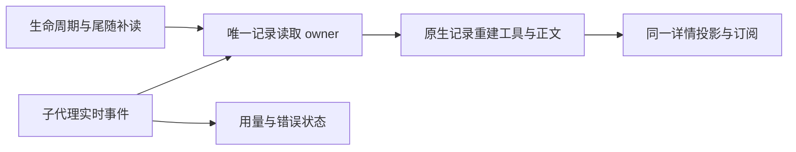
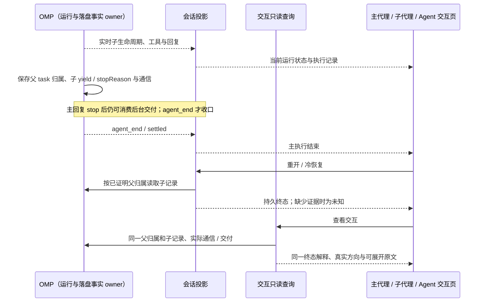
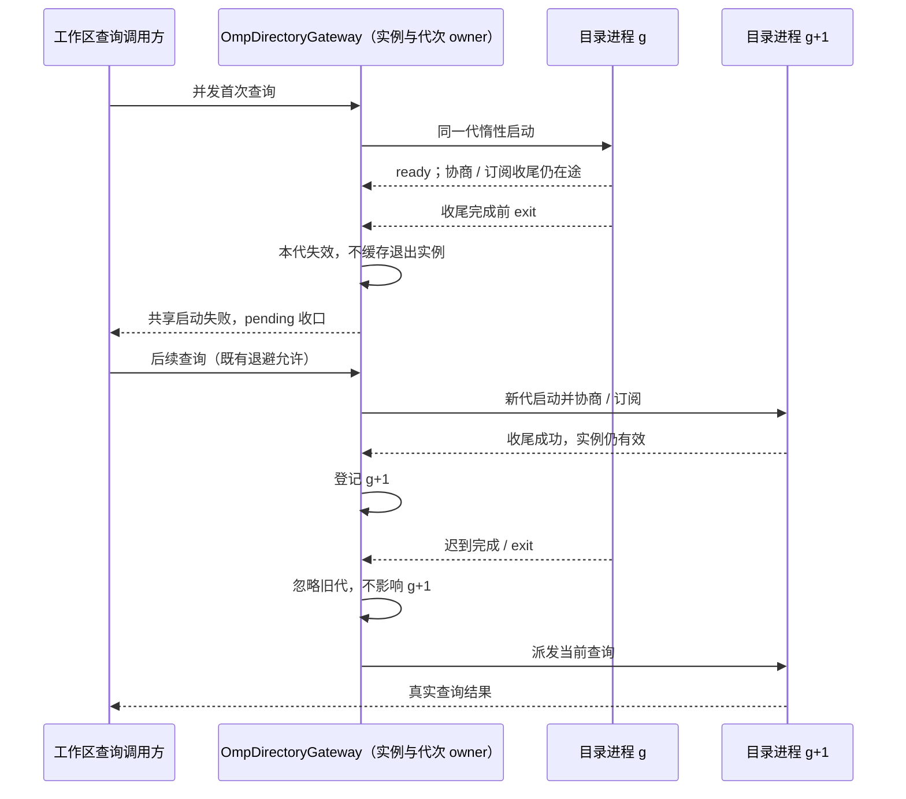
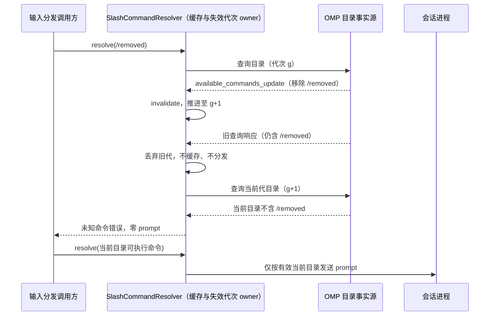

# OMP 核心接入（每会话一进程 + 目录进程 v3 能力）

本域规定 ZCode 接入 OMP RPC 核心（`omp --mode rpc-ui`）的拓扑、能力面、输入分流与降级语义。基线为 omp `v18.8.0+fork.298` 起的协议面：上游单会话 RPC + v3 fork 最小面（`commandCompletion` / `modelRoleConfig` / `sessionDirectory`）；旧「项目宿主/多会话宿主」（`--rpc-project`）已被 OMP 侧删除，本仓库不再保留对应接入层。OMP 协议需求唯一权威为其仓库 `docs-zh-CN/requirements/rpc-ui-protocol.md`，英文 `docs/rpc.md` 仅作参考；本文件只维护 ZCode 侧的接入差异。与本域相关的既有规则仍以各所属文档为准：模型与命令见 [models-and-commands.md](models-and-commands.md)，技能见 [skills.md](skills.md)，恢复见 [session-recovery.md](session-recovery.md)，子代理与集成见 [integrations.md](integrations.md)。

## 产品规则

- **进程拓扑**：每个会话一个惰性 omp 进程（`--mode rpc-ui [--resume <file>]`，cwd = workspace 根），另维护一个常驻**目录进程**（`--mode rpc-ui --no-session`）承载工作区级查询：模型/思考档位/命令目录（v1 面，任何核可用）与 v3 能力（动态补全、模型角色、会话目录）。渲染器刷新不终止任何进程（进程归 Host 侧 omp-agent 所有）；omp-agent 退出时以 stdin EOF 有序关闭。工具、终端、MCP 等必要子进程不受此约束。
- **v3 协商与能力门控**：目录进程与每个会话进程在 ready 后按 `supportedProtocolVersions` 自动协商（含 3 → v3）。v3 能力缺失（旧核）时对应功能显式报能力缺失（-32601 语义，不伪造）；目录进程启动失败/退避窗口属暂时不可用（-32000 可重试），两者必须区分。
- **会话生命周期**：创建 = 惰性每会话进程（首次发送现场启动）；恢复 = `--resume <file>` + 冷历史先行入投影；关闭 = stdin EOF 卸载进程（保留历史，会话文件由 omp 持久化）；删除 = 先结束该会话进程，再经目录进程 `delete_session`（omp 权威删除；旧核无 v3 时回落本地文件删除，仍须确认文件删除成功后才发索引移除事件）；改名 = 已加载走会话进程 `set_session_name`，冷会话走目录进程 `rename_session`（按稳定 ID）。会话 ID 身份沿用既有「临时 ID → 文件 UUID」迁移规则（见 [session-recovery.md](session-recovery.md)）。
- **斜杠输入严格分发**：以 `/` 起始的输入先按命令目录（目录进程 `get_available_commands`，v3 富目录含 `execution`/`availability` 判定）在适配层解析：目录内且 omp 可执行的命令以 `prompt` 原文发送；运行中附带原生 `streamingBehavior`，由 OMP 决定命令消费或剩余文本的排队/引导。未知命令或仅 TUI 可执行（`tui_only`/`unsupported`）明确报错，**绝不发给模型**。携带图片或文本附件的斜杠输入明确拒绝（`omp_command_attachments_unsupported`），不静默丢弃。普通运行中补充仍走 steer/follow_up；`/context` 等内部本地查询同经 prompt。本次核心命令、ACK 与迟到输出、历史投影及验收唯一见 [核心 rpc-ui 命令接入](omp-native-commands.md)。
- **交互回路**：会话进程 ready 后发送 `set_ask_dialog {enabled:true}`；此后 omp `ask` 以 `extension_ui_request{method:"ask"}` 单帧携带完整问题集（多题/多选/选项说明/preview/`recommended`），投影为 ZCode `ElicitationDialog` 富问答，「其他」自定义回答映射 `customInput`，应答经 `extension_ui_response{answers:[{id,selectedOptions,customInput}]}` 按题回传，取消整体收口；服务端超时自动按 recommended 收尾，适配器投影倒计时展示。未启用 ask 对话框（旧核）时 ask 沿用 `select`（选项）+ `editor`（自由文本，`promptStyle:true`）逐题降级路径。
- **审批形态**：工具审批由 omp extension runner 发 `extension_ui_request{method:"select"}`（选项 `Approve`/`Deny`，提示携带工具名、原因与 `formatApprovalDetails` 行），沿通用询问回路呈现与应答；六档结构化审批卡（旧 v3 `permission_request`）已随 OMP 侧删除不再提供，会话级/始终允许等持久决策由 omp 自身 approvalMode 与 `tools.approval` 配置持有。omp 审批仅在用户 omp 审批配置生效时出现；默认 yolo 无确认。超时、销毁与断连一律 fail-closed 拒绝，无静默放行。
- **extension_ui 其余方法**：`select/confirm/input/editor` 沿用通用询问回路（`sensitive` 投影密码输入，`editor` 携带 `prefill` 透传）；`notify/setStatus/setWidget/setTitle/set_editor_text/open_url` 无宿主呈现面，按取消回执不让 omp 挂起；`cancel+targetId` 立即收口等待中交互。
- **原生扩展文本输出**：`pi.sendMessage` 的 `role:"custom"`、`display:true` 消息支持标准字符串/文本块内容，经 `message_end` 显示一次，冷恢复读取对应 `custom_message`（或合法 message 包装）内容；`display:false` 不显示、也不进入供 UI 使用的派生 transcript。仅投影普通文本，不运行 TUI 自定义 renderer、不承诺其布局/图片呈现；此消息不是 assistant 模型响应，不改变模型用量、当前错误、流式锚点或主轮结算，扩展未请求 triggerTurn 时不得制造模型调用。技能注入的 `skill-prompt` 不是普通扩展正文，其 chip、原始输入及冷恢复呈现唯一按 [技能需求](skills.md) 管理，不以此通用规则展开技能全文。
- **命令与技能目录/补全**：命令目录事实源为目录进程 `get_available_commands`（v3 富目录：`inputHint` 顶层、`subcommands`、`source`、`execution`、`availability`、`revision`；v1 形状 `input:{hint}` 兼容解析），技能目录继续按其中 `source=skill` 命令投影（`skills/referenceCatalog` 语义不变）。动态补全经目录进程 `complete_command`（UTF-16 光标、替换区间、参数提示、零执行副作用）；静态名称过滤仍可在 UI 本地完成，二者合并呈现且过期结果丢弃。`available_commands_update` 事件使目录与补全缓存失效并即时推送。
- **模型两种入口分离**：会话临时切换走会话级 `set_model`，用户级角色持久配置走目录进程 `get_model_roles`/`set_model_role`；不得共用同一按钮语义。角色清单、保存状态、修订冲突、profile 与旧核回落边界唯一按 [模型与命令](models-and-commands.md) 管理，提交时的临时选择按 [输入区](composer.md) 管理。
- **子代理读面与控制接口**：运行中目录来自父会话投影（`subagent_lifecycle`/`subagent_progress` 帧 + `get_subagents` 快照对账；新核快照仅含运行中子代理）；已结束目录来自投影持久行，冷恢复从会话文件重建。详情以合成 `childSessionId`（`omp-subagent:<id>@<parentSessionId>`）订阅 `conversation/<childSessionId>`，正文、思考与工具行只从父会话进程 `get_subagent_messages` 的已保存记录重建（`fromByte`/`nextByte`/`reset` 续读）；实时 `subagent_event` 通知补读及状态更新，不另写执行记录。停止映射 `cancel_subagent`，发送消息映射 `steer_subagent`；面板与目录的用户可见规则唯一见 [子代理集成](integrations.md#子代理)，详情阅读与控制状态按下述执行页规则。
- **执行页的记录与呈现**：主会话与子代理详情按真实顺序保留任务输入、每次工具调用及结果、助手回复和后续运行，不把不同输入或唤醒后的执行合并成只剩最后一句回复。OMP 的 `irc:incoming`、`irc:relay`、`async-result` 等运行时协调消息不作为助手正文在执行页铺开；代理通信和后台结果由 Agent 交互页提供精简内容及原文。已标注为 agent 来源的 IRC steering 输入只保留可读的发送方和消息正文，不展示模型侧的等待中断/XML 包装。普通用户正文和其他可见扩展输出保持原样。`agent://` 通信、作业控制等虚拟资源写入不计入文件变更，也不生成文件 diff 或文件链接。界面初次打开定位到任务结果；用户展开执行过程或向上滚动后保持所选位置，不因同一记录的重复补读跳到后续协调消息。
- **子代理控制状态**：详情顶部的发送和停止入口只有在当前父会话 owner 能证明该子代理可控制时可用；纯冷历史或已结束记录保持只读并显示对应状态，不把可见「停止」按钮当成仍在执行的事实。控制命令仍由既有 `session/controlSubagent` 路径执行，失败不得伪报成功。
- **连通性测试与 MCP 状态**：新核无 `test_model`/`list_mcp_servers`；`provider/testModelConnectivity` 显式拒绝（-32601），`mcp/list` 返回合法空状态表，不伪造服务状态。各自能力边界见 [FORK.md](FORK.md) 与 [原生集成](integrations.md)。

## 状态所有者与接口

```text
Host（窗口级）→ omp-agent 进程（每 workspace 一个）
  ├─ OmpDirectoryGateway（唯一目录进程 --no-session；懒启动/退避/崩溃重建）
  │    ├─ v1 目录查询：get_available_models / get_available_thinking_levels / get_available_commands
  │    └─ v3 能力：complete_command / get_model_roles / set_model_role
  │                / list_sessions / rename_session / delete_session
  └─ ConversationEngine（每会话一个；惰性 OmpChildProcess --mode rpc-ui [--resume]）
       ├─ 会话命令：prompt/steer/follow_up/abort/set_model/…/cancel_subagent/steer_subagent
       ├─ 交互：set_ask_dialog → extension_ui_request（含 method:"ask"）
       └─ 投影/订阅/子代理桥（与目录进程无关）

OMP 身份 ←→ UI 地址投影：sessionId 即 omp 会话 ID；
子代理 childSessionId = `omp-subagent:<subagentId>@<parentSessionId>`（适配层地址）
```

- `OmpDirectoryGateway` 是目录进程唯一所有者；`SessionRegistry` 决定会话创建/恢复/关闭/删除并持有「会话 → 引擎」映射。`ConversationEngine` 不感知目录进程，仅通过 `OmpSessionProcess` 端口与会话进程交互。
- 公开协议方法（legacy JSON-RPC）；能力缺失、暂不可用与本地回落分别按本域及对应功能域规则处理，不伪造结果：
  - `workspace/completeOmpCommand`：text/cursor → complete_command 候选；
  - `workspace/ompModelRoles`：全部 RoleDescriptor（零会话可用）；
  - `workspace/ompSetModelRole`：roleId/scope/selection → 保存后的 role 与修订；
  - `session/controlSubagent`：subagentId/action(send_message|stop)/message → 控制结果（映射 cancel_subagent/steer_subagent，状态如实呈现）。
- omp-agent 与 OMP 的联调启动形态：`OMP_RPC_BINARY_PATH` 指向 bun 可执行、`OMP_RPC_ARGS_JSON` 携带 `["<oh-my-pi>/packages/coding-agent/src/cli.ts"]`（extraArgs 先于 `--mode rpc-ui`）；不修改 OMP 仓库。

## 辅助对话（原生 BTW，唯一需求权威）

- 现有「辅助对话」、划词提问、`/side` 与 `/btw` 共用 v4 `createSelectionSideSession` 与 `conversation/<sessionId>`。GUI 命令面板及富输入/普通文本提交均先消费这两个本地业务别名，再处理主会话配置/输入路由；原生目录的同名 `btw=tui-only` 元数据保持真实，但不得遮蔽 GUI 入口或令输入掉入主 `prompt`。无 `firstInput`（含 bare 别名）只建立空 pane，不调用模型；首次提交及带参数入口调用父进程 `btw {question}`，追问调用 `btw {question,recordId}`，不得创建普通 OMP 会话冒充辅助对话。别名输入带附件/结构化上下文明确拒绝并保留草稿，不退化为主会话发送；别名完整匹配，不拦截 `/btw-extra` 等原生命令或正文中的同名文本。
- BTW 使用父会话当前上下文（包括 streaming 回合），不使用工具，不进入主 transcript；模型固定继承父会话，辅助 pane 不提供独立模型/思考/计划切换。附件等 BTW 协议不支持的输入明确拒绝；旧核未知 BTW 命令明确报能力缺失。
- OMP 父进程与 BTW sidecar 是唯一运行/历史所有者。`OmpBtwStore` 只持有地址映射、订阅与派生投影，不持有接受队列或另写历史。空 pane 使用临时地址；首问 ACK 提供真实主题地址后，UI 原子替换 tab，保留 workspaceIdentity/remoteSessionId。父文件首次落盘时保留 live 父身份作为 UI 可见性别名，稳定父 UUID 与主题地址用于冷恢复；主 UI 不因身份绑定丢失新 tab。真实主题地址包含父会话与 recordId，可冷恢复而不依赖旧进程内映射。多父会话、多 tab 不串流。
- 核心顺序是 started `btw_record` → `btw` response（running checkpoint 已保存）→ `btw_delta` → terminal `btw_record`；接受不等于完成。适配器以真实 record 全量覆盖、delta 只追加最新 running turn；同一 stdout 分片内在 ACK continuation 前到达的 terminal 不被旧 response 回退为 running，父进程实例 fence 丢弃旧回调。完成/错误/取消/进程中断保留部分回答与真实终态。保存失败 `notice(source:btw-history)` 必须呈现，不伪报已落盘。
- 停止只发送带匹配 recordId 的 `btw_cancel`，不得 `abort` 主回合；空 pane 未发送时无停止副作用。关闭只卸载 pane/订阅，不删除历史、不停止父会话；历史入口通过 `get_btw_history` 发现所有已保存主题，关闭重开及进程重启后可恢复并追问，interrupted 不伪装 complete。
- 清洁切换不将旧普通 child 会话的副屏记忆恢复为 BTW：只移除旧 tab 元数据，不删除原会话文件；新的辅助地址与已保存主题从原生命令/sidecar 建立。
- 首问 ACK 将 draft 地址绑定为已保存主题时，侧栏实际使用的 workspace/owner scope 筛选与父身份筛选遵循同一 live 父身份别名规则；主题仍是当前父会话的可见 active tab，不能退回空标签选择器。回归须覆盖实际 scope 筛选、关闭重开及不同 workspace/父会话的隔离。

```text
UI draft/tab → v4 command（commandId 幂等）→ OmpBtwStore 派生地址/投影
                                             ↓ 父进程实例 fence
                                      OMP btw → BTW sidecar
                                      record → ACK → delta → terminal record
desktop-continuous: 同一 topic owner → 连续实时帧
web-remote-replayable: 同一 owner → 水位增量 / 缺口快照；冷启动从 get_btw_history 重建
```

验收：空入口零模型请求；参数/划词首问真实流式；同主题追问在 sidecar 的 followUps 中且主 transcript 不增长；主回合 streaming 时 BTW 正常执行；另一 tab 或父会话的停止不影响当前 BTW/主回合；complete/error/cancelled/interrupted 正确；历史入口发现全部主题并在关闭重开、Host/OMP 重启后继续；旧核能力错误、未知主题及保存失败明确显示；桌面连续与 Web 重连水位恢复均无重复发送。AI 仅在 Windows 本机以隔离真 GUI 与真实模型逐项记录验收，静态检查不替代；CentOS 产品行为仍与 Windows 一致，但专属测试已取消，不宣称已验收。

## 验收场景

1. **Z01** 同一项目 5 个会话 = 5 个会话进程 + 1 个目录进程（进程数核对）；切换选中会话不改变 OMP 会话对象；不同项目各自独立进程组。
2. **Z08** 现有输入框发送普通消息：流式回答、工具过程、停止与失败提示正确；刷新后内容可恢复且消息不重复发送。
3. **Z03** 输入 `/` 可见命令与技能的说明及补全（含 `complete_command` 动态候选与参数提示），选中后正确执行（omp 本地执行 + `command_output` 收口）；未知命令与仅 TUI 可执行命令报错、不触发模型。扩展命令标准 `pi.sendMessage` 的 display:true 字符串/文本块在 live 与冷恢复显示，display:false 隐藏；主回合 streaming 时扩展文本不关闭 assistant 响应或清除其错误/用量，不要求 TUI custom renderer。
4. **Z09/Z10** 主对话显示子代理状态卡片；点击打开只读详细过程并持续更新；已结束目录仍可打开详情；关闭重开、恢复历史父会话及重启 OMP 后可读取已保存过程与真实终态，不重新运行子代理；一个父工具的多个子代理与不同父会话不串内容。
5. **Z11/Z13** GUI 临时切模型后发送消息，显示与实际执行模型一致；磁盘 role 配置不变，其他会话不受影响；两类模型操作入口与状态清楚区分。
6. **Z12** 无配置/无账号时仍显示全部可配置 role（含未配置项与自定义项）；选定模型后自动保存无需第二次保存；重启页面和 OMP 后配置一致；保存中、失败、被覆盖、无候选状态真实。
7. **Z14** GUI 能发现并使用 ZCode 原先没有的 OMP 业务命令；详细子代理视图可展开每次工具调用及代理间通信，截断或缺失内容有明确提示。
8. **Z15/Z05** 已开放的控制操作（停止/发送消息）经 `session/controlSubagent` 业务入口执行并呈现返回状态；只读详情保持观察无副作用；渲染器刷新后宿主重建视图、进程存活；OMP 重启后读取历史，不伪造执行完成或重发副作用。
9. **Z02** 技能目录、候选、补全与实际调用准确作用于目标 OMP；设置页保持只读，现有 RPC 不提供的安装、删除与开关不能伪装可用。完整业务规则及验收唯一见 [skills.md](skills.md)。
10. **Z04** 并行会话执行、审批、问题、队列各归其会话；长操作接受不显示为已完成（沿用 session-recovery.md）。
11. **Z16** 审批以 Approve/Deny 双档询问呈现并正确应答（omp 审批配置生效时）；`ask` 富问答（多题/多选/自定义/推荐项）单帧呈现、按题应答、取消与超时收口正确。
12. **Z17** 冷会话改名（未加载）经 `rename_session` 真实生效；删除（已加载/冷）经 `delete_session` 后会话文件确已删除、索引移除；旧核回落本地文件删除路径不受影响。
13. **审查补充边界（无模型回归）**：目录首次查询必须等待协议协商结束；延迟 v3 ACK 不得永久误判为旧核。会话在 ready/状态水合中关闭后不得残留进程或复活投影，旧进程的 exit/模型回读不得影响新进程。未知/TUI-only/带附件斜杠输入被拒时，不先改变会话模型；思考档位被核心拒绝时不得报告成功。select 只回传用户实际选择的合法选项，缺失、未知及相互冲突的选择均取消，不默认 Approve；input/editor 的 GUI 结构化单题答案须无损回传。永久删除覆盖临时 ID、稳定 UUID 和尚未落盘的草稿；核心删除失败保留索引。已结束子代理在父进程重启后从受限的持久文件读到完整详情，终态最后一批记录与重写 reset 对已打开详情订阅可见，关闭详情/Host 后不留后台重读。
14. **协议与冷历史补充**：同 chunkId 的 count/byteLength 必须恒定，重复片拒绝整个序列，实收不得超过声明长度；过期命令失败不得关闭新的活跃轮。合法用户 content 字符串与 blocks 均恢复正文、标题和子代理 transcript，畸形块不打断其他记录。主 v4 与 legacy 压缩失败均不得报告 accepted。
15. **Editor/Input 衔接**：无 prefill 的 editor 仍为空的临时多行编辑器，可取消；敏感输入不进入持久草稿，按 [composer.md](./composer.md) 验收 7 记录。
16. **主/子执行页联合回归**：真实 GUI 并行创建 a、b、c 并广播 `hello`，逐一打开三个正确归属的详情；展开后每个工具 ID 与核心记录一一对应，文件写入、通信工具和最终回复均可见。切换详情、关闭重开、重复补读和冷恢复不丢记录、不串代理、不改变手动阅读位置；主会话与三项详情的终态及控制可用性一致。执行页不铺开 IRC/后台结果的模型提示包，普通正文与扩展输出不被误过滤；每项均截图核对，Agent 交互页另按其唯一需求验收。

核心五项（普通消息、技能调用+补全、内置命令+补全、子代理过程、模型双入口）必须逐项真实 GUI 操作验收并记录证据；协议类型检查或页面可打开不替代操作验收。

## 上游审查补充验收与目录所有者时序

子代理详情的正文、思考与工具行只由已读取的原生记录重建。实时子代理事件只通知补读，并更新用量/错误等状态事实，不能在详情中另起实时轮或再写同一次工具调用；收到新一轮唤醒的完整生命周期时也保持此边界。Agent 卡片和详情标签的标题以真实子代理 ID 开头，完整任务正文保留，不能被长任务或后续通信正文遮掉身份。发送回执若提供每个收件人的真实消息 ID 和发送时间，交互投影直接使用这些字段与接收记录幂等归并；旧核没有字段时继续明确保留证据边界，不以正文或记录时间冒充消息身份。



主代理的单条助手回复 `stop` 不代表整个执行结束；后台交付仍可能继续驱动模型，运行态由核心 `agent_end` / settled 事实收口。子代理持久终态遵循 OMP `yield` 契约：成功的非空字符串数组为增量，`complete: true`、无类型或字符串类型的成功交付才结束；失败的工具调用不能冒充任务终态。执行页和交互页使用同一持久终态解释，只有实时生命周期能够证明当前仍在运行。



以下仅补充既有目录崩溃重建与命令缓存失效规则，不表示本次验证已完成。

- **F006 — 启动收尾退出可重建**：目录进程已经 ready、但仍在协议协商或事件订阅收尾中退出时，本代启动不可成功缓存为可用进程；等待调用必须收到可见的暂不可用失败，挂起请求被拒绝。验收后续查询在既有退避规则允许时创建新实例，重新协商并能成功查询，不持续复用已退出实例。并发首查询共享同一代启动结果；释放/换代后，旧代迟到的启动完成或 exit 不能安装死实例、清除新登记或派发到新实例。正向对照是 ready、协商与收尾完成且实例仍有效时后续查询复用唯一目录进程。该生命周期故障属于暂不可用，不误报旧核能力缺失。



- **F014 — invalidate 代次隔离**：命令目录 owner 在 `available_commands_update` 时推进失效代次；事件前发起、事件后才返回的目录查询属于旧代，不能回填当前缓存或用于本次命令 dispatch。验收旧快照含命令 `/removed`，在查询在途时核心移除它并发送更新，再让旧查询完成：缓存与后续查询必须采用更新后目录，提交 `/removed` 明确拒绝且零 `prompt`/模型请求。新增命令在新代目录可见并正常分发；未发生 invalidate 的查询仍可正常复用缓存，不制造永久等待。动态候选继续按既有规则丢弃过期结果；不另建命令事实源。



上述工作区目录事实同时服务桌面和 Web；恢复仍遵循 [会话恢复](session-recovery.md#上游审查补充验收与所有者时序) 的 `desktop-continuous` / `web-remote-replayable` 区分。F010/F018 的取消 ACK 与同文队列、F016 的创建身份、F001/F019/F027 的连接与预算边界唯一维护在该文件，不在此重定义。

## 实现与验证状态

- 辅助对话是本 Fork 的 GUI 接入需求，OMP 自身 rpc-ui 需求文档不承诺独立 BTW GUI，不将其当上游等价产品声明。2026-10-08 的 Windows 打包版提交 `ca04952` 已验证 bare `/btw` 空 pane、首问/追问、关闭重开与进程冷恢复，包含 live parent ID 与稳定 task UUID 分离场景；具体版本及边界见 [修复后验收](../test-reports/acceptance-2026-10-08.md)。该历史结果不代表当前工作树或全部 BTW 场景通过；完整交互、Web replayable 重连与 CentOS 7 真实模型 GUI 仍未验收。
- 2026-10-07 需求重写与实施完成（适配 omp v18.8.0+fork.298 RPC 大改，实测核对安装二进制）：OMP 侧删除项目宿主（`--rpc-project` unknown flag）、旧 v3 fork 面（`permission_request`/`ask_request`/`ask_pause`/`test_model`/`list_mcp_servers`/`execute_command`/项目级子代理目录），收敛为 v3 三组能力（`commandCompletion`/`modelRoleConfig`/`sessionDirectory`）。ZCode 侧对应重写：删除项目模式层（ompProjectProcess/ompProjectReadyGate/ompProjectChannel/ompProjectGateway/projectSessionLifecycle 项目分支），新增目录进程网关（`adapters/ompDirectoryGateway.ts`，`--mode rpc-ui --no-session` 常驻 + v3 三态：available/unsupported/unavailable）；斜杠严格分发改适配层本地判定（`app/slashCommandResolver.ts` 目录缓存 + unknown 复核，未知命令 `omp_command_unknown`、tui_only `omp_command_tui_only`，绝不发给模型——实测证实新核会把未知 `/xxx` 当普通文本送入模型）；会话进程 ready 后 `set_ask_dialog` 启用富 ask（`extension_ui_request{method:"ask"}` 单帧问题集 → `answers` 按题回传）；审批降级为 extension runner 的 select(Approve/Deny) 通用询问；子代理控制改 `cancel_subagent`/`steer_subagent`、详情续读改父会话进程 `get_subagent_messages`（fromByte/nextByte，无 hasMore/recordTooLarge——上游游标单调推进即读尽）；冷会话改名/删除走目录进程 `rename_session`/`delete_session`（先结束承载进程再删，旧核回落本地文件路径）；`provider/testModelConnectivity` 与 `mcp/list` 按能力缺失/空状态表收口。
- 自动化验证（2026-10-07 实际执行，均通过）：`pnpm --filter @zcode/omp-agent test` 217 项 0 失败 0 跳过（含 fake-omp 协议级 E2E 30 项：严格分发/审批两档/富 ask answers/snooze 无协议帧/能力缺失语义；真实内嵌核 E2E 3 项实际执行——流式→write 工具→审批→文件落盘→完成、本地命令收口+临时模型切换（`zhipu-coding-plan/glm-5.3-flash`）、v3 目录能力（complete_command 补全候选/get_model_roles role 目录/能力缺失语义），内嵌二进制取本地安装的 `omp/18.8.0+fork.298`（`OMP_RELEASE_BINARY_PATH` 注入，与 oh-my-pi 源码 HEAD 同日构建）；`pnpm typecheck`、`pnpm lint`（0w0e）、`pnpm fmt:check`、`pnpm architecture:check --changed`（0 违例）。连带面：`packages/ui/test/ompModelRolesFallback.test.ts` 7 项、`packages/services/test/workspaceConfigEvents.test.ts` 1 项通过。
- 未验证范围（如实记录）：GUI 真实操作验收（Z01—Z17 的桌面链路）未执行——本轮为协议适配与自动化验证闭环，GUI 走查待后续按本文件验收场景补足；CentOS 7 侧（WSL）链路未跑。测试基建已知限制：adapter e2e 的行池按 rowId 合并多会话行，双会话断言需独立 harness（取消路径用例已拆分）。
- 历史实现与验证记录（项目模式时期，协议面已失效，仅作沿革备查）：2026-09-29 需求定稿与 Z1/Z2 实施；2026-09-30 GUI 真实验收（Z01/Z02/Z03/Z05/Z08/Z09/Z10/Z11/Z12/Z13/Z14/Z15 逐项通过，截图 `%TEMP%/omp-accept/`）；2026-10-01 低危备查两项缺陷修复；2026-10-04 协议对比审查 24 项修复；2026-10-05 第二轮交叉评审闭环（261 测试全绿）。

- 2026-10-09 核心体验续作：目录进程退出缓存、命令失效代次、原生 custom 输出增量历史，以及会话创建/输入/恢复相关回归已纳入 OMP 全集；固定 Node 24.14.0 下 374/374 通过、0 跳过，包含本机安装核的真实 E2E。具体缺陷边界以各自协议/文件 I/O 用例为准，不把真实核的其他成功路径当作真实崩溃注入或全部 GUI 验收。最终 GLM live/stable、R7 正常退出后 cold 与草稿/mentions 场景通过，证据及完整门禁边界见 [核心体验续作验收](../test-reports/performance-hot-paths-2026-10-09.md#核心体验续作验收)。
