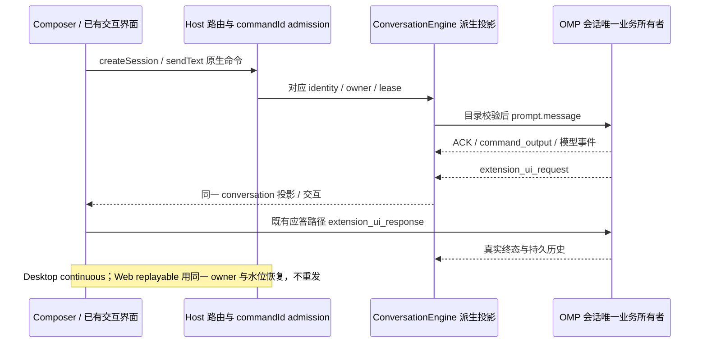

# OMP rpc-ui 核心命令接入

本功能域是本 Fork 的核心接入需求，命令规则唯一在此维护；[OMP 核心接入](omp-core-integration.md) 规定进程、交互与双链路。消费本机当前 OMP 的公开 `rpc-ui` 协议，不在 ZCode 中复制 OMP 业务。

## 必须接入的入口

| 入口                                      | 原生行为与可观察结果                                                                               |
| ----------------------------------------- | -------------------------------------------------------------------------------------------------- |
| `/wiki`                                   | 索引查看、检索、建立与删除；确认、进度、取消和失败沿用 OMP                                         |
| `/repo`                                   | 代码索引状态、确认建立、更新、重建及删除；进度与取消沿用 OMP                                       |
| `/team <问题或需求>`                      | OMP 多模型只读规划讨论，参数和结果由 OMP 处理；空参数显示原生用法                                  |
| `/plan [任务]`                            | OMP 计划模式、只读工具、计划 role 临时模型、计划正文与批准/拒绝；批准后由 OMP 恢复模型与工具并执行 |
| `/loop`                                   | OMP 参数、次数/时长、条件、暂停/恢复与关闭；不在 Host 或 UI 增加循环计时器                         |
| `/goal`                                   | OMP 目标创建/替换、查看、暂停、恢复、删除和预算调整；不复用旧 ZCode goal 状态机                    |
| `/advisor`                                | OMP 开关、状态与记录；`configure` 的 TUI 编辑器明确显示不支持，角色配置仍走既有接口                |
| `/ultrathink`、正文 `ultrathink`          | 命令和正文魔法关键词分别按 OMP 规则执行，正文关键词不是 `/advisor` 参数                            |
| `/orchestrate`、`/workflowz`、`/fullsend` | OMP 原生命令/魔法关键词流程，不另造编排实现                                                        |
| `/skill:<name>`                           | 实际可执行技能目录与原生 token；技能目录规则仍见 [skills.md](skills.md)                            |
| `/compact [参数]`                         | 原生命令参数完整交给 OMP，压缩过程、结果、错误和用量回投可见                                       |

## 产品规则、接口与所有权

- 命令与别名来自目标工作区 OMP 的实际注册目录 `get_available_commands`；参数补全沿用 `complete_command`。上表规定必接能力，不作为人工目录或硬编码允许清单。Windows 与 CentOS 7 使用同一入口与界面。
- 命中原生目录的输入以原文经现有 v4 `createSession` / `sendText` 到对应会话进程的 `prompt.message`，保留参数与空白。GUI 不以旧 `/plan`、`/goal` 或 `/compact` 本地业务覆盖原生命令；未登记的兼容别名仅保留既有行为。未知或 TUI-only 输入明确报错且不得作为普通提示发给模型；带附件命令沿既有明确拒绝规则处理。
- 结果和状态由 `command_output` 进入现有会话时间线；选择、确认、输入与计划批准由 `extension_ui_request` / `extension_ui_response` 进入已有交互组件。显示失败、拒绝和取消的真实结果；受理 ACK 不等于模型轮或长操作完成。OMP 原生输出的可见历史与冷恢复须一致，不重发已执行的命令。
- 当前 OMP 的后台索引/压缩命令可先 ACK、后发无请求 ID 的输出，且 `command_output` 未写原生 journal。适配器必须接收当前会话进程的迟到输出，以独立行呈现；仅为 GUI 冷恢复持久保存这些已收到的派生输出，不复制模型历史或 OMP 业务状态。稳定会话身份、行 ID、去重和删除一致性由同一适配存储路径负责；未提供终态的操作不凭 ACK 推测完成。
- `/team` 等命令的可见 `custom` 结果也必须可冷恢复：OMP 父会话尚未经过模型轮时，原生 lazy journal 不保证写出这些消息。复用上述派生显示存储保留结果；原生日志随后落盘时，仅对同类型、同正文的对应显示记录去重，不删除合法重复消息，不复制模型回复。隐藏的 `display:false` 消息不保存或展示。
- OMP 是索引、计划、团队、目标、循环、advisor 与压缩状态唯一所有者，文件和持久配置按 OMP 原生规则维护。`ConversationEngine` 只投影进程事实，Host 只路由，UI 只持有草稿与 pending overlay。计划/命令临时模型变更随真实事件回投，不被下一次陈旧草稿选择覆盖。
- OMP 自主提交的 loop/goal 后续轮依据真实用户消息与运行事件建立派生时间线，后续回复、工具与终态完整显示；不得因没有 GUI sendText 就丢弃输出，也不得为显示补发原命令。已接受的 GUI/排队轮与原生运行事件须对账，不能生成重复轮。
- 保留会话身份、workspaceIdentity、owner/lease、进程实例 fence 与 commandId 幂等边界；停止沿已有 abort 通道，等待交互或长命令不得阻塞它。关闭或 EOF 后 OMP 不得向其他会话续跑。运行中提交的处理遵循 OMP 与既有 admission 语义，不能将原生命令悄悄改成模型正文。

## 验收场景

1. **N01 目录与补全**：真实安装 OMP 和 GUI 命令面板包含上述全部入口及实际技能；参数补全使用真实目标目录。未知、TUI-only、`/advisor configure` 不支持和带附件失败可辨识，零误发模型。
2. **N02 统一执行**：每个入口从真实公开提交入口执行到可观察结果；参数、别名与正文 ultrathink 保留，命中目录的 `/plan`、`/goal`、`/compact` 无本地截获。
3. **N03 索引与交互**：在隔离临时项目验证 wiki/repo 状态、确认建立、检索/更新、取消/失败与删除；不改用户项目。计划正文、批准/拒绝与模式/模型恢复使用真实 OMP 交互回路。
4. **N04 状态生命周期**：team 真实讨论与 advisor 开关/查询；goal 创建、暂停、恢复、预算及删除；loop 有限轮次、停止和会话隔离；魔法命令与技能真实模型结果；compact 参数、过程与终态。模型验收使用既有 `zhipu-coding-plan/glm-5.3-flash`，不修改用户配置。
5. **N05 历史与双链路**：本地命令输出及真实模型输出 live/冷恢复可见且不重复；Desktop continuous 与 Web replayable 重连不重发副作用；并行会话与旧进程延迟结果不串流，停止通道可用。
6. **N06 门禁与平台**：相关 UT、集成、真实 OMP E2E、隔离桌面 GUI 及 CentOS 7/Linux 场景按实际环境执行；`pnpm typecheck`、`pnpm lint`、架构与变更格式检查通过。跳过、失败和未经过的边界必须记录，不以 fake 或静态检查代替真实验收。

## 实现与验收状态

2026-10-08：核心对接已实施，按用户明确选择完成 Windows 验收；安装核为 `18.8.4+fork.304`。相关 UT、真实 OMP API、隔离 GUI、Desktop/Web 双链路及完整 GUI 冷恢复通过。CentOS 7 本次未验证，不计通过；全仓格式检查仍有本次未修改的既有失败。实际结果与保留失败见 [验收报告](../test-reports/omp-native-commands-2026-10-08.md)。
