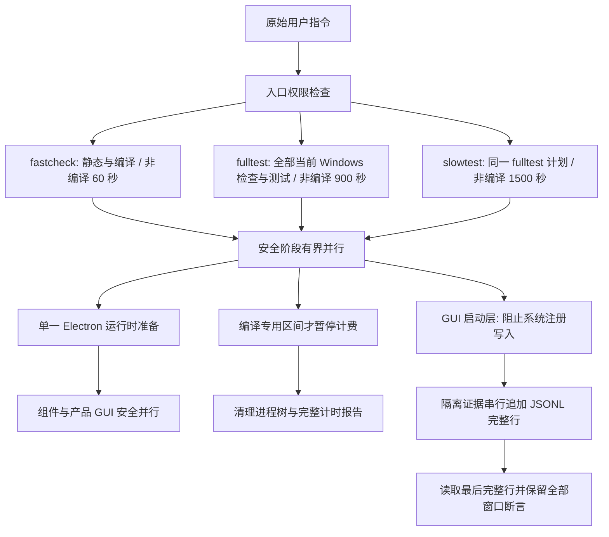

# 三级测试入口

本域维护 **Windows 本机**现有 OMP 核心及上游保留测试的三级编排、覆盖关系与验收。以用户本次明确调用的 `jch-fastcheck-fulltest-slowtest-gates` 为准：不执行 CI、发布、Computer Use 或接管全局鼠标/前台焦点的测试。项目没有适用的 WSL 测试扩展，AI 不执行 CentOS/Linux/WSL 测试；slowtest 报告 `SKIPPED_NOT_APPLICABLE` 并与 fulltest 覆盖相同。产品两平台分发要求不属于测试通过结论。

## 所有者与入口

- 根 `package.json` 提供 `pnpm fastcheck`、`pnpm fulltest`、`pnpm slowtest`；三个入口只允许 Windows 执行测试。Node 支持范围沿用根 `package.json` 的 `engines.node`（当前 `>=24.0.0`）；`mise.toml` 的 Node 固定版本仅用于可复现开发基线，不是门禁精确版本准入条件。脚本复用并记录当前 Node，不自动降级或安装；pnpm 仍按 `mise.toml` 校验固定版本，不清除缓存。
- `scripts/test-gates.mjs` 拥有入口权限、最终状态及快照；过程模块是单一计时与所属子进程树所有者。只调整编排，复用原有检查、编译和测试原语，不修改产品代码、测试断言或质量配置。结果绑定 HEAD、未提交差异、内容指纹及工具版本。
- `fastcheck` 只运行增量 TypeScript 编译、Lint、变更架构和格式检查，不执行任何 UT、集成、GUI、冒烟或门禁自检。大量变更格式名单按 Windows 命令行上限分批，不截断。安全独立阶段有界并行，非编译预算最多 **60 秒**。
- `fulltest` 包含 fastcheck 全部检查原语（全量检查可覆盖其变更子集，不重复运行）、全部现存适用 Windows 核心/上游测试、门禁自检、真实 OMP E2E，以及当前 Main/Host/Preload/Renderer 构建、工具详情和真实产品 GUI 启动/身份/同根冷恢复。复用现有本地资源准备与 Electron unpacked 打包原语和 afterPack 校验，显式 `--publish never`，打包/资源下载计费且不调用发布入口；不等同正式安装器或两平台分发。非编译预算最多 **900 秒**。
- `slowtest` 复用 fulltest 相同计划一次，不再用 GUI 或较慢的当前平台测试区分层级。项目已取消 WSL 测试扩展，不探测或启动 WSL，也不额外增加环境、CI、远程阶段或重复 fulltest。非编译预算最多 **1500 秒**。
- 先前用户授权精简的 Fork 新增专项保持已删除；上游原有测试与有效断言仍全部保留。不再按耗时移动层级、删除现存测试或缩减覆盖。当前快照没有预算超限依据，不启用 `fork-affected` 缩域；不宣称已验收历史删除专项或两平台打包。
- 编译前后复用既有 `tsc -b` composite/incremental、固定 dist/out 和稳定 Vite 缓存，不调用 clean 或为计时删除/切换缓存。只将纯编译原语标记为编译；staging、初始化、准备、静态检查、测试、等待、快照、聚合与清理均计入非编译时间。GUI 中的 Vite 懒编译是混合测试阶段，保守全部计费。
- 每个入口只有一个单调时钟：`budgeted = total - compile_excluded`；排除观察到的“至少一个编译活跃且没有非编译工作活跃”的区间并集。编译与检查/测试并行的重叠计费一次，不累加并发阶段时长，不在阶段边界重置预算。
- 编译、检查及独立离线测试安全并行；adapter 编译先于 staging，桌面编译先于产品 GUI，同根 live/cold 先后执行。独立 GUI 使用不同根/端口/进程；依赖或共享不兼容产物的阶段保留屏障。
- Electron npm 运行时是组件及产品 GUI 的共享依赖；门禁在并行运行它们之前，串行调用同一 Desktop 包解析得到的 `require("electron")`，完成缺失二进制的下载与解压。准备阶段计入非编译预算，失败阻止所有 GUI；既有安装直接复用，不修改依赖安装器、不清缓存，也不让并发测试同时改写共享可执行文件。
- 预算包括入口准备和最终所属进程树清理，提前预留清理余量；纯编译区间暂停非编译预算定时器，不给编译继承剩余预算墙钟限制。超时停止所有所属子进程，不再启动后续阶段，非零退出。`--budget-seconds` 只能下调 60/900/1500 秒上限。
- 每个成功、失败、缺环境、超时和已处理取消路径均输出 `status / total / compile_excluded / budgeted / limit`，秒数至少一位小数。必须等编译完成且所有在范围内阶段成功才允许 PASS；缺工具/测试跳过不冒充通过。

## 环境与失败语义

- 真实 OMP 使用本机安装版本；源码权威及无安装时不验证的规则见 [FORK.md](FORK.md#omp-侧依赖)。缺少安装、凭据、二进制或测试发生跳过时，记录未验证而非通过，不静默使用旧缓存核或临时安装。
- adapter 编译只依赖源码、构建工具和 workspace 依赖，不以本机安装 OMP 为前提；缺 OMP 只阻止真正使用它的真实核心和产品 GUI 阶段，并记录未验证，不能误跳过离线编译。
- 产品 GUI 必须由专用隔离 fixture 提供；保留真实启动、工具结果呈现和 `identityMigration` 的 before/after 同根新进程冷恢复，不连接日常实例。被删除专项不再构成缺环境阶段，也不得在测试结果中声称已验证。
- GUI 判据基于产品契约与独立真实持久记录，不把自动生成的会话标题当作稳定身份。身份迁移按实际稳定会话 ID 验证唯一侧栏项及同根重启连续性。
- 工具结果组件入口自己创建临时 Vite/Electron/userData，不调用模型；它补充工具结果显示验证，不代替真实产品 GUI。
- 产品 GUI 必须使用当前构建的真实 Main/Preload。Preload 需内联其第三方运行依赖，保持既有沙箱与 context isolation 设置；不能因沙箱无法加载 npm 模块而留下空白 Renderer，也不能注入假 bridge、关闭沙箱或加空值兜底冒充通过。
- 产品 GUI 由 `ompCore.launch.mjs` 创建专用临时根、独占端口和当前真实 Electron/renderer；通过 Electron 测试启动层在任何产品 BrowserWindow 创建前设置隐藏、不可全局聚焦，保持真实 Main/Preload、沙箱和安全边界。Playwright/CDP 只驱动目标页面 DOM，不调用 Computer Use、全局输入或通知焦点操作；隔离性须观察实际所有测试窗口，而非仅凭工具名称推断。凭据只留在测试子进程环境，不落证据或认证库。
- GUI 启动层在导入真实 Main 之前拒绝协议客户端注册及 `reg.exe add` 系统写入；这些系统集成不属于此沙箱 GUI 的验收覆盖，拒绝不能伪装为成功。隔离证据串行追加 JSONL，每次读取最后完整行，仍核对当前 PID、所有窗口状态和新鲜度；不通过重试、忽略写入错误或放宽窗口断言处理 Windows 文件替换失败。
- 隐藏窗口采用 Electron 离屏渲染保持真实 DOM/动画帧可运行；准备及验收截图统一通过该 Electron 进程的 `webContents.capturePage`（保持隐藏、保持唤醒）采集。专用回环临时端口只返回该 fixture Renderer 的 PNG；不通过展示/聚焦窗口获得截图，也不依赖可见合成面。GUI 准备不增加独立的 Playwright 默认截止，仍由外层同一非编译预算终止所属进程树；既有 DOM 验收断言不变。
- 全新 GUI 根必须通过产品公开的首次引导跳过入口完成准备；不能直接改 store 或设置文件伪造完成。就绪须证明引导已关闭、真实主界面入口可用，并保留页面截图；准备失败立即让阶段失败，启动器仍由门禁持有并清理整棵进程树。
- 三个测试入口不接受 `--publish-releases`，不发现或检查 workflow、不调用 GitHub CLI，不推送、不创建 Tag、不发布。CI 不是测试环境或验收步骤；既有分发 workflow 不改动、不触发。
- 源码变化后不能沿用此前测试结果。所有 Windows 测试阶段记录耗时，失败、取消、跳过和缺环境保持非通过状态；CentOS 产品支持及构建期产物完整性约束不因此取消。

## 验收

1. 三个入口存在；未授权 full/slow 在检查前拒绝。本次显式技能调用授权本任务所需三级验证与必要修复复验，无需逐次询问；不扩展到 CI、发布、Computer Use 或全局鼠标测试。
2. fastcheck 无测试；fulltest 包含其全部原语和现存适用当前平台测试；无适用 WSL 的 slowtest 与 fulltest 计划相同且只执行一次，报告明确 WSL 不适用。
3. 每个入口验证单一 60/900/1500 秒非编译预算及所有退出路径计时：成功、失败、缺工具、超时、已处理取消；纯编译超过短预算仍成功，编译失败仍失败，编译与非编译重叠仍计费，连续阶段不能重置预算。
4. 临时短桩验证实际并行、依赖顺序、缓存保留、失败传播、所属孙进程终止、参数不能增加上限、未授权拒绝及禁止操作；不修改现存产品测试断言、不调用真实 CI 或全局鼠标。
   Electron 缺失时，所有并行 GUI 必须等待共享运行时准备成功；已有运行时直接复用，准备失败不得启动其消费者。组件和产品 GUI 的现有断言保持不变。
   普通成功、失败和缺工具短桩的预算须容纳 Windows 子进程启动及清理，不能让计时器抢先覆盖待验证状态；专门的短预算、编译排除和累计预算场景仍使用各自短预算。自检无论通过或断言失败都清理自己创建的临时目录和进程，不修改任何既有断言或产品测试判据。
5. 实际运行必要的 fastcheck/fulltest/slowtest，记录完整命令、退出码、总/编译排除/非编译耗时、预算与源码快照。GUI 必须实际证明没有可见或可聚焦窗口，且真实回复和冷恢复判据仍通过。
6. 系统 Node 满足项目支持范围但不同于 mise 固定版本时，三级入口的只读计划可正常生成并记录实际 Node；普通 fastcheck 可进入并执行检查。full/slow 的授权、预算与 pnpm 版本拒绝语义不变，不能把入口准入通过冒充完整测试通过。

## 实现与验证状态

以下为此前门禁方案的历史记录，不代表本次技能迁移后的定义。2026-10-10 用户先授权减重与小于 5/10 分钟总时限，随后明确要求“一切以技能的描述为准”；现行规则改为 60/900/1500 秒非编译预算和上文固定三级语义。此前结果、失败、缺环境及发布证据不改写，也不提供后续授权。

### Windows-only 切换前的历史记录

本节的 slowtest 范围、旧发布参数及 Linux 环境排查均为旧编排证据，不是可复用的当前命令或验证前提。

- 2026-10-09，Node 24.14.0 / pnpm 10.33.2、Windows x64：fastcheck 重跑耗时 5.0 秒（现有暖缓存，未验证冷缓存）。类型、Lint、变更架构及 18 项快速单测通过；整体 FAIL，原因是本次门禁任务之外的 9 个已修改/新增文件格式不合规，未修改或排除它们。首轮 6.3 秒期间还发生并发源码变化，入口如实拒绝合并为同一快照通过结论；随后复跑上述受影响阶段。
- 入口自检 2.6 秒通过，覆盖临时桩的失败传播、缺工具、Node spec reporter 跳过识别、预算不能放宽、未授权拒绝、前序失败阻止远端、CI 反递归及超时进程树清理。没有运行真实 fulltest/slowtest、WSL 或流水线。
- 只读计划与文件对照确认：当前 Windows fulltest 包含 46 阶段、147 个现有测试文件和 21 个产品 GUI 阶段，未遗漏当前测试文件，未混入 WSL/远端；slowtest 追加 WSL（含 CentOS 运行时、字体与启动器）、三项既有目标环境验收缺口及两条既有发布流水线。GUI fixture 配置及跨平台/发布环境尚未执行验证。
- 新增的六个 `scripts/test-gates*.mjs` 文件分别执行 `node --check <文件>`，均通过；显式指定这六个文件的 `pnpm exec oxlint <文件列表>`（0 警告/错误）与 `pnpm exec oxfmt --check <文件列表>` 通过。没有按目录或全仓执行新入口的专项豁免检查。
- 续作发现并修复源码指纹的两种误判：LF/CRLF stderr 诊断曾混入 diff；逐 Buffer 解码还会在中文 UTF-8 字符跨管道边界时产生数量不稳定的替换符。现在两条流各自连续 UTF-8 解码，指纹只取成功 Git 命令的 stdout，失败保留 stderr。实际临时 Git 仓库覆盖大段中文 diff、警告开关、真实编辑与缺失目录诊断；新增回归修复前失败，最终自检 4.7 秒通过，当前 87 项变更连续两次指纹一致。未关闭保护或放宽快照条件。
- 授权完整执行 `pnpm slowtest --human-authorized --publish-releases`：干净快照 `6338b0885bd84445e6d930f3e313654fe860fceb`，Node 24.14.0 / pnpm 10.33.2，916.1 秒，整体 **FAIL**。类型、Lint、格式、全量架构、普通 OMP 366 项、真实 OMP 3 项、构建及 Windows 本地测试包通过；原生命令 4/5，另有 services/UI 测试失败、6 项跳过，Knip 未通过，组件与 21 项 GUI fixture 未完成。不得将此前核心 374/374 或独立 GUI 通过合并为该门禁通过。
- 收尾修正只限验证正确性：TTL 测试从首次扫描前统一受控时钟；`/btw` 测试删除已取消的旧上下文字段和实现文案断言，保留真实附件/上下文拒绝与草稿不变约束，定向 28/28 通过。Electron 门禁按 Desktop 的实际模块解析定位已提升至根目录的运行时；外部 fixture 固定 Node 24.14.0 并删除 `ELECTRON_RUN_AS_NODE`，不以空字符串冒充禁用。
- 原生命令 fixture 缺少 `OMP_NATIVE_E2E_ROOT`，已关联此前真实计划验收的隔离目录，未改用户配置。WSL 实际 Node 为 20.19.0 / 24.21.0，未发现精确 24.14.0；真 VM、Citrix IME 与目标网络盘缺统一自动入口。两条发布阶段因前序非通过被门禁拒绝，**未触发正式发布**，不能标记成功。

### Windows-only 切换后的历史记录

以下通过/失败和发布结果仅适用于各条明确绑定的快照，不能作为当前 HEAD 或完整 Windows 门禁已通过的声明。

- Windows-only 切换实际复验：调整后的 Windows 路径、RPC 参数、数据根、环境白名单、正常 HTTP 重定向、node:sqlite、门控、TTL 与 `/btw` 相关定向测试 **49/49**，0 失败、0 跳过；真实 CLI 自检 **6.9 秒通过**（只读 full/slow 计划一致、旧发布参数拒绝、权限/指纹/超时与自有进程清理）。`fastcheck` **11.0 秒通过**，类型、Lint（0 警告/错误）、变更架构、20 项快速用例与 26 个变更文件格式通过；该次内容指纹 `281c158cde9abb60b263de152d0ffdbc06929fb83327146c7eb2b58c54b28508`。不代表完整 Windows 门禁通过。
- Electron 运行时定位修正后，通过真实组件 E2E 的门禁入口实测 `PASS`。隔离 R7 测试版 GUI 已重新打开并实际截图，专用 CDP 9268 / renderer 5268、既有沙箱数据根；不连接日常实例。全新 GUI fixture 的原侧栏超时已由失败截图定位为首跑职业引导；外部准备器按真实三步“跳过”入口完成引导，8.92 秒准备成功，实际页面断言确认引导消失、目标项目侧栏与 Lexical 输入区可见，并截图。原 GUI 冒烟命令完成；它的旧 textarea 诊断仍为 false，不用该字段冒充富输入框验证。
- 正式发布独立使用既有已推送业务快照 `main@6338b0885bd84445e6d930f3e313654fe860fceb`；本轮测试范围与 Knip 配置调整和该业务版本分离。修正真实 bundle、GUI 与性能入口后，完整 Knip 仍报告 122 个未使用文件及依赖/导出等诊断，不记为通过，也不扩大到已取消功能的产品清理。Windows 完整门禁尚未全部通过；发布成功不替代测试结论。
- 独立正式发布已完成：Windows [run 37865831354](https://github.com/jchanghong023/OmpCode/actions/runs/37865831354) 与 CentOS [run 37865830627](https://github.com/jchanghong023/OmpCode/actions/runs/37865830627) 均为 `completed/success`，自动 Tag 指向上述业务快照，正式 EXE/ZIP 及 SHA256 资产上传完成。这里只记录已授权发布的操作结果，不是流水线测试；没有执行 CentOS 测试。

### 2026-10-10 门禁修复的阶段性证据

- 首轮 `fulltest` 从 `b6c10bb3a73f62aaeb2d1c49cc1c29d7dee48d0f` 开始，794.0 秒 **FAIL**：Knip、原生命令计划 fixture、缺少性能/GUI 环境等未通过，运行期间源码变化也记录为未验证；这些阶段结果不能合并为当前快照通过。
- 根据实际消费者清理已取消的旧供应商/账号/套餐、插件市场、静态 Hook 管理及空模块；内部 helper/type 不再暴露出口，重复公共别名迁移到唯一实际 schema，协议与状态所有者不变。仅精确登记动态调用、组件 fixture、架构契约、平台工具和生产打包闭包，保留有效测试断言。
- 独立 `pnpm knip` 已以零退出码完成，仍有配置提示而非未使用项失败。两项真实 Electron 组件冒烟均通过：性能完整场景 21.84 秒，工具详情深浅主题/1100 与 360 宽度 20.34 秒；环境与截图位于本轮仓库外临时目录，不调用模型、不连接日常实例。
- Windows 大量变更曾使格式阶段的命令行超过上限，未执行检查便失败；修复后真实 `fastcheck` **29.7 秒 PASS**，三批检查全部 294 个现存变更文件，类型、Lint、架构及 20 项快速用例通过。本次内容指纹 `838c1895630aabeb97b2b035c53e91d846c273d6d76544fb6a466cc01e843ce2`，仍是局部门禁证据，不替代最终完整运行。
- 上述是局部验证，不代表 `fulltest` 已通过；最终完整结论必须来自修复后稳定快照的完整门禁输出，发布仍须在该结论之后独立执行。
- 随后的稳定修复快照 `73b7a5c` 进入真实 GUI 后仍全灰，已取消该失败运行并清理其专用窗口。实际 Electron 控制台报 `Unable to load preload script` / `module not found: zod`：preload 产物外置了 Zod，沙箱无法加载，`window.zcode` 未注入。此前静态/组件检查不能替代该产品 GUI 边界，此快照没有完整通过，也未触发发布。
- Preload 内联 Zod 后，当前 Main/Preload/Renderer 已实际重建；真实宿主窗口截图确认侧栏、项目和输入区恢复，启动 GUI 检查以零退出码完成，目录外的已配 default role 保留且可打开真实 GLM 候选。删除 GUI 对旧原生 `select/options` 的实现假设，改用现有可访问菜单；Profile `before → 同根新进程 after` 两阶段亦以零退出码完成，保存后仍使用旧 profile、重启后命名配置生效。以上仍是定向验收；最终完整运行采用新的隔离根，不复用已切换 profile 的诊断 fixture。
- 稳定快照 `e71ca87eb98ce594189f40454ade759cc508e871` 的 `fulltest` **1672.2 秒 FAIL**：真实原生命令 team、交互页 cold、原生命令 GUI live/capture/cold、恢复准备器、身份 live/recovery 与技能候选未全部通过。启动/Profile、子代理状态、执行页 live/cold、性能 live/stable/cold、mentions、组件、构建与打包等已完成阶段不能合并成完整通过；两平台发布尚未触发。
- 修复后的定向真实原生命令执行 **4/4、0 失败、0 跳过**，300.3 秒：独立 team 完成有效结构化报告、只读文件约束、失败面及双链路冷历史；完整对象用原生 `yield {data: object}` 单次终结，不再误提交到 proposal 正文字段。小会话压缩拒绝、真实模型命令/有限循环/目标/压缩/计划及延迟控制场景也通过；未将该定向结果冒充原生命令全文件或完整门禁。
- 原生命令 GUI `live → capture → 同根新进程 cold` **404.9 秒通过**：只执行一次真实压缩，保留失败拒绝；同一 UUID 的 91 项真实助手行完整采集并逐项冷恢复。身份 GUI `live → recovery` **75.0 秒通过**，两轮真实 GLM 回复、唯一侧栏项及同一持久 UUID 连续性均保留，不再用截断标题定位。
- 新隔离根上的交互页 `live/cold`、技能设置/`$`/原生 `/skill:` 候选及工具会话真实写读后同根冷重启，联合定向执行 **234.1 秒通过**。交互页从实际沙箱项目建任务，避免全局新任务逃逸到没有验收 agent 的默认工作区；独立证据读取覆盖原生顶层 async-result，并按父子身份核对终态。技能沿既有 GUI 默认预算等待真实目录结果，不用额外五秒门限截断核心启动。恢复准备器记录实际持久 UUID，关闭已核对身份的 renderer target 并等待原进程退出，避免等待 Electron 退出时丢失的 `Browser.close` 应答；不替换会话、不注入工具结果。
- 上述仍为修复阶段定向证据；正式完整门禁使用另一套全新隔离根及稳定快照，不能跨此前失败、定向运行或源码快照合并通过结论。

当前标准入口为 `pnpm fulltest --human-authorized` 与 `pnpm slowtest --human-authorized`；`--plan` 只读查看精简计划与总预算。slowtest 自动准备上述最短隔离 GUI，不需要旧的仓库外配置，不能添加发布参数。

### 2026-10-10 精简后的完整门禁实测

- Windows x64、Node 24.14.0 / pnpm 10.33.2，既有暖缓存，未清缓存、未测冷缓存。两个完整入口均绑定 HEAD `f86d9868153ca9714a1cd1465683fb6bff431226` 和运行时内容指纹 `702b9a3243d0e6d8acbb1db72abdbcaed1d9c5a2d4345b0fb24d88ff4dc86a52`；工作树包含未提交改动。此指纹是追加本段实测记录之前的快照，不将结果冒充其他快照通过。
- `pnpm fulltest --human-authorized`：**PASS，32.2 秒**。静态质量、上游保留测试、OMP 离线核心及真实 GLM 流式输出、审批通过、write 文件精确落盘全部通过，无跳过。审批用真实 `always-ask` 模式和 v4 选项响应；测试结束关闭 stdin，等待 adapter 正常释放数据库，不用强杀伪造完成。
- `pnpm slowtest --human-authorized`：**PASS，116.4 秒**。包含上述核心阶段及当前 adapter/Main/Host/Preload 构建、工具详情组件、真实启动 GUI、两轮真实 GLM 回复和同根新进程冷恢复，无跳过。GUI 截图确认主界面、输入区和恢复后的两条回复可见；启动 22.9 秒、身份 live 28.0 秒、recovery 11.9 秒。
- 门禁入口自检通过：有界并发、依赖顺序、失败传播、权限、源码指纹、禁止增加总预算、禁止发布参数，以及三个入口的短预算超时和自有孙进程清理。自检中故意失败的短桩不是实际门禁失败。
- 删除路径与当前 `upstream/main` 的上游测试路径无交集；四个上游测试已恢复并登记到核心计划。只删除 Fork 新增的非核心、非 OMP、冗余或长耗时专项。本次没有调用 CI、提交推送、创建 Tag 或发布；没有执行两平台打包，也不声称已验收被删除专项。

### 2026-10-10 按技能非编译预算迁移后的实测

- Windows x64、Node 24.14.0 / pnpm 10.33.2，既有暖缓存；未清理编译或 Vite 缓存，冷缓存未验证。以下最终结果绑定 HEAD `f86d9868153ca9714a1cd1465683fb6bff431226`、未提交工作树及内容指纹 `2d5eb6b7180e7faa6499cd8310e02ceed0b9ee6372adba974f445825a8a2b36d`，该指纹为追加本段记录前的快照。
- 通过固定 Node 的 `scripts/mise-run.mjs` 执行 `pnpm fastcheck`：退出码 0，**PASS**，`total=51.9s compile_excluded=0.8s budgeted=51.1s limit=60.0s`；只执行类型、Lint、架构和格式检查，没有测试。
- 同样执行 `pnpm slowtest --human-authorized`：退出码 0，**PASS**，`total=390.4s compile_excluded=22.8s budgeted=367.7s limit=1500.0s`，32 阶段全部通过。包括完整静态质量、现存测试、构建、Windows 本地未发布打包、真实 GLM 流式/审批/write、工具详情组件、真实启动 GUI、两轮回复及同 UUID 冷恢复。fulltest 未另行重复执行；本次 slowtest 只包含一次相同的完整当前平台计划，WSL 为 `SKIPPED_NOT_APPLICABLE`。
- 完整运行内的独立入口短桩自检 **PASS，82.4 秒**，不属于 fastcheck；覆盖三个入口的状态/计时输出、纯编译排除、重叠计费、累计预算、取消/进程树清理、并行和缓存保留。GUI 隔离记录证明窗口始终隐藏、不聚焦、不可聚焦；最终冷恢复截图可见两条真实回复。
- 先前同任务完整 slowtest 的 **FAIL**（`282.4/29.2/253.2s`）及 **TIMEOUT**（`1510.3/13.5/1496.8s`）保留，不与最终通过结果合并；三项数字依次为总时长/编译排除/非编译计费。Windows 证据替换失败、隐藏窗口截图停滞及启动后的依赖优化重载均由测试编排修复，没有改写产品测试断言或提高预算。
- 首轮未修复的 GUI 启动日志确认曾注册 `zcode` 协议并安装/更新 Explorer 右键菜单；此前注册值未知，未擅自恢复或删除。后续测试启动层已阻止这些系统写入；最终每个 GUI 进程记录了被阻止的协议注册和注册表写入。这一历史副作用不因最终门禁通过而隐去。
- 仅清理本任务三个一次性 Windows 打包目录中的 `win-unpacked`，保留诊断日志、GUI 截图、隔离数据及所有可复用缓存；没有调用 CI、发布、WSL、Computer Use 或共享鼠标测试。

### Electron 首次准备并发修复

- HEAD `11b82dfc4930872e1138f095a5d715c010d78b0e` 的干净快照上，首轮 fulltest 退出码 1：`total=158.1s compile_excluded=9.2s budgeted=148.9s limit=900.0s`。组件与产品 GUI 同时打印 Electron 下载日志，组件启动报 `spawn EBUSY`；其他通过阶段不能合并为整体通过。
- Electron 44.4.5 的 `index.js` 在二进制缺失时由 `require("electron")` 同步运行安装器，多个消费者会同时解压同一个运行时。修复只在 full/slow 共享计划中增加计费的串行准备屏障，保留并行测试、所有断言和编译缓存；fastcheck 不新增测试。
- 临时隔离桩冒烟退出码 0：验证 full/slow 计划一致、准备计为 check、消费者在准备完成后并行运行，及准备失败阻止消费者；临时文件已清理。修复后的完整通过结论以随后实际门禁输出和源码指纹为准，不沿用首轮失败结果。

### Node 精确版本限制移除

- 用户要求移除 Node 24.14.0 的精确准入限制；保留根 `engines.node` 支持范围、mise 可复现基线、pnpm 版本校验和全部门禁权限、预算及检查定义。
- 系统 Node 24.20.0 的三个公开入口只读计划均成功并记录实际运行时；未授权 fulltest 仍退出 2，错误 pnpm 版本仍退出 1。入口语法检查通过；只读计划不执行测试，也不代表该 Node 下 fulltest/slowtest 已通过。
