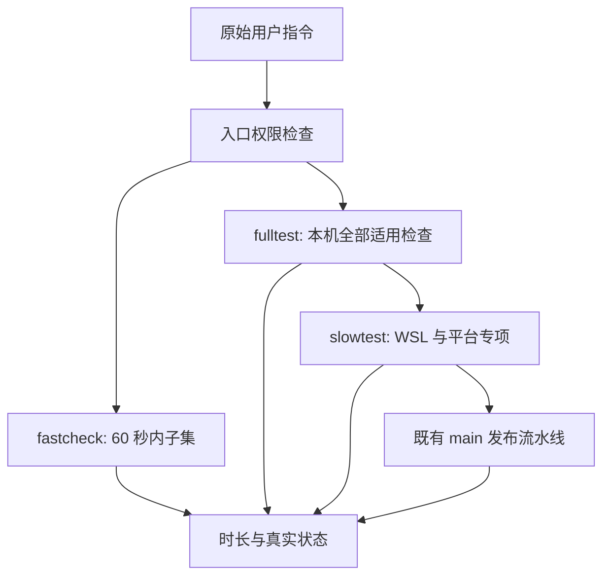

# 三级测试入口

本域只维护测试编排、覆盖关系与验收，不修改既有检查内容或通过标准。Agent 执行权限唯一维护于 [AGENTS.md](../../AGENTS.md#三级测试门禁)。

## 所有者与入口

- 根 `package.json` 提供 `pnpm fastcheck`、`pnpm fulltest`、`pnpm slowtest`；`mise.toml` 固定 Node/pnpm，脚本复用当前运行时。入口拒绝版本不符，不安装工具或清除缓存。
- `scripts/test-gates.mjs` 拥有权限检查、总时限、子进程树和最终状态；编排模块复用既有命令，测试与质量配置仍各自拥有断言及通过标准。结果记录 HEAD、未提交差异摘要、内容指纹及工具版本，不跨快照合并通过结论。
- `fastcheck` 复用类型检查、Lint、变更架构/格式检查和固定的快速单测子集。总计最多 60 秒，提前预留进程清理时间；超时输出 `TIMEOUT` 和秒数、结束自己的进程树并以非零码退出。预算参数只能下调。
- `fulltest` 包含根静态检查、未被根命令覆盖的包级检查、当前 workspace 全部测试文件、真实 OMP API、性能对照、组件及产品 GUI、当前平台构建与本地打包。独立上游 CLI 快照不接回产品，也不把跨平台检查混入本级。
- `slowtest` 包含相同本机完整检查，加上 Windows→WSL 的 Linux 原生检出、CentOS 运行时/字体/启动器、真 VM 包级、Citrix IME、目标网络盘及现有 Windows EXE/CentOS ZIP 发布流水线。没有现成自动入口或缺少环境的项目明确 `UNVERIFIED`，不伪造替代测试。

## 环境与失败语义

- 真实 OMP 使用本机安装版本；源码权威及无安装时不验证的规则见 [FORK.md](FORK.md#omp-侧依赖)。缺少安装、凭据、二进制或测试发生跳过时，记录未验证而非通过，不静默使用旧缓存核或临时安装。
- 产品 GUI 必须由专用隔离 fixture 提供，保持各场景要求的 profile、审批、扩展、历史和工作区；live/stable/cold、capture、before/after 按原测试定义运行，冷恢复需要同一数据根上的新进程。组件测试不代替产品 GUI。
- `ZCODE_GATE_ENVIRONMENTS` 指向本机 fixture 配置 JSON。各阶段可配置 `prepare`/`cleanup` 命令及 `environmentFile`；准备器仅提供隔离运行环境，门禁仍直接执行既有测试。环境文件声明当前 `snapshot`、`isolatedRoot` 与 `env`，不能填写任意通过结果。具体格式见编排脚本；配置缺失时输出缺少的阶段 ID，不连接日常实例。
- 性能文件索引对照需要显式 `ZCODE_GATE_PERF_BASELINE`；不猜测改前提交。WSL 需要显式发行版与 Linux 原生 checkout，进入后先核对同一源码指纹与原生工具链，不自动安装环境或同步覆盖其他 checkout。
- 本机失败或缺少验证阻止后续发布。发布仅复用 `.github/workflows/release-windows.yml` 与 `release-centos7.yml`，目标固定 `origin/main`；需要显式发布授权、干净工作树和远端同一 HEAD。由原 workflow 生成 Tag，不另造版本或目标，不自动提交/推送。必须读到对应 run 的最终结论；触发、运行中、等待超时都不是通过。
- CI 环境拒绝本地 `slowtest`，防止递归触发。源码变化后不能沿用此前环境或 pipeline 结果。所有阶段记录耗时，失败、取消、跳过和缺环境保持非通过状态。

## 验收

1. 三个标准入口及只读 `--plan` 存在；没有授权的 full/slow 在执行任何检查之前拒绝。
2. fastcheck 实测不超过 60 秒，报告暖/冷缓存边界；禁止为计时清除缓存。
3. 用临时目录短桩验证超时及子进程清理、失败传播、缺工具非通过、本机失败阻止远端、CI 反递归；不执行真实 full/slow 或流水线。
4. 全量单测与 GUI 脚本按当前文件发现，新增未登记 GUI 不被静默遗漏；所有适用缺口进入最终状态。
5. fulltest 不启动 WSL 或远程流水线；slowtest 逐阶段绑定同一快照，发布成功需要正确 run ID/HEAD 的最终成功结论。

## 实现与验证状态

首次建立入口时仅执行自动 fastcheck 与入口机制验证；历史未授权时未运行 fulltest/slowtest，不表示通过。当前续作已获得本次用户对完整 slowtest、提交/推送全部当前工作区与两条 origin/main 正式发布的明确授权。真 VM、Citrix 和目标网络盘当前没有统一自动验收入口，仍须记录为项目验证缺口，不因发布请求另造替代或降低标准。

- 2026-10-09，Node 24.14.0 / pnpm 10.33.2、Windows x64：fastcheck 重跑耗时 5.0 秒（现有暖缓存，未验证冷缓存）。类型、Lint、变更架构及 18 项快速单测通过；整体 FAIL，原因是本次门禁任务之外的 9 个已修改/新增文件格式不合规，未修改或排除它们。首轮 6.3 秒期间还发生并发源码变化，入口如实拒绝合并为同一快照通过结论；随后复跑上述受影响阶段。
- 入口自检 2.6 秒通过，覆盖临时桩的失败传播、缺工具、Node spec reporter 跳过识别、预算不能放宽、未授权拒绝、前序失败阻止远端、CI 反递归及超时进程树清理。没有运行真实 fulltest/slowtest、WSL 或流水线。
- 只读计划与文件对照确认：当前 Windows fulltest 包含 46 阶段、147 个现有测试文件和 21 个产品 GUI 阶段，未遗漏当前测试文件，未混入 WSL/远端；slowtest 追加 WSL（含 CentOS 运行时、字体与启动器）、三项既有目标环境验收缺口及两条既有发布流水线。GUI fixture 配置及跨平台/发布环境尚未执行验证。
- 新增的六个 `scripts/test-gates*.mjs` 文件分别执行 `node --check <文件>`，均通过；显式指定这六个文件的 `pnpm exec oxlint <文件列表>`（0 警告/错误）与 `pnpm exec oxfmt --check <文件列表>` 通过。没有按目录或全仓执行新入口的专项豁免检查。
- 续作发现并修复源码指纹的两种误判：LF/CRLF stderr 诊断曾混入 diff；逐 Buffer 解码还会在中文 UTF-8 字符跨管道边界时产生数量不稳定的替换符。现在两条流各自连续 UTF-8 解码，指纹只取成功 Git 命令的 stdout，失败保留 stderr。实际临时 Git 仓库覆盖大段中文 diff、警告开关、真实编辑与缺失目录诊断；新增回归修复前失败，最终自检 4.7 秒通过，当前 87 项变更连续两次指纹一致。未关闭保护或放宽快照条件。

后续可由用户明确授权运行 `pnpm fulltest --human-authorized` 或 `pnpm slowtest --human-authorized`；正式双平台发布另需明确授权后使用 `--publish-releases`。所有真实 GUI 的配置应位于仓库外，避免配置自身参与源码指纹计算；先以 `pnpm fulltest --plan` 查阶段 ID，再由隔离 fixture 准备器生成对应环境文件。环境文件必须绑定本次 HEAD/内容指纹；真实 OMP 场景还必须声明与本机安装路径一致的 `ompBinary`。WSL 配置额外指定 Linux 原生 `environmentConfig`、`performanceBaseline`，并校验 CentOS 7 与原生 Linux 工具链。
