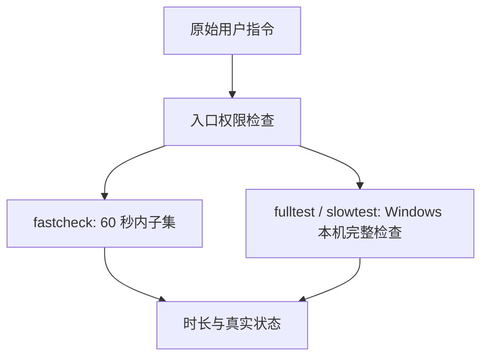

# 三级测试入口

本域只维护 **Windows 本机**测试编排、覆盖关系与验收。AI 不执行 CentOS/Linux/WSL 测试；CentOS 专用测试已取消。Windows 既有功能断言保持原标准。测试不触发、不等待、不验证任何发布流水线；两平台构建与发布是独立外部操作，不属于测试结果。Agent 执行权限唯一维护于 [AGENTS.md](../../AGENTS.md#三级测试门禁)。

## 所有者与入口

- 根 `package.json` 提供 `pnpm fastcheck`、`pnpm fulltest`、`pnpm slowtest`；三个入口只允许 Windows 执行测试。`mise.toml` 固定 Node/pnpm，脚本复用当前运行时，拒绝版本不符，不安装工具或清除缓存。
- `scripts/test-gates.mjs` 拥有权限检查、总时限、子进程树和最终状态；编排模块复用既有命令，测试与质量配置仍各自拥有断言及通过标准。结果记录 HEAD、未提交差异摘要、内容指纹及工具版本，不跨快照合并通过结论。
- `fastcheck` 复用类型检查、Lint、变更架构/格式检查和固定的快速单测子集。全部变更文件都纳入格式检查，大量文件按 Windows 命令行长度上限分批，不截断名单。总计最多 60 秒，提前预留进程清理时间；超时输出 `TIMEOUT` 和秒数、结束自己的进程树并以非零码退出。预算参数只能下调。
- `fulltest` 包含根静态检查、未被根命令覆盖的包级检查、当前 workspace 的 Windows 适用测试、真实 OMP API、性能对照、组件及产品 GUI、Windows 构建与本地打包。独立上游 CLI 快照不接回产品。
- 未使用文件/依赖/导出检查按真实公开入口与调用图执行；仅精确登记现有动态加载、手动工具入口、架构契约、平台二进制及打包闭包，不用整包豁免掩盖死代码。已取消功能的无消费者代码和依赖删除，不接回产品。
- `slowtest` 复用相同 Windows 完整检查，不追加 WSL、CentOS 专用测试、Linux/VM、Citrix/目标网络盘专项或发布流水线。缺少 Windows 必需环境仍记录未验证；取消的 CentOS 验收不再阻塞 Windows 结果，也不冒充通过。

## 环境与失败语义

- 真实 OMP 使用本机安装版本；源码权威及无安装时不验证的规则见 [FORK.md](FORK.md#omp-侧依赖)。缺少安装、凭据、二进制或测试发生跳过时，记录未验证而非通过，不静默使用旧缓存核或临时安装。
- 产品 GUI 必须由专用隔离 fixture 提供，保持各场景要求的 profile、审批、扩展、历史和工作区；live/stable/cold、capture、before/after 按原测试定义运行，冷恢复需要同一数据根上的新进程。组件测试不代替产品 GUI。
- 组件入口自己创建临时 Vite/Electron/userData，不依赖产品 GUI fixture，也不调用模型；两项现有组件入口都纳入完整计划。主/子执行页联合 GUI 按 `live → 同根新进程 cold` 验证，`saved` 不替代冷恢复。
- 产品 GUI 必须使用当前构建的真实 Main/Preload。Preload 需内联其第三方运行依赖，保持既有沙箱与 context isolation 设置；不能因沙箱无法加载 npm 模块而留下空白 Renderer，也不能注入假 bridge、关闭沙箱或加空值兜底冒充通过。
- 原生命令 API 全文件执行时，模型场景拥有本轮新建的隔离 fixture，计划控制场景复用该场景实际创建的计划；显式 `OMP_NATIVE_E2E_ROOT` 仅用于既有隔离 fixture 的手动恢复，不作为首次完整执行的必需输入。
- `ZCODE_GATE_ENVIRONMENTS` 指向本机 fixture 配置 JSON。各阶段可配置 `prepare`/`cleanup` 命令及 `environmentFile`；准备器仅提供隔离运行环境，门禁仍直接执行既有测试。环境文件声明当前 `snapshot`、`isolatedRoot` 与 `env`，不能填写任意通过结果。具体格式见编排脚本；配置缺失时输出缺少的阶段 ID，不连接日常实例。
- 性能文件索引对照需要显式 `ZCODE_GATE_PERF_BASELINE`；不猜测改前提交。测试环境配置不再接受或使用 WSL 发行版、Linux checkout 或跨平台工具链作为测试前提。
- 发布独立于三个测试入口。测试不接受 `--publish-releases`，不发现或检查 workflow、不调用 GitHub CLI。两条既有 `.github/workflows/release-windows.yml` 与 `release-centos7.yml` 保留，发布须由原始用户另行明确授权，目标固定 `origin/main`；既有 workflow 生成 Tag，不另造版本或目标。Windows 验证失败仍须先修复，不能以发布成功代替测试通过。
- 源码变化后不能沿用此前测试结果。所有 Windows 测试阶段记录耗时，失败、取消、跳过和缺环境保持非通过状态；CentOS 产品支持及构建期产物完整性约束不因此取消。

## 验收

1. 三个标准入口及只读 `--plan` 存在；没有授权的 full/slow 在执行任何检查之前拒绝。
2. fastcheck 实测不超过 60 秒，报告暖/冷缓存边界；禁止为计时清除缓存。
3. 用临时目录短桩验证超时及子进程清理、失败传播、缺工具非通过、预算不能放宽和未授权拒绝；不执行真实 full/slow 或任何流水线测试。
4. 全量 Windows 单测与 GUI 脚本按当前文件发现，新增未登记 GUI 不被静默遗漏；所有 Windows 适用缺口进入最终状态。
5. 三个入口均不调用 WSL 或远程流水线；fulltest 与 slowtest 的执行计划相同，包含 Windows 构建/打包及真实核心、组件与产品 GUI。发布和测试状态分开报告。

## 实现与验证状态

首次建立入口及下列历史运行曾采用跨平台/发布联合门禁。2026-10-09 用户明确取消 CentOS 测试，并要求 AI 只测 Windows、slowtest 删除流水线测试；现行规则以上文 Windows-only 边界为准。此前 FAIL 与缺环境记录保留为历史证据，不改写为通过；已取消的测试不再成为现行 Windows 测试前提。下列执行及发布记录均不提供后续任务的授权，权限以根 AGENTS.md 与当前对话为准。

### Windows-only 切换前的历史记录

本节的 slowtest 范围、旧发布参数及 Linux 环境排查均为旧编排证据，不是可复用的当前命令或验证前提。

- 2026-10-09，Node 24.14.0 / pnpm 10.33.2、Windows x64：fastcheck 重跑耗时 5.0 秒（现有暖缓存，未验证冷缓存）。类型、Lint、变更架构及 18 项快速单测通过；整体 FAIL，原因是本次门禁任务之外的 9 个已修改/新增文件格式不合规，未修改或排除它们。首轮 6.3 秒期间还发生并发源码变化，入口如实拒绝合并为同一快照通过结论；随后复跑上述受影响阶段。
- 入口自检 2.6 秒通过，覆盖临时桩的失败传播、缺工具、Node spec reporter 跳过识别、预算不能放宽、未授权拒绝、前序失败阻止远端、CI 反递归及超时进程树清理。没有运行真实 fulltest/slowtest、WSL 或流水线。
- 只读计划与文件对照确认：当前 Windows fulltest 包含 46 阶段、147 个现有测试文件和 21 个产品 GUI 阶段，未遗漏当前测试文件，未混入 WSL/远端；slowtest 追加 WSL（含 CentOS 运行时、字体与启动器）、三项既有目标环境验收缺口及两条既有发布流水线。GUI fixture 配置及跨平台/发布环境尚未执行验证。
- 新增的六个 `scripts/test-gates*.mjs` 文件分别执行 `node --check <文件>`，均通过；显式指定这六个文件的 `pnpm exec oxlint <文件列表>`（0 警告/错误）与 `pnpm exec oxfmt --check <文件列表>` 通过。没有按目录或全仓执行新入口的专项豁免检查。
- 续作发现并修复源码指纹的两种误判：LF/CRLF stderr 诊断曾混入 diff；逐 Buffer 解码还会在中文 UTF-8 字符跨管道边界时产生数量不稳定的替换符。现在两条流各自连续 UTF-8 解码，指纹只取成功 Git 命令的 stdout，失败保留 stderr。实际临时 Git 仓库覆盖大段中文 diff、警告开关、真实编辑与缺失目录诊断；新增回归修复前失败，最终自检 4.7 秒通过，当前 87 项变更连续两次指纹一致。未关闭保护或放宽快照条件。
- 授权完整执行 `pnpm slowtest --human-authorized --publish-releases`：干净快照 `6338b0885bd84445e6d930f3e313654fe860fceb`，Node 24.14.0 / pnpm 10.33.2，916.1 秒，整体 **FAIL**。类型、Lint、格式、全量架构、普通 OMP 366 项、真实 OMP 3 项、构建及 Windows 本地测试包通过；原生命令 4/5，另有 services/UI 测试失败、6 项跳过，Knip 未通过，组件与 21 项 GUI fixture 未完成。不得将此前核心 374/374 或独立 GUI 通过合并为该门禁通过。
- 收尾修正只限验证正确性：TTL 测试从首次扫描前统一受控时钟；`/btw` 测试删除已取消的旧上下文字段和实现文案断言，保留真实附件/上下文拒绝与草稿不变约束，定向 28/28 通过。Electron 门禁按 Desktop 的实际模块解析定位已提升至根目录的运行时；外部 fixture 固定 Node 24.14.0 并删除 `ELECTRON_RUN_AS_NODE`，不以空字符串冒充禁用。
- 原生命令 fixture 缺少 `OMP_NATIVE_E2E_ROOT`，已关联此前真实计划验收的隔离目录，未改用户配置。WSL 实际 Node 为 20.19.0 / 24.21.0，未发现精确 24.14.0；真 VM、Citrix IME 与目标网络盘缺统一自动入口。两条发布阶段因前序非通过被门禁拒绝，**未触发正式发布**，不能标记成功。

### Windows-only 切换后的历史记录

以下通过/失败和发布结果仅适用于各条明确绑定的快照，不能作为当前 HEAD 或完整 Windows 门禁已通过的声明。

- Windows-only 切换实际复验：调整后的 Windows 路径、RPC 参数、数据根、环境白名单、正常 HTTP 重定向、node:sqlite、门控、TTL 与 `/btw` 相关定向测试 **49/49**，0 失败、0 跳过；真实 CLI 自检 **6.9 秒通过**（只读 full/slow 计划一致、旧发布参数拒绝、权限/指纹/超时与自有进程清理）。`fastcheck` **11.0 秒通过**，类型、Lint（0 警告/错误）、变更架构、20 项快速用例与 26 个变更文件格式通过；该次内容指纹 `281c158cde9abb60b263de152d0ffdbc06929fb83327146c7eb2b58c54b28508`。不代表完整 Windows 门禁通过。
- Electron 运行时定位修正后，通过真实组件 E2E 的门禁入口实测 `PASS`。隔离 R7 测试版 GUI 已重新打开并实际截图，专用 CDP 9268 / renderer 5268、既有沙箱数据根；不连接日常实例。全新 GUI fixture 的原侧栏超时已由失败截图定位为首跑职业引导；外部准备器按真实三步“跳过”入口完成引导，8.92 秒准备成功，实际页面断言确认引导消失、目标项目侧栏与 Lexical 输入区可见，并截图。原 GUI 冒烟命令完成；它的旧 textarea 诊断仍为 false，不用该字段冒充富输入框验证。
- 正式发布独立使用既有已推送业务快照 `main@6338b0885bd84445e6d930f3e313654fe860fceb`；本轮测试范围与 Knip 配置调整和该业务版本分离。修正真实 bundle、GUI 与性能入口后，完整 Knip 仍报告 122 个未使用文件及依赖/导出等诊断，不记为通过，也不扩大到已取消功能的产品清理。Windows 完整门禁尚未全部通过；发布成功不替代测试结论。
- 独立正式发布已完成：Windows [run 37865831354](https://github.com/jchanghong023/OmpCode/actions/runs/37865831354) 与 CentOS [run 37865830627](https://github.com/jchanghong023/OmpCode/actions/runs/37865830627) 均为 `completed/success`，自动 Tag 指向上述业务快照，正式 EXE/ZIP 及 SHA256 资产上传完成。这里只记录已授权发布的操作结果，不是流水线测试；没有执行 CentOS 测试。

### 2026-10-10 门禁修复的阶段性证据

- 首轮 `fulltest` 从 `b6c10bb3a73f62aaeb2d1c49cc1c29d7dee48d0f` 开始，794.0 秒 **FAIL**：Knip、原生命令计划 fixture、缺少性能/GUI 环境等未通过，运行期间源码变化也记录为未验证；这些阶段结果不能合并为当前快照通过。
- 根据实际消费者清理已取消的旧供应商/账号/套餐、插件市场、静态 Hook 管理及空模块；内部 helper/type 不再暴露出口，重复公共别名迁移到唯一实际 schema，协议与状态所有者不变。仅精确登记动态调用、组件 fixture、架构契约、平台工具和生产打包闭包，保留有效测试断言。
- 独立 `pnpm knip` 已以零退出码完成，仍有配置提示而非未使用项失败。两项真实 Electron 组件冒烟均通过：性能完整场景 21.84 秒，工具详情深浅主题/1100 与 360 宽度 20.34 秒；环境与截图位于本轮仓库外临时目录，不调用模型、不连接日常实例。
- Windows 大量变更曾使格式阶段的命令行超过上限，未执行检查便失败；修复后真实 `fastcheck` **29.7 秒 PASS**，三批检查全部 294 个现存变更文件，类型、Lint、架构及 20 项快速用例通过。本次内容指纹 `838c1895630aabeb97b2b035c53e91d846c273d6d76544fb6a466cc01e843ce2`，仍是局部门禁证据，不替代最终完整运行。
- 上述是局部验证，不代表 `fulltest` 已通过；最终完整结论必须来自修复后稳定快照的完整门禁输出，发布仍须在该结论之后独立执行。
- 随后的稳定修复快照 `73b7a5c` 进入真实 GUI 后仍全灰，已取消该失败运行并清理其专用窗口。实际 Electron 控制台报 `Unable to load preload script` / `module not found: zod`：preload 产物外置了 Zod，沙箱无法加载，`window.zcode` 未注入。此前静态/组件检查不能替代该产品 GUI 边界，此快照没有完整通过，也未触发发布。
- Preload 内联 Zod 后，当前 Main/Preload/Renderer 已实际重建；真实宿主窗口截图确认侧栏、项目和输入区恢复，启动 GUI 检查以零退出码完成，目录外的已配 default role 保留且可打开真实 GLM 候选。删除 GUI 对旧原生 `select/options` 的实现假设，改用现有可访问菜单；Profile `before → 同根新进程 after` 两阶段亦以零退出码完成，保存后仍使用旧 profile、重启后命名配置生效。以上仍是定向验收；最终完整运行采用新的隔离根，不复用已切换 profile 的诊断 fixture。

完整 Windows 测试使用 `pnpm fulltest --human-authorized` 或 `pnpm slowtest --human-authorized`；无需也不允许添加发布参数。所有真实 GUI 的配置位于仓库外，避免配置自身参与源码指纹计算；先以 `pnpm fulltest --plan` 查 Windows 阶段 ID，再由隔离 fixture 准备器生成对应环境文件。环境文件必须绑定本次 HEAD/内容指纹；真实 OMP 场景声明与本机安装路径一致的 `ompBinary`。
