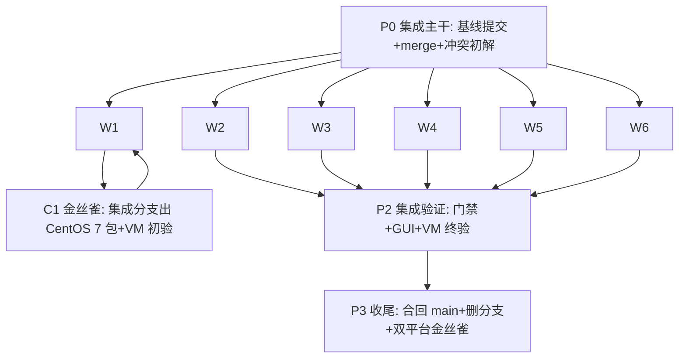

# 单分支统一重构执行计划

> 工程执行计划，不是需求权威。需求以 [docs/requirements/](../requirements/README.md) 为准；本计划只定义怎么并行落地。**已于 2026-09-28 执行完毕并归档至本目录**：`experiment/centos7-no-proot` 已合回 `main`（合并提交 cd4a492）并删除专有分支；验收结论见 [windows-acceptance.md](windows-acceptance.md)、[centos7-acceptance.md](centos7-acceptance.md) 与 [requirements/README.md](../requirements/README.md)「实现与验证状态」。

## 目标与边界

- 把 `experiment/centos7-no-proot`（领先 main 32 个提交、落后 9 个）合入 `main`，之后删除该专有分支；仓库只保留 `main` 一个产品分支（FORK.md「分支策略」）。
- 落地已确认的需求决策：
  - 两平台界面结构、入口与交互完全一致，Windows 为全功能基准；唯一豁免是 CentOS 7 构建标记的渲染性能策略（动画/合批），不得触及界面元素与功能。
  - CentOS 7 用现有 `--offline` 参数门控企业离线锁定（激活链：启动器设 `OMPCODE_CENTOS7_LOCAL_ONLY=1` + 透传 omp）；被关功能入口保留、呈禁用态并附「离线锁定中已关闭」说明，无法做禁用态的触发明确报错。
  - Windows 跑 Electron 44.x（manifest/lockfile 按 Windows 基线维护）；CentOS 7 发布流水线构建时切换 Electron 28.3.3 + Node 18 兼容依赖（undici 6.23.0、better-sqlite3 9.6.0 等）并启用 `__OMPCODE_CENTOS7_DESKTOP__` 标记。
  - 分支 UI 产品决策全局采纳：压缩/自动压缩控件在工具栏与输入框下方全部隐藏（只留 `/compact`）、浏览器「默认开启」说明页、Monitor 图标、技能/钩子页纯 omp 事实源、上游官方云远控入口两平台统一移除（内嵌 relay 替代）。
- 预计冲突 13 个文件（6 文档 + 7 代码），裁决依据为 `docs/requirements/` 现行版；`.github/workflows/release-centos7.yml` 两边逐字节一致，合并后只需按本计划调整分支校验。

## 分工总览（7 人）

| 工作流            | 负责人                     | 范围                                                      | 主要交付                              |
| ----------------- | -------------------------- | --------------------------------------------------------- | ------------------------------------- |
| P0 集成主干       | 1 人（集成者，兼 P2 主导） | 需求基线提交、git merge、13 冲突初解、子分支合入          | `refactor/unify-centos7` 可 typecheck |
| W1 构建双轨       | 1 人                       | 构建切换脚本、workflow、编译标记注入                      | main/集成分支可构建出 28.3.3 产物     |
| W2 双运行时兼容   | 1 人                       | sqlite 层、依赖集、Electron 44↔28 API 审计（含 renderer） | 两运行时都绿的兼容层 + UT             |
| W3 桌面 Main/Host | 1 人                       | 启动器语义、离线门控面、logger、host 日志流、共享接口     | `--offline` 全链路 + 门控 UT/E2E      |
| W4 UI 统一        | 1 人                       | 侧栏、设置页、composer、locales、性能标记边界             | 两平台一致的 UI 与文案                |
| W5 会话/协议核验  | 1 人                       | omp-agent、services 审查与 UT                             | UT 全绿 + 缺口清单                    |
| W6 文档与验收矩阵 | 1 人                       | docs 清理、10 份文档验收矩阵、VM 验收组织                 | 验收矩阵 + 干净需求目录               |

## 阶段与依赖

- P0 先行（1–2 天）：含步骤 0「提交需求基线」（当前未提交的 docs/requirements、AGENTS.md 改动先落库并通过 `node scripts/check-workspace-freshness.mjs`），否则 merge 基线不可复现且脏工作区阻塞合并。
- W1–W6 并行（2–4 天），文件所有权互斥，集成者按固定顺序合入。
- C1 金丝雀（0.5–1 天，W1 内）：workflow 过渡期校验接受 `refs/heads/main` 与 `refs/heads/refactor/unify-centos7`，先从集成分支产出 CentOS 7 包完成一轮 VM 验证——这满足需求「VM 验收通过后才调整 workflow」的时序；VM 通过后才把校验收窄为仅 main（合回 main 时生效）。
- P2 集成验证（3–5 天）：Package acceptance 约 8 组多步场景且串行依赖金丝雀产出；公司 Citrix 主机的 IBus 中文输入验收单列（VM 不等价）。
- P3 收尾（0.5 天）。总量约 6–10 个工作日。

## 文件所有权（避免并行冲突）

- W1：`scripts/prepare-centos7-build.mjs`（新增）、`.github/workflows/**`、vite 构建配置中 `__OMPCODE_CENTOS7_DESKTOP__` define 注入点。
- W2：`packages/desktop/src/main/chromeCookieManager.ts`、`packages/services/src/session/*Repo.ts`、`packages/services/src/session/tasksDatabase/**`（migrations/prepared/startup/provider-selection）、sqlite/undici 依赖封装层及其测试。
- W3：`packages/desktop/src/main/index.ts`、`logger.ts`、`mainLogWriter*`、`desktopHostProcess.ts`、`preload/**`、`packages/shared/**`（platform.ts、zcode-protocol 离线门控接口，W3 所有、W4 只消费）、`scripts/publish/centos7/**`（启动器及其 UT）。
- W4：`packages/ui/src/**`（侧栏、settings、composer、i18n locales、`lib/centos7Desktop.ts`）。
- W5：`packages/omp-agent/**`、`packages/services/**`（除 W2 认领文件）、相关 `test/`。
- W6：`docs/**`、`AGENTS.md`、验收矩阵。
- 交叠文件（`pnpm-lock.yaml`、`packages/desktop/package.json`）只由集成者在合入各子分支后统一再生，工作流内不手改 lockfile。

## 各工作流任务明细

### P0 集成主干

1. 步骤 0：提交当前需求基线（docs/requirements + AGENTS.md + 本计划），运行 `node scripts/check-workspace-freshness.mjs`。
2. `git merge --no-ff experiment/centos7-no-proot`，按需求文档解决 13 个冲突：6 个文档以 `docs/requirements/` 现行版为准（分支旧路径内容已迁入并按新决策改写）；代码冲突按 W2–W4 目标形态初解，允许先取一侧并留 TODO 给对应工作流精修。
3. manifest 冲突取 main 侧（electron 44.4.5、undici ^8、`@types/node-forge` 保留）；28.3.3 钉死由 W1 构建切换承担。
4. 冲突初解可按域拆给对应工作流负责人出裁决建议，集成者落盘；产出 `pnpm typecheck` 通过后推集成分支。

### W1 构建双轨

1. 新增 `scripts/prepare-centos7-build.mjs`：把 `packages/desktop/package.json` 的 electron 切到精确 `28.3.3`，运行时依赖切到 Node 18 兼容组合（undici `6.23.0`、better-sqlite3 `9.6.0`，其余以分支 lockfile 提取的精确清单为准），并在构建配置注入 `__OMPCODE_CENTOS7_DESKTOP__`。脚本必须幂等且不回传改写仓库文件。
2. `release-centos7.yml`：preflight 过渡期接受 `refs/heads/main` 与 `refs/heads/refactor/unify-centos7`，集成分支 VM 验收通过后收窄为仅 `refs/heads/main`（收窄与合回 main 同一 PR）；desktop/native 两个 job 在 install 前执行切换脚本并改用 `--no-frozen-lockfile`（全精确版本保证可重现）；其余校验、并行构建、打包、发布保持。
3. 验证：本地跑切换脚本后 `pnpm --filter @zcode/desktop exec electron-builder --linux --x64 --dir` 产出含 28.3.3 的目录构建；不切换时 Windows 构建零变化。Windows 发布 workflow 不动。

### W2 双运行时兼容（风险最高，优先启动）

1. sqlite 层统一：封装模块按运行时选择 `node:sqlite`（Electron 44/Node 22）或 better-sqlite3 9.6.0（Electron 28/Node 18.18），接口单入口覆盖 `chromeCookieManager`、`automationRepo`、`offPeakTaskRepo`、`taskIndexRepo`、`tasksDatabase/**`；优先验证 better-sqlite3 9.6.0 能否同时编译两个 ABI（可行则单一驱动）。两平台数据行为等价，UT 用内存库覆盖行为一致与故障路径。
2. Electron 44↔28 差异审计：main 进程（`webUtils`、`navigationHistory`、`fs/promises.glob` 等分支既有回退在合并结果中仍成立；main 分叉后新增的主进程代码逐项补回退）+ **renderer 层**（同一 UI 代码跑 Chromium 120 与 44：CSS/JS 语法基线、新 API 使用扫描），产出 API 差异清单并落入构建期检查（centos7-release.md「Ownership」要求）。
3. 依赖集：CentOS 7 构建的 Node 18 兼容精确版本清单从分支 lockfile 提取固化到切换脚本。

### W3 桌面 Main/Host

1. 启动器语义（`scripts/publish/centos7/launch.sh` 及 UT）：`OMPCODE_CENTOS7_LOCAL_ONLY=1` 仅在传入 `--offline` 时设置（分支现为常开），`--offline` 同时透传内嵌 omp；`--help` 文案同步；UT 覆盖参数矩阵（offline/profile/home/online 组合）。
2. 离线门控面逐项落地（不止 relay）：手机远控 relay、公网更新检查、公网配置/帮助/社区/反馈、账号/分享、外部浏览器拉起、遥测与启动/日活调度、Host 在线 bot 任务、推荐提示词本地化——每项在 `LOCAL_ONLY=1` 时后端关闭。经 `packages/shared` 定义唯一门控状态接口暴露给 renderer（W4 消费做禁用态）。
3. 手机远控门控测试：UT（不监听、握手拒绝、入口状态）+ 本机 WebSocket 探测 E2E；frp 真机链路缺失时如实记为未验证范围，不得以条件判断替代（mobile-relay.md 验收 5）。
4. logger 收敛为单一有界异步队列（时间/容量上限显式常量并被测试引用，参考值 25ms/4MiB）；保留 `LOCAL_ONLY` 下 error-only 过滤与退出 1 秒排空预算；删除分支 `mainLogWriter` 重复路径及其测试，语义并入 mainLoggerAsync 测试。
5. Host 工具进程管道容错（EBADF/EPIPE）按分支实现保留并补 UT。上游官方云远控入口的移除在 W3（进程侧）与 W4（UI 侧）同步完成。

### W4 UI 统一

1. `WorkspaceSidebarFooter`：恢复完整入口（内嵌手机远控 trigger），采纳 Monitor 图标；上游官方云远控入口移除（两平台统一，替代关系）。
2. locales 取两侧并集；分支 UI 文案全部采纳（压缩全隐藏、浏览器默认开启说明、钩子页、技能入口、无工作区空态）。
3. `PluginsSection`/`SkillsSection` 合并：设置页技能/钩子/浏览器按 integrations.md 与 skills.md 纯 omp 事实源。
4. composer：工具栏与输入框下方均隐藏压缩/自动压缩控件，`/compact` 命令路径保留。
5. `lib/centos7Desktop.ts` 标记越界控制：显式白名单机制——该标记仅允许出现在枚举的封装模块内（UI 根视觉策略、`MessageResponse` 缓冲），配扫描测试强制（引用白名单外的模块即失败），不得隐藏入口或分叉界面。
6. 离线门控 UI：消费 W3 的门控状态接口，被关功能入口一律禁用态 + 「离线锁定中已关闭」说明。

### W5 会话/协议核验

1. 逐文件审查 auto-merge 结果，重点：会话级并发与背压（main 3776734）× 分支 host 日志流/技能目录改动的叠加处。
2. 运行并修复 `pnpm --filter @zcode/omp-agent test` 全量；补充分支新增行为 UT 缺口（IBus 启动器逻辑、profile/offline 转发、`--home` 链接语义的纯逻辑部分）。

### W6 文档与验收矩阵

1. 清理 `docs/specs/` 已迁移的分支 spec 与过时引用；需求索引与 AGENTS.md 复核。
2. 验收矩阵覆盖 `docs/requirements/` **全部 10 份文档**（含 session-recovery.md 与 performance.md——本次合并风险最高的会话叠加恰在其域内）：每条需求 → 验证方式（UT/E2E/GUI/VM/人工）→ 负责工作流 → 状态列。
3. 组织 P2 的 VM 验收清单执行与公司主机 IBus 验收排期；汇总 Windows 与 CentOS 7/Linux 侧的验收文档（每平台一份，`docs/test-reports/`）。

## P2 集成验证门禁（合入 main 前必须全绿）

1. `node scripts/check-workspace-freshness.mjs`、`pnpm typecheck`、`pnpm lint`、`pnpm fmt:check`、`pnpm architecture:check`。
2. `pnpm --filter @zcode/omp-agent test`（含 `test/real-omp.e2e.test.ts` 真实核心 E2E 必须实际执行——环境缺失即门禁不绿并如实记录，不得以跳过充当通过）；desktop/services/client 相关既有 UT 按实际文件运行。
3. Windows 真实界面验收（操作计算机执行界面测试，不止 CDP 冒烟）：`pnpm dev:desktop` 起真实桌面后，经真实界面操作至少完成：
   a) 基本工具调用会话：新建会话 → 发起会触发工具调用的任务 → 工具调用展示与结果 → 实际文件变更 → 完成/中断；
   b) 子代理分配：发起会派生子代理的任务，核对子代理运行/结束状态与记录展开；
   c) 核心界面与 omp 数据一致性：会话列表、技能目录、模型目录与角色、上下文用量、子代理状态等界面展示与 omp 事实源逐一核对；
   真实模型统一使用 `zhipu-coding-plan/glm-5.3-flash`；手机远控入口在 Windows 正常（有 frp 环境则真机连一次）。
4. CentOS 7/Linux 侧验收：经 `jch-wsl-git-test` 技能执行（用户指定路径）——从 Windows 仓库推送待测代码到指定 WSL2 发行版，以 Linux 原生仓库运行与 Windows 同一组核心场景（基本工具调用会话、子代理分配、界面与 omp 数据一致性，模型同为 glm-5.3-flash）；集成分支金丝雀先过一轮 VM 初验（C1），合流前按 centos7-release.md「Package acceptance」终验，含 `--offline` 两模式网络追踪与被关功能入口逐项检查、文件附件拖拽与浏览器历史导航、Windows 基线保护检查、Chromium 120 与 Windows 的 UI 走查对比；ELF/GLIBC 检查由流水线内置步骤保证。
5. 公司 Citrix 主机 IBus 中文输入验收单独执行并记录（VM 不等价）。
6. 验收文档：代码测试通过后必须产出验收文档——每平台一份写入 `docs/test-reports/`，逐场景记录执行的操作/命令、证据（截图、日志、omp 侧对照数据）、结果与未验证范围；无验收文档不得进入 P3。
7. 任何一项不绿不得进入 P3；验证结论随验收文档落盘。

## P3 收尾

1. 集成分支合回 `main` 并推送；同批落地 workflow 校验收窄为仅 main；发布一个正常 Windows EXE tag 与一个 CentOS 7 金丝雀 tag 验证两条流水线。
2. 删除本地与远端 `experiment/centos7-no-proot`；保留既有 centos7 tag（历史仍可达）。
3. `docs/requirements/README.md`「实现与验证状态」更新为本次实际验证结论；本计划归档。

## 风险与对策

| 风险                                               | 影响                | 对策                                                                                                |
| -------------------------------------------------- | ------------------- | --------------------------------------------------------------------------------------------------- |
| better-sqlite3 9.6.0 不支持 Electron 44 ABI        | W2 阻塞             | 封装层按运行时双驱动（node:sqlite / better-sqlite3）单入口；升级 better-sqlite3 到双 ABI 版本为备选 |
| renderer 新代码用了 Chromium 44 才有的 CSS/JS 特性 | CentOS 7 UI 故障    | W2 renderer 审计 + P2 UI 走查对比                                                                   |
| main 新增主进程代码依赖 Electron 44 API            | CentOS 7 运行期故障 | W2 差异清单 + 构建期检查 + C1 金丝雀前置                                                            |
| 金丝雀与 main-only 校验互锁                        | P2 无法产出         | 过渡期校验接受集成分支，VM 通过后随合流收窄                                                         |
| workflow 修改先于 VM 验收违反需求时序              | 需求违规            | C1 阶段先以集成分支金丝雀完成 VM 验证再定稿 workflow 收窄                                           |
| `--no-frozen-lockfile` 构建可重现性                | 构建/供应链漂移     | 全精确版本 + 幂等切换脚本；后续可固化 centos7 lockfile 变体                                         |
| UI 性能标记越界影响界面一致性                      | 违反 UI 统一需求    | W4 白名单 + 扫描测试 + 验收矩阵覆盖                                                                 |
| 并行工作流改到同一文件                             | 合入冲突            | 文件所有权表 + lockfile 只由集成者再生                                                              |
| P0 单点（冲突初解集中一人）                        | 进度瓶颈            | 初解裁决按域分发给对应负责人出建议，集成者落盘                                                      |
| CentOS 7 VM / frp / 公司主机环境不可用             | 验收缺口            | 如实标注未验证范围，不得宣称验收通过（AGENTS.md 规则）                                              |

## 协作约定

- 每个工作流在 `refactor/unify-centos7` 上开 `refactor/w<N>-<域>` 子分支，使用独立 git worktree；完成判据 = 自身交付 + 对应 UT/typecheck 绿 + `pnpm lint` 0 error（不把 lint 推迟到集成末端）。
- 集成顺序固定：W2 → W3 → W4 → W5 → W1 → W6（兼容层最先稳定，其余按依赖）。
- 任何需求疑义以 `docs/requirements/` 为准裁决；发现文档缺口先补文档再改代码（AGENTS.md 规则）。
