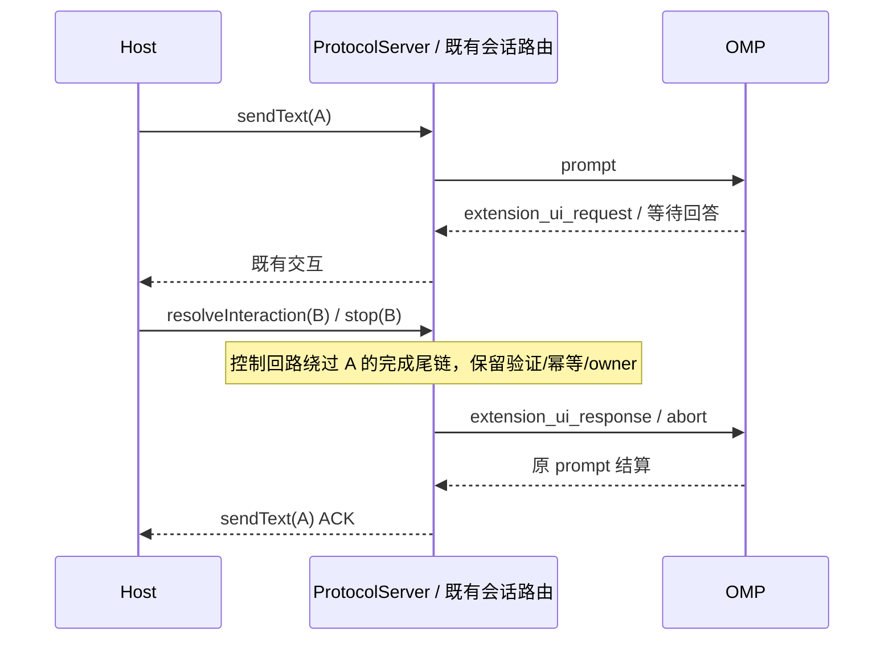

# omp rpc-ui 接入实现边界

产品规则与验收唯一权威：[omp-core-integration.md](../../../docs/requirements/omp-core-integration.md)；恢复、技能及原生集成分别引用该页链接的对应需求。此 spec 只记录实现责任，不保留旧项目宿主或旧 v3 权限/问答协议。

## 所有者与协议

- `OmpChildProcess` 拥有持续 stdout 读取、ready 等待、v3 优先/v2 回落协商、命令关联与 EOF 销毁；start 在协商完成后才返回。每会话一进程，`OmpDirectoryGateway` 唯一持有工作区 `--no-session` 目录进程。
- v3 只增加 commandCompletion/modelRoleConfig/sessionDirectory；审批仍是 `extension_ui_request {method:"select",options:["Approve","Deny"]}`，富 ask 通过 `set_ask_dialog` 启用同一载体的 `method:"ask"`。
- `OmpInteractionProxy` 汇合 v4 与宿主反向应答，按请求 ID 只接受一次。select 缺失/未知/冲突选项取消；input/editor 传递 sensitive/prefill 与实际文本；销毁、取消或断连 fail-closed。
- ask 服务端持有真实超时与 recommended 收尾；适配器不发送不存在的 `ask_pause`，本地 snooze 不声称暂停核心倒计时。
- 当前核心无 `test_model`/`list_mcp_servers`：连通性测试显式 -32601；MCP 查询仅合法空状态，不伪造连接事实。
- 原生 `custom` 消息由现有 `OmpEventProjector` 在 `message_end` 投影为独立完成文本行；`message_start` 不重复落行。`ConversationProjection` 仍唯一拥有行 ID/seq，纯 domain helper 只提取显式可见文本、组装行，不调用模型或修改主 turn/usage/error/stream anchor。冷 `custom_message`/message 包装复用同一可见性与文本提取；两链路继续使用同一 publisher，进程 callback gate 不变。
- 核心命令需求见 [omp-native-commands.md](../../../docs/requirements/omp-native-commands.md)。所有斜杠输入先按实际目录校验，空闲和运行中都经 `prompt.message`；运行中附带对应 `streamingBehavior`，由 OMP 先执行内置命令，再为技能/魔法命令的模型输入应用队列策略。普通补充文本保留 `steer` / `follow_up` 路径。未知、TUI-only 与带附件命令先拒绝，不切模型。
- 安装核 `18.8.4+fork.304` 的 `/wiki`、`/repo`、`/compact` 可在 `agentInvoked:false` ACK 后继续背景操作。ACK 仅收口本次提交，header 标为既有 `executionKind:controlOnly`，不代表索引/压缩业务完成；没有带请求 ID 的背景操作终态协议，不根据文本、定时器或无输出推测完成。运行中本地提交按 `sourceCommandId` 单独收口，不能关闭正在运行的模型轮或队首普通补充。真实 `/wiki` 等待 select 时 `abort` 会取消 commandOperations signal 并发 `method:cancel`，已有交互取消与公开停止继续使用该回路。
- `command_output` 没有请求 ID，也不进入 OMP journal。每个收到的文本帧以唯一记录 ID 投影为独立完成文本行，不借模型流式行；ACK 后、多段与自动续跑的输出仍可见。记录只是 GUI 接收事实，通过 `OmpStorePort` 的派生历史接口保存、冷恢复合并与删除；不写 OMP journal、不复制业务状态或已接受队列。进程实例 fence 位于 `createEngineOmpProcess`，旧进程结果不能落行或保存。
- GUI 接受的逻辑会话 ID 是冷读取的有效别名；OMP 随后落盘或变更 UUID 时，派生存储通过已保存的 aliases 定位同一条显示历史并返回当前真实文件路径。列表的 canonical UUID 不能取代别名查找，也不能把旧 GUI 地址重新创建成另一会话。
- Registry 从权威冷摘要学习 alias→已登记 engineId 的派生查找索引；只有同 workspace identity、操作路径与原生文件 epoch 才复用同一引擎。先打开 UUID 或旧逻辑 ID、以及两者并发恢复，都在冷水合登记门收敛到一个投影/进程/lease owner。每条订阅仍沿请求的 ID 发 topic/snapshot；别名不复制会话状态。删除/关闭屏障覆盖请求 ID、owner ID 与 canonical UUID，drop/dispose 同步清除派生别名索引。
- 冷合并只对 `omp-command-output:<记录 ID>` 的派生显示事实做身份去重；原生 journal 行逐条保留。既有冷解析的 `assistantText`/`reasoning`/`userInput` entityId 表示行类别，多轮或同轮多段可以重复，不能据此覆盖原生历史。
- 每条冷原生可见 custom 按 journal entry ID 派生独立稳定的显示 turn/group，缺少 entry ID 时按冷行序号派生。它不能附着最近模型 turn，否则同一模型轮后的多次 team 报告会被 UI 常规组的 latest-assistant 显示折叠；解析 custom 不推进或替换模型 currentTurnId。
- 仅原生 custom 结果的父会话也可能尚未跨过 OMP assistant 落盘门。`display:true` 的 `message_end` 与命令输出共用显示事实桥；实际 journal 的 type/文本/原生事件时间均相同才跳过保存，无法证明同一事件时保留显示事实。原始 epoch 由既有 sessionPath→UUID helper 提取并随记录保存。OMP 先创建 message 时间、后经 normalize 创建 entry 时间，冷合并因此只在同 epoch 内按 type/原文与 `entry.timestamp >= message.timestamp` 的因果顺序一对一配对，不用时间容差；旧事件或其他原生 file 不能吞新结果。隐藏/非文本 custom 不进入派生历史。
- 原生 loop/goal 与后台任务自动续跑仅有 OMP 事件，没有新的 GUI commandId。`agent_start` 优先复用已接受/排队轮；没有该轮时纯投影派生原生显示轮，真实 `user message_start` 只补一次 synthetic 输入。不能发送第二次 prompt，不能新增 Host 计时器、目标或循环状态。
- 新命令输出触发既有状态合并回读，成功压缩后的 `get_state.contextUsage` 与空闲 `/context` 分项回投使用真实值；不按输出文案构造压缩 marker，不以合并回读时窗推断业务完成。
- stdio 请求保留普通会话写入的串行完成顺序；`v4/command` 的 `resolveInteraction` 与 `stop` 绕过该完成尾链，仍经原 `handleRequest`、Envelope 校验、幂等和会话 owner 路由。控制回路不能等待它要释放的同步 prompt/confirm 完成，不新增已接受输入队列。
- 停止可用性是同一投影 owner 从真实 pendingInteractions 与当前 control 派生的事实。背景命令 ACK 已收口时，等待交互仍令 `canStop:true`；不改变该提交的 phase、activeWorks 或业务终态。回答/取消移除最后等待后恢复当前控制；模型仍运行或 stopping 时保持模型控制，不能用旧提交 ACK 或等待解除回退当前运行事实。



## 时序与恢复

内部 `/context` 查询与 OMP 背景本地命令可交错；无 requestId 的 `command_output` 不能按查询等待窗口整体归入上下文侧信道。当前原生 `/context` 通过一次 `runtime.output(buildContextReportText(...))` 返回完整报告，只将已有解析器识别出的完整报告收集为 token 事实；其余输出继续经独立显示事实桥进入时间线和派生历史。查询 ACK 前后均保持此规则，不能吞掉计划退出、目标状态或压缩终态。

```text
ready → 持续读流 → 协商 ACK → 订阅/ask opt-in → start 完成
用户输入 → 斜杠/附件校验 → 模型选择 → 核心 admission ACK → 本次提交收口 / 模型终态
command_output → 当前进程 fence → 唯一记录 ID → 独立文本行 + 派生历史保存
冷恢复 → OMP journal 行 + 派生命令记录（按唯一 ID 去重）→ 同一投影 owner
核心 UI → 单一交互 owner → v4/反向应答汇合 → extension_ui_response
冷子代理 → 父会话身份/子代理 ID 校验 → 受限持久记录 → 同一只读投影
记录 reset → row.removed 屏障 → 行追加 → 同一订阅水位
desktop-continuous / web-remote-replayable → 同一投影，不同交付边界
```

## 内部符号与公共出口

包入口只暴露 `contract.ts` 的启动契约。仅在定义文件内使用的帧 schema、投影默认值和进程接线 helper 不再导出；没有消费者的类型与 helper 移除。实际帧解析、目录命令载荷、进程 fence、会话 owner 和事件时序保持原路径，不因静态清理放宽协议验证。`module.ts` 与 `contract.example.ts` 是架构入口，不按产品无引用文件删除。

## 验证入口

相关真实边界、模拟回归与未执行范围按产品权威文档记录；本 spec 不把静态检查或 fake 核心通过写成真实验收。
